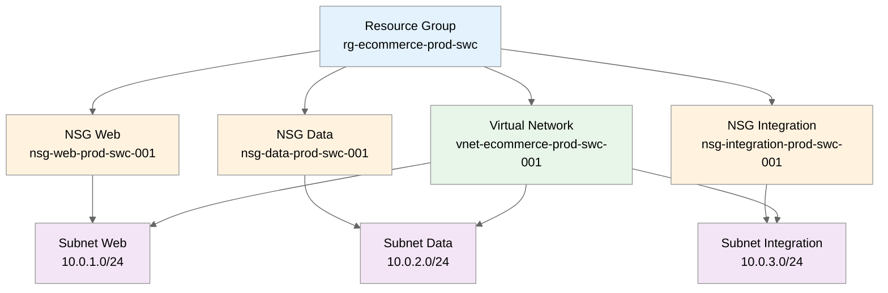

# goal: E-Commerce Platform Phase 1 - Network Foundation

## Introduction

This implementation plan covers the foundational networking infrastructure for
a PCI-DSS compliant multi-tier e-commerce platform.
Phase 1 establishes the Virtual Network with three segmented subnets (web, data,
integration) and Network Security Groups with deny-by-default rules. Region: `swedencentral`.

---

## Resources

### resourceGroup

```yaml
name: resourceGroup
kind: Raw
type: Microsoft.Resources/resourceGroups@2024-03-01

purpose: Container for all e-commerce platform resources
dependsOn: []

parameters:
  required:
    - name: resourceGroupName
      type: string
      description: Name of the resource group
      example: rg-ecommerce-prod-swc
    - name: location
      type: string
      description: Azure region for deployment
      example: swedencentral
  optional:
    - name: tags
      type: object
      description: Resource tags for governance
      default: See tagging strategy below

outputs:
  - name: resourceGroupName
    type: string
    description: Name of the created resource group
  - name: resourceGroupId
    type: string
    description: Resource ID of the resource group

estimatedCost:
  sku: N/A
  monthlyRange: "$0"
  costDrivers: [Resource groups are free]

references:
  docs: https://learn.microsoft.com/azure/azure-resource-manager/management/manage-resource-groups-portal
```

---

### virtualNetwork

```yaml
name: virtualNetwork
kind: AVM
avmModule: br/public:avm/res/network/virtual-network:0.7.1

purpose: Main VNet providing network isolation for e-commerce workloads
dependsOn: [resourceGroup]

parameters:
  required:
    - name: name
      type: string
      description: Name of the virtual network
      example: vnet-ecommerce-prod-swc-001
    - name: addressPrefixes
      type: array
      description: Address space for the VNet
      example: ['10.0.0.0/16']
  optional:
    - name: location
      type: string
      description: Azure region
      default: swedencentral
    - name: tags
      type: object
      description: Resource tags
      default: See tagging strategy
    - name: dnsServers
      type: array
      description: Custom DNS servers
      default: [] (Azure-provided DNS)
    - name: subnets
      type: array
      description: Subnet configurations (defined separately for clarity)
      default: See subnet resources below

outputs:
  - name: resourceId
    type: string
    description: Resource ID of the VNet
  - name: name
    type: string
    description: Name of the VNet
  - name: subnetResourceIds
    type: object
    description: Map of subnet names to resource IDs

estimatedCost:
  sku: N/A
  monthlyRange: "$0"
  costDrivers: [VNet is free, costs come from peering/gateways]

references:
  docs: https://learn.microsoft.com/azure/virtual-network/virtual-networks-overview
  avm: https://github.com/Azure/bicep-registry-modules/tree/main/avm/res/network/virtual-network
```

---

### nsgWeb

```yaml
name: nsgWeb
kind: AVM
avmModule: br/public:avm/res/network/network-security-group:0.5.2

purpose: NSG for web tier - allows HTTPS from Front Door only
dependsOn: [resourceGroup]

parameters:
  required:
    - name: name
      type: string
      description: Name of the NSG
      example: nsg-web-prod-swc-001
  optional:
    - name: location
      type: string
      description: Azure region
      default: swedencentral
    - name: securityRules
      type: array
      description: Security rules for web tier
      default: |
        [
          {
            name: 'AllowFrontDoorHTTPS'
            properties: {
              priority: 100
              direction: 'Inbound'
              access: 'Allow'
              protocol: 'Tcp'
              sourceAddressPrefix: 'AzureFrontDoor.Backend'
              sourcePortRange: '*'
              destinationAddressPrefix: '10.0.1.0/24'
              destinationPortRange: '443'
            }
          },
          {
            name: 'AllowHealthProbes'
            properties: {
              priority: 110
              direction: 'Inbound'
              access: 'Allow'
              protocol: 'Tcp'
              sourceAddressPrefix: 'AzureLoadBalancer'
              sourcePortRange: '*'
              destinationAddressPrefix: '10.0.1.0/24'
              destinationPortRange: '*'
            }
          },
          {
            name: 'DenyAllInbound'
            properties: {
              priority: 4096
              direction: 'Inbound'
              access: 'Deny'
              protocol: '*'
              sourceAddressPrefix: '*'
              sourcePortRange: '*'
              destinationAddressPrefix: '*'
              destinationPortRange: '*'
            }
          }
        ]

outputs:
  - name: resourceId
    type: string
    description: Resource ID of the NSG
  - name: name
    type: string
    description: Name of the NSG

estimatedCost:
  sku: N/A
  monthlyRange: "$0"
  costDrivers: [NSGs are free]

references:
  docs: https://learn.microsoft.com/azure/virtual-network/network-security-groups-overview
  avm: https://github.com/Azure/bicep-registry-modules/tree/main/avm/res/network/network-security-group
```

---

### nsgData

```yaml
name: nsgData
kind: AVM
avmModule: br/public:avm/res/network/network-security-group:0.5.2

purpose: NSG for data tier - allows traffic from web subnet only
dependsOn: [resourceGroup]

parameters:
  required:
    - name: name
      type: string
      description: Name of the NSG
      example: nsg-data-prod-swc-001
  optional:
    - name: location
      type: string
      description: Azure region
      default: swedencentral
    - name: securityRules
      type: array
      description: Security rules for data tier
      default: |
        [
          {
            name: 'AllowWebSubnetInbound'
            properties: {
              priority: 100
              direction: 'Inbound'
              access: 'Allow'
              protocol: 'Tcp'
              sourceAddressPrefix: '10.0.1.0/24'
              sourcePortRange: '*'
              destinationAddressPrefix: '10.0.2.0/24'
              destinationPortRange: '*'
            }
          },
          {
            name: 'AllowIntegrationSubnetInbound'
            properties: {
              priority: 110
              direction: 'Inbound'
              access: 'Allow'
              protocol: 'Tcp'
              sourceAddressPrefix: '10.0.3.0/24'
              sourcePortRange: '*'
              destinationAddressPrefix: '10.0.2.0/24'
              destinationPortRange: '*'
            }
          },
          {
            name: 'DenyAllInbound'
            properties: {
              priority: 4096
              direction: 'Inbound'
              access: 'Deny'
              protocol: '*'
              sourceAddressPrefix: '*'
              sourcePortRange: '*'
              destinationAddressPrefix: '*'
              destinationPortRange: '*'
            }
          }
        ]

outputs:
  - name: resourceId
    type: string
    description: Resource ID of the NSG
  - name: name
    type: string
    description: Name of the NSG

estimatedCost:
  sku: N/A
  monthlyRange: "$0"
  costDrivers: [NSGs are free]

references:
  docs: https://learn.microsoft.com/azure/virtual-network/network-security-groups-overview
  avm: https://github.com/Azure/bicep-registry-modules/tree/main/avm/res/network/network-security-group
```

---

### nsgIntegration

```yaml
name: nsgIntegration
kind: AVM
avmModule: br/public:avm/res/network/network-security-group:0.5.2

purpose: NSG for integration tier - allows traffic from web and data subnets
dependsOn: [resourceGroup]

parameters:
  required:
    - name: name
      type: string
      description: Name of the NSG
      example: nsg-integration-prod-swc-001
  optional:
    - name: location
      type: string
      description: Azure region
      default: swedencentral
    - name: securityRules
      type: array
      description: Security rules for integration tier
      default: |
        [
          {
            name: 'AllowWebSubnetInbound'
            properties: {
              priority: 100
              direction: 'Inbound'
              access: 'Allow'
              protocol: 'Tcp'
              sourceAddressPrefix: '10.0.1.0/24'
              sourcePortRange: '*'
              destinationAddressPrefix: '10.0.3.0/24'
              destinationPortRange: '*'
            }
          },
          {
            name: 'AllowDataSubnetInbound'
            properties: {
              priority: 110
              direction: 'Inbound'
              access: 'Allow'
              protocol: 'Tcp'
              sourceAddressPrefix: '10.0.2.0/24'
              sourcePortRange: '*'
              destinationAddressPrefix: '10.0.3.0/24'
              destinationPortRange: '*'
            }
          },
          {
            name: 'DenyAllInbound'
            properties: {
              priority: 4096
              direction: 'Inbound'
              access: 'Deny'
              protocol: '*'
              sourceAddressPrefix: '*'
              sourcePortRange: '*'
              destinationAddressPrefix: '*'
              destinationPortRange: '*'
            }
          }
        ]

outputs:
  - name: resourceId
    type: string
    description: Resource ID of the NSG
  - name: name
    type: string
    description: Name of the NSG

estimatedCost:
  sku: N/A
  monthlyRange: "$0"
  costDrivers: [NSGs are free]

references:
  docs: https://learn.microsoft.com/azure/virtual-network/network-security-groups-overview
  avm: https://github.com/Azure/bicep-registry-modules/tree/main/avm/res/network/network-security-group
```

---

## Subnet Configuration

Subnets are defined within the VNet module using the `subnets` parameter:

| Subnet Name           | Address Prefix | Purpose                                    | NSG            | Service
Endpoints                |
| --------------------- | -------------- | ------------------------------------------ | -------------- |
-------------------------------- |
| snet-web-prod         | 10.0.1.0/24    | App Service VNet integration               | nsgWeb         | Microsoft.Web
|
| snet-data-prod        | 10.0.2.0/24    | Private endpoints for data services        | nsgData        | Microsoft.Sql,
Microsoft.Storage |
| snet-integration-prod | 10.0.3.0/24    | Functions VNet integration,
Service Bus PE | nsgIntegration | Microsoft.ServiceBus             |

---

## Cost Estimation

### Monthly Cost Breakdown

| Resource          | SKU/Tier | Quantity | Unit Cost | Monthly Cost |
| ----------------- | -------- | -------- | --------- | ------------ |
| Resource Group    | N/A      | 1        | $0        | $0           |
| Virtual Network   | N/A      | 1        | $0        | $0           |
| NSG (Web)         | N/A      | 1        | $0        | $0           |
| NSG (Data)        | N/A      | 1        | $0        | $0           |
| NSG (Integration) | N/A      | 1        | $0        | $0           |
| **Total**         |          |          |           | **$0**       |

**Cost Notes:**

- Phase 1 resources (VNet, NSGs, Subnets) are free
- Costs will begin in Phase 2 with compute and data services
- VNet peering would add costs (~$0.01/GB) if needed later

---

## Resource Dependencies

### Dependency Diagram



### Deployment Order

1. Resource Group (foundation)
2. NSGs (must exist before subnet association)
3. Virtual Network with Subnets (references NSGs)

---

## Implementation Plan

### Phase 1 — Network Foundation

**Objective:** Establish secure, segmented network infrastructure for PCI-DSS compliance

- IMPLEMENT-GOAL-001: Create resource group and networking foundation

| Task     | Description             | Action                                               |
| -------- | ----------------------- | ---------------------------------------------------- |
| TASK-001 | Create folder structure | Create `infra/bicep/ecommerce/` folder               |
| TASK-002 | Create main.bicep       | Entry point with parameters and module orchestration |
| TASK-003 | Create network module   | `modules/network.bicep` with VNet and subnets        |
| TASK-004 | Create NSG module       | `modules/nsg.bicep` with all three NSGs              |
| TASK-005 | Create parameters file  | `main.bicepparam` with environment values            |
| TASK-006 | Validate deployment     | Run `bicep build` and `bicep lint`                   |

---

## File Structure

```
infra/bicep/ecommerce/
├── main.bicep              # Entry point, orchestrates modules
├── main.bicepparam         # Parameters for prod deployment
├── modules/
│   ├── network.bicep       # VNet + Subnets (AVM module)
│   └── nsg.bicep           # All NSGs (AVM module)
└── README.md               # Deployment instructions
```

---

## Tagging Strategy

All resources must include these tags:

```yaml
tags:
  Environment: prod
  ManagedBy: Bicep
  Project: ecommerce-platform
  Owner: platform-team
  CostCenter: CC-ECOM-001
  Compliance: PCI-DSS
  DeploymentDate: 2025-12-01
  Region: swedencentral
```

---

## Testing Strategy

### Validation Steps

| Phase           | Validation Method     | Success Criteria               | Tools           |
| --------------- | --------------------- | ------------------------------ | --------------- |
| Pre-deployment  | Bicep build & lint    | No errors, warnings resolved   | bicep CLI       |
| Pre-deployment  | What-if analysis      | Expected 5 resources created   | Azure CLI       |
| Post-deployment | Resource verification | All resources in Running state | Azure Portal    |
| Post-deployment | NSG rule validation   | Rules applied correctly        | Azure CLI       |
| Functional      | Connectivity test     | Subnets isolated per NSG rules | Network Watcher |

### Validation Commands

```bash
# Build and lint
bicep build infra/bicep/ecommerce/main.bicep
bicep lint infra/bicep/ecommerce/main.bicep

# What-if deployment
az deployment sub what-if \
  --location swedencentral \
  --template-file infra/bicep/ecommerce/main.bicep \
  --parameters infra/bicep/ecommerce/main.bicepparam

# Deploy
az deployment sub create \
  --location swedencentral \
  --template-file infra/bicep/ecommerce/main.bicep \
  --parameters infra/bicep/ecommerce/main.bicepparam
```

---

## Rollback Strategy

**If deployment fails:**

1. Check deployment logs: `az deployment sub show --name <deployment-name>`
2. Delete resource group (safe for Phase 1): `az group delete --name rg-ecommerce-prod-swc --yes`
3. Fix issues in Bicep templates
4. Re-run deployment

---

## Next Phases (Out of Scope)

| Phase   | Resources                                   | Dependency on Phase 1                        |
| ------- | ------------------------------------------- | -------------------------------------------- |
| Phase 2 | Key Vault, App Service Plan, SQL, Redis     | Uses snet-data-prod for private endpoints    |
| Phase 3 | App Service, Search, Service Bus, Functions | Uses snet-web-prod and snet-integration-prod |
| Phase 4 | Front Door, App Insights, Log Analytics     | Connects to App Service in snet-web-prod     |

---

## High-Level Design

Phase 1 establishes the network foundation using a hub-less architecture optimized for
a single-region PCI-DSS compliant e-commerce platform.
The VNet (10.0.0.0/16) is segmented into three subnets with NSGs enforcing deny-by-default rules:

- **Web tier (10.0.1.0/24)**: Only accepts HTTPS from Azure Front Door
- **Data tier (10.0.2.0/24)**: Only accepts traffic from web and integration tiers
- **Integration tier (10.0.3.0/24)**: Hosts async processing, accessible from web and data tiers

This foundation enables private endpoint deployment in subsequent phases while maintaining strict network isolation for
PCI-DSS compliance.
