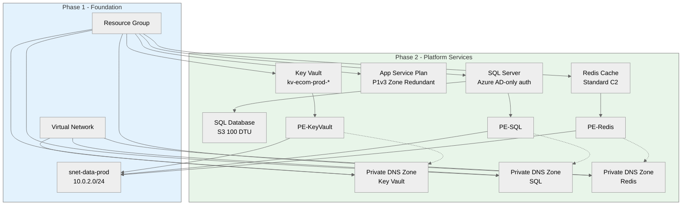

# goal: E-Commerce Platform Phase 2 - Platform Services

## Introduction

This implementation plan covers platform services for the PCI-DSS compliant e-commerce platform.
Phase 2 deploys Key Vault, App Service Plan (P1v3 zone redundant), Azure SQL with Azure AD-only auth,
and Redis Cache with private endpoints. **Depends on Phase 1 network foundation.** Region: `swedencentral`.

---

## Resources

### keyVault

```yaml
name: keyVault
kind: AVM
avmModule: br/public:avm/res/key-vault/vault:0.13.3

purpose: Centralized secrets management with managed identity access
dependsOn: [Phase 1: virtualNetwork, nsgData]

parameters:
  required:
    - name: name
      type: string
      description: Name of the Key Vault (max 24 chars)
      example: kv-ecom-prod-abc123
  optional:
    - name: location
      type: string
      description: Azure region
      default: swedencentral
    - name: sku
      type: string
      description: SKU family
      default: standard
    - name: enableRbacAuthorization
      type: bool
      description: Use RBAC instead of access policies
      default: true
    - name: enableSoftDelete
      type: bool
      description: Enable soft delete for recovery
      default: true
    - name: softDeleteRetentionInDays
      type: int
      description: Days to retain deleted secrets
      default: 90
    - name: enablePurgeProtection
      type: bool
      description: Prevent permanent deletion
      default: true
    - name: publicNetworkAccess
      type: string
      description: Public network access setting
      default: Disabled
    - name: privateEndpoints
      type: array
      description: Private endpoint configuration
      default: See private endpoint section

outputs:
  - name: resourceId
    type: string
    description: Resource ID of the Key Vault
  - name: name
    type: string
    description: Name of the Key Vault
  - name: uri
    type: string
    description: URI of the Key Vault

estimatedCost:
  sku: Standard
  monthlyRange: "$0.03/10K operations"
  costDrivers: [Secret operations, certificate operations]

references:
  docs: https://learn.microsoft.com/azure/key-vault/general/overview
  avm: https://github.com/Azure/bicep-registry-modules/tree/main/avm/res/key-vault/vault
```

---

### appServicePlan

```yaml
name: appServicePlan
kind: AVM
avmModule: br/public:avm/res/web/serverfarm:0.5.0

purpose: Zone-redundant compute platform for .NET 8 REST API
dependsOn: [Phase 1: resourceGroup]

parameters:
  required:
    - name: name
      type: string
      description: Name of the App Service Plan
      example: asp-ecommerce-prod-swc-001
    - name: sku
      type: object
      description: SKU configuration (P1v3 for zone redundancy)
      example: |
        {
          name: 'P1v3'
          tier: 'PremiumV3'
          size: 'P1v3'
          capacity: 2
        }
  optional:
    - name: location
      type: string
      description: Azure region
      default: swedencentral
    - name: zoneRedundant
      type: bool
      description: Enable zone redundancy (requires Premium SKU)
      default: true
    - name: kind
      type: string
      description: Type of App Service Plan
      default: linux
    - name: reserved
      type: bool
      description: Linux App Service Plan
      default: true

outputs:
  - name: resourceId
    type: string
    description: Resource ID of the App Service Plan
  - name: name
    type: string
    description: Name of the App Service Plan

estimatedCost:
  sku: P1v3
  monthlyRange: "$138/instance × 2 = $276"
  costDrivers: [Instance count, zone redundancy]

references:
  docs: https://learn.microsoft.com/azure/app-service/overview-hosting-plans
  avm: https://github.com/Azure/bicep-registry-modules/tree/main/avm/res/web/serverfarm
```

---

### sqlServer

```yaml
name: sqlServer
kind: AVM
avmModule: br/public:avm/res/sql/server:0.21.1

purpose: Azure SQL Server with Azure AD-only authentication (PCI-DSS)
dependsOn: [Phase 1: virtualNetwork, nsgData]

parameters:
  required:
    - name: name
      type: string
      description: Name of the SQL Server
      example: sql-ecommerce-prod-swc-abc123
    - name: administrators
      type: object
      description: Azure AD administrator configuration
      example: |
        {
          azureADOnlyAuthentication: true
          login: 'sql-admins@contoso.com'
          principalType: 'Group'
          sid: '<AAD-Group-Object-ID>'
        }
  optional:
    - name: location
      type: string
      description: Azure region
      default: swedencentral
    - name: minimalTlsVersion
      type: string
      description: Minimum TLS version
      default: "1.2"
    - name: publicNetworkAccess
      type: string
      description: Public network access setting
      default: Disabled
    - name: privateEndpoints
      type: array
      description: Private endpoint configuration
      default: See private endpoint section

outputs:
  - name: resourceId
    type: string
    description: Resource ID of the SQL Server
  - name: name
    type: string
    description: Name of the SQL Server
  - name: fullyQualifiedDomainName
    type: string
    description: FQDN of the SQL Server

estimatedCost:
  sku: N/A (Server is free)
  monthlyRange: "$0"
  costDrivers: [Database costs separate]

references:
  docs: https://learn.microsoft.com/azure/azure-sql/database/sql-database-paas-overview
  avm: https://github.com/Azure/bicep-registry-modules/tree/main/avm/res/sql/server
```

---

### sqlDatabase

```yaml
name: sqlDatabase
kind: AVM
avmModule: br/public:avm/res/sql/server/database:0.2.1

purpose: Product catalog and order database (S3 tier, 100 DTU)
dependsOn: [sqlServer]

parameters:
  required:
    - name: name
      type: string
      description: Name of the database
      example: sqldb-ecommerce-prod
    - name: serverName
      type: string
      description: Parent SQL Server name
      example: sql-ecommerce-prod-swc-abc123
  optional:
    - name: sku
      type: object
      description: Database SKU
      default: |
        {
          name: 'S3'
          tier: 'Standard'
          capacity: 100
        }
    - name: maxSizeBytes
      type: int
      description: Maximum database size
      default: 268435456000 (250 GB)
    - name: collation
      type: string
      description: Database collation
      default: SQL_Latin1_General_CP1_CI_AS
    - name: zoneRedundant
      type: bool
      description: Zone redundancy (not available for S3)
      default: false

outputs:
  - name: resourceId
    type: string
    description: Resource ID of the database
  - name: name
    type: string
    description: Name of the database

estimatedCost:
  sku: S3 (100 DTU)
  monthlyRange: "$150"
  costDrivers: [DTU capacity, storage size]

references:
  docs: https://learn.microsoft.com/azure/azure-sql/database/service-tiers-dtu
  avm: https://github.com/Azure/bicep-registry-modules/tree/main/avm/res/sql/server/database
```

---

### redisCache

```yaml
name: redisCache
kind: AVM
avmModule: br/public:avm/res/cache/redis:0.16.4

purpose: Session caching for 10K concurrent users
dependsOn: [Phase 1: virtualNetwork, nsgData]

parameters:
  required:
    - name: name
      type: string
      description: Name of the Redis Cache
      example: redis-ecommerce-prod-swc-abc123
  optional:
    - name: location
      type: string
      description: Azure region
      default: swedencentral
    - name: sku
      type: object
      description: Redis SKU configuration
      default: |
        {
          name: 'Standard'
          family: 'C'
          capacity: 2
        }
    - name: enableNonSslPort
      type: bool
      description: Enable non-SSL port (disable for security)
      default: false
    - name: minimumTlsVersion
      type: string
      description: Minimum TLS version
      default: "1.2"
    - name: publicNetworkAccess
      type: string
      description: Public network access setting
      default: Disabled
    - name: privateEndpoints
      type: array
      description: Private endpoint configuration
      default: See private endpoint section

outputs:
  - name: resourceId
    type: string
    description: Resource ID of Redis Cache
  - name: name
    type: string
    description: Name of Redis Cache
  - name: hostName
    type: string
    description: Hostname of Redis Cache

estimatedCost:
  sku: Standard C2 (6GB)
  monthlyRange: "$170"
  costDrivers: [Cache size, tier]

references:
  docs: https://learn.microsoft.com/azure/azure-cache-for-redis/cache-overview
  avm: https://github.com/Azure/bicep-registry-modules/tree/main/avm/res/cache/redis
```

---

### privateDnsZones

```yaml
name: privateDnsZones
kind: AVM
avmModule: br/public:avm/res/network/private-dns-zone:0.8.0

purpose: DNS resolution for private endpoints
dependsOn: [Phase 1: virtualNetwork]

parameters:
  required:
    - name: name
      type: string
      description: Private DNS zone name
      example: privatelink.vaultcore.azure.net
  optional:
    - name: virtualNetworkLinks
      type: array
      description: VNet links for DNS resolution
      default: Link to vnet-ecommerce-prod-swc-001

zones:
  - privatelink.vaultcore.azure.net (Key Vault)
  - privatelink.database.windows.net (SQL)
  - privatelink.redis.cache.windows.net (Redis)

outputs:
  - name: resourceId
    type: string
    description: Resource ID of the DNS zone

estimatedCost:
  sku: N/A
  monthlyRange: "$0.50/zone/month"
  costDrivers: [Number of zones, DNS queries]

references:
  docs: https://learn.microsoft.com/azure/private-link/private-endpoint-dns
  avm: https://github.com/Azure/bicep-registry-modules/tree/main/avm/res/network/private-dns-zone
```

---

## Cost Estimation

### Monthly Cost Breakdown

| Resource          | SKU/Tier     | Quantity    | Unit Cost      | Monthly Cost |
| ----------------- | ------------ | ----------- | -------------- | ------------ |
| Key Vault         | Standard     | 1           | ~$0.03/10K ops | ~$5          |
| App Service Plan  | P1v3         | 2 instances | $138/instance  | $276         |
| SQL Database      | S3 (100 DTU) | 1           | $150           | $150         |
| Redis Cache       | Standard C2  | 1           | $170           | $170         |
| Private DNS Zones | N/A          | 3           | $0.50/zone     | $1.50        |
| Private Endpoints | N/A          | 3           | $7.30/endpoint | $22          |
| **Total**         |              |             |                | **~$625**    |

**Cost Optimization:**

- Reserved Instances (1-year): Save ~30% on App Service ($193 instead of $276)
- Reserved Capacity for SQL: Save ~30% ($105 instead of $150)

---

## Resource Dependencies

### Dependency Diagram



### Deployment Order

1. Private DNS Zones (can deploy in parallel)
2. Key Vault with private endpoint
3. App Service Plan
4. SQL Server → SQL Database with private endpoint
5. Redis Cache with private endpoint

---

## Implementation Plan

### Phase 2 — Platform Services

**Objective:** Deploy secure platform services with private endpoints for PCI-DSS compliance

- IMPLEMENT-GOAL-002: Deploy platform services with private network access only

| Task     | Description                    | Action                                      |
| -------- | ------------------------------ | ------------------------------------------- |
| TASK-007 | Create DNS module              | `modules/private-dns.bicep` for all zones   |
| TASK-008 | Create Key Vault module        | `modules/key-vault.bicep` with PE           |
| TASK-009 | Create SQL module              | `modules/sql.bicep` with Azure AD auth + PE |
| TASK-010 | Create Redis module            | `modules/redis.bicep` with PE               |
| TASK-011 | Create App Service Plan module | `modules/app-service-plan.bicep`            |
| TASK-012 | Update main.bicep              | Add Phase 2 module references               |
| TASK-013 | Validate deployment            | Run `bicep build` and `bicep lint`          |

---

## Updated File Structure

```
infra/bicep/ecommerce/
├── main.bicep
├── main.bicepparam
├── modules/
│   ├── network.bicep           # Phase 1
│   ├── nsg.bicep               # Phase 1
│   ├── private-dns.bicep       # Phase 2 (NEW)
│   ├── key-vault.bicep         # Phase 2 (NEW)
│   ├── sql.bicep               # Phase 2 (NEW)
│   ├── redis.bicep             # Phase 2 (NEW)
│   └── app-service-plan.bicep  # Phase 2 (NEW)
└── README.md
```

---

## Private Endpoint Configuration

All private endpoints deploy to `snet-data-prod` (10.0.2.0/24):

| Service    | Private Endpoint Name   | DNS Zone                            | Group ID   |
| ---------- | ----------------------- | ----------------------------------- | ---------- |
| Key Vault  | pe-kv-ecommerce-prod    | privatelink.vaultcore.azure.net     | vault      |
| SQL Server | pe-sql-ecommerce-prod   | privatelink.database.windows.net    | sqlServer  |
| Redis      | pe-redis-ecommerce-prod | privatelink.redis.cache.windows.net | redisCache |

---

## Testing Strategy

### Validation Steps

| Phase           | Validation Method       | Success Criteria                | Tools        |
| --------------- | ----------------------- | ------------------------------- | ------------ |
| Pre-deployment  | Bicep build & lint      | No errors                       | bicep CLI    |
| Pre-deployment  | What-if analysis        | 10+ resources created           | Azure CLI    |
| Post-deployment | Private endpoint status | All PEs in Approved state       | Azure Portal |
| Post-deployment | DNS resolution          | Private IPs resolve correctly   | nslookup     |
| Functional      | Key Vault access        | Secrets accessible via PE only  | Azure CLI    |
| Functional      | SQL connectivity        | Connection via private endpoint | sqlcmd       |
| Functional      | Redis connectivity      | PING succeeds via PE            | redis-cli    |

### Validation Commands

```bash
# Verify private endpoint status
az network private-endpoint show \
  --name pe-kv-ecommerce-prod \
  --resource-group rg-ecommerce-prod-swc \
  --query 'privateLinkServiceConnections[0].privateLinkServiceConnectionState.status'

# Test DNS resolution (from within VNet)
nslookup kv-ecom-prod-abc123.vault.azure.net

# Test SQL connectivity
az sql db show-connection-string \
  --server sql-ecommerce-prod-swc-abc123 \
  --name sqldb-ecommerce-prod \
  --client ado.net
```

---

## Rollback Strategy

**If Phase 2 deployment fails:**

1. Private endpoints may need manual cleanup if partially created
2. Delete Phase 2 resources: Key Vault, SQL, Redis, DNS zones
3. Phase 1 resources remain intact
4. Check soft-delete for Key Vault (purge if needed for name reuse)

```bash
# List soft-deleted Key Vaults
az keyvault list-deleted --query "[].name"

# Purge if needed (careful - permanent!)
az keyvault purge --name kv-ecom-prod-abc123
```

---

## Security Configuration

### Key Vault RBAC Roles (to assign in Phase 3)

| Principal                    | Role                    | Scope     |
| ---------------------------- | ----------------------- | --------- |
| App Service Managed Identity | Key Vault Secrets User  | Key Vault |
| Functions Managed Identity   | Key Vault Secrets User  | Key Vault |
| SQL Admin Group              | Key Vault Administrator | Key Vault |

### SQL Server Security

- ✅ Azure AD-only authentication (no SQL auth)
- ✅ Public network access disabled
- ✅ TLS 1.2 minimum
- ✅ Private endpoint only access

---

## Next Phases (Out of Scope)

| Phase   | Resources                                   | Uses Phase 2 Outputs                                |
| ------- | ------------------------------------------- | --------------------------------------------------- |
| Phase 3 | App Service, Search, Service Bus, Functions | App Service Plan, Key Vault secrets, SQL connection |
| Phase 4 | Front Door, App Insights, Log Analytics     | Connects to App Service                             |

---

## High-Level Design

Phase 2 establishes the secure platform foundation with all data services accessible only via private endpoints in
the data subnet (10.0.2.0/24). Key architectural decisions:

- **Key Vault**: RBAC-enabled, soft-delete with purge protection for PCI-DSS
- **App Service Plan**: P1v3 with zone redundancy for 99.9% SLA (minimum 2 instances)
- **SQL Server**: Azure AD-only authentication eliminates SQL injection via credential theft
- **Redis Cache**: Standard C2 (6GB) handles 10K concurrent sessions with TLS 1.2

All services use private DNS zones for secure name resolution within the VNet.
