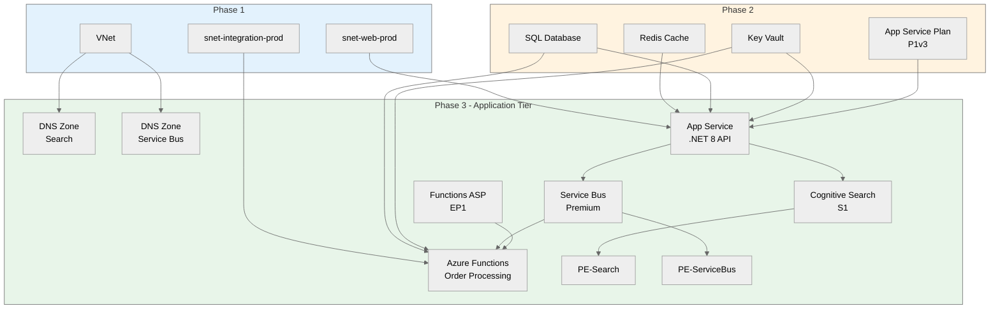

# goal: E-Commerce Platform Phase 3 - Application Tier

## Introduction

This implementation plan covers the application tier for the PCI-DSS compliant e-commerce platform.
Phase 3 deploys App Service (.NET 8 API), Azure Cognitive Search, Service Bus Premium,
and Azure Functions for async order processing. **Depends on Phase 1 (network) and
Phase 2 (platform services).** Region: `swedencentral`.

---

## Resources

### appService

```yaml
name: appService
kind: AVM
avmModule: br/public:avm/res/web/site:0.19.4

purpose: .NET 8 REST API for e-commerce operations
dependsOn: [Phase 2: appServicePlan, keyVault, sqlDatabase, redisCache]

parameters:
  required:
    - name: name
      type: string
      description: Name of the App Service
      example: app-ecommerce-api-prod-swc-001
    - name: serverFarmResourceId
      type: string
      description: Resource ID of the App Service Plan
      example: /subscriptions/.../asp-ecommerce-prod-swc-001
    - name: kind
      type: string
      description: App type
      example: app,linux
  optional:
    - name: location
      type: string
      description: Azure region
      default: swedencentral
    - name: siteConfig
      type: object
      description: Site configuration
      default: |
        {
          linuxFxVersion: 'DOTNETCORE|8.0'
          alwaysOn: true
          http20Enabled: true
          minTlsVersion: '1.2'
          ftpsState: 'Disabled'
          vnetRouteAllEnabled: true
        }
    - name: httpsOnly
      type: bool
      description: HTTPS only
      default: true
    - name: virtualNetworkSubnetId
      type: string
      description: Subnet for VNet integration
      default: snet-web-prod resource ID
    - name: managedIdentities
      type: object
      description: Managed identity configuration
      default: |
        {
          systemAssigned: true
        }
    - name: appSettingsKeyValuePairs
      type: object
      description: Application settings
      default: |
        {
          ASPNETCORE_ENVIRONMENT: 'Production'
          KeyVaultUri: '@Microsoft.KeyVault(...)'
        }

outputs:
  - name: resourceId
    type: string
    description: Resource ID of the App Service
  - name: name
    type: string
    description: Name of the App Service
  - name: defaultHostName
    type: string
    description: Default hostname
  - name: systemAssignedMIPrincipalId
    type: string
    description: Managed identity principal ID

estimatedCost:
  sku: Included in App Service Plan
  monthlyRange: "$0 (uses Phase 2 ASP)"
  costDrivers: [Included in App Service Plan costs]

references:
  docs: https://learn.microsoft.com/azure/app-service/overview
  avm: https://github.com/Azure/bicep-registry-modules/tree/main/avm/res/web/site
```

---

### cognitiveSearch

```yaml
name: cognitiveSearch
kind: AVM
avmModule: br/public:avm/res/search/search-service:0.11.1

purpose: Full-text product search with sub-100ms query performance
dependsOn: [Phase 1: virtualNetwork, nsgData]

parameters:
  required:
    - name: name
      type: string
      description: Name of the Search service
      example: srch-ecommerce-prod-swc-abc123
  optional:
    - name: location
      type: string
      description: Azure region
      default: swedencentral
    - name: sku
      type: string
      description: SKU name
      default: standard
    - name: replicaCount
      type: int
      description: Number of replicas
      default: 1
    - name: partitionCount
      type: int
      description: Number of partitions
      default: 1
    - name: hostingMode
      type: string
      description: Hosting mode
      default: default
    - name: publicNetworkAccess
      type: string
      description: Public network access
      default: disabled
    - name: privateEndpoints
      type: array
      description: Private endpoint configuration
      default: Deploy to snet-data-prod

outputs:
  - name: resourceId
    type: string
    description: Resource ID of Search service
  - name: name
    type: string
    description: Name of Search service

estimatedCost:
  sku: Standard S1
  monthlyRange: "$250"
  costDrivers: [Replicas, partitions, storage]

references:
  docs: https://learn.microsoft.com/azure/search/search-what-is-azure-search
  avm: https://github.com/Azure/bicep-registry-modules/tree/main/avm/res/search/search-service
```

---

### serviceBus

```yaml
name: serviceBus
kind: AVM
avmModule: br/public:avm/res/service-bus/namespace:0.16.0

purpose: Reliable async order processing queue
dependsOn: [Phase 1: virtualNetwork, nsgIntegration]

parameters:
  required:
    - name: name
      type: string
      description: Name of the Service Bus namespace
      example: sb-ecommerce-prod-swc-abc123
  optional:
    - name: location
      type: string
      description: Azure region
      default: swedencentral
    - name: sku
      type: string
      description: SKU name (Premium for private endpoint)
      default: Premium
    - name: capacity
      type: int
      description: Messaging units
      default: 1
    - name: zoneRedundant
      type: bool
      description: Zone redundancy
      default: true
    - name: publicNetworkAccess
      type: string
      description: Public network access
      default: Disabled
    - name: privateEndpoints
      type: array
      description: Private endpoint configuration
      default: Deploy to snet-integration-prod
    - name: queues
      type: array
      description: Queue definitions
      default: |
        [
          {
            name: 'orders'
            maxSizeInMegabytes: 5120
            requiresDuplicateDetection: true
            deadLetteringOnMessageExpiration: true
          }
        ]

outputs:
  - name: resourceId
    type: string
    description: Resource ID of Service Bus
  - name: name
    type: string
    description: Name of Service Bus namespace

estimatedCost:
  sku: Premium (1 MU)
  monthlyRange: "$668"
  costDrivers: [Messaging units, message operations]

references:
  docs: https://learn.microsoft.com/azure/service-bus-messaging/service-bus-messaging-overview
  avm: https://github.com/Azure/bicep-registry-modules/tree/main/avm/res/service-bus/namespace
```

---

### functionApp

```yaml
name: functionApp
kind: AVM
avmModule: br/public:avm/res/web/site:0.19.4

purpose: Event-driven order processing triggered by Service Bus
dependsOn: [Phase 2: keyVault, sqlDatabase; serviceBus]

parameters:
  required:
    - name: name
      type: string
      description: Name of the Function App
      example: func-ecommerce-orders-prod-swc-001
    - name: serverFarmResourceId
      type: string
      description: Resource ID of Functions App Service Plan (EP1)
      example: /subscriptions/.../asp-func-ecommerce-prod-swc-001
    - name: kind
      type: string
      description: App type
      example: functionapp,linux
  optional:
    - name: location
      type: string
      description: Azure region
      default: swedencentral
    - name: siteConfig
      type: object
      description: Site configuration
      default: |
        {
          linuxFxVersion: 'DOTNET-ISOLATED|8.0'
          alwaysOn: true
          vnetRouteAllEnabled: true
          functionsRuntimeScaleMonitoringEnabled: true
        }
    - name: virtualNetworkSubnetId
      type: string
      description: Subnet for VNet integration
      default: snet-integration-prod resource ID
    - name: managedIdentities
      type: object
      description: Managed identity configuration
      default: |
        {
          systemAssigned: true
        }
    - name: appSettingsKeyValuePairs
      type: object
      description: Function app settings
      default: |
        {
          FUNCTIONS_EXTENSION_VERSION: '~4'
          FUNCTIONS_WORKER_RUNTIME: 'dotnet-isolated'
          ServiceBusConnection__fullyQualifiedNamespace: '<namespace>.servicebus.windows.net'
        }

outputs:
  - name: resourceId
    type: string
    description: Resource ID of the Function App
  - name: systemAssignedMIPrincipalId
    type: string
    description: Managed identity principal ID

estimatedCost:
  sku: Requires separate EP1 plan
  monthlyRange: "$0 (see Functions ASP below)"
  costDrivers: [Executions, compute time]

references:
  docs: https://learn.microsoft.com/azure/azure-functions/functions-overview
  avm: https://github.com/Azure/bicep-registry-modules/tree/main/avm/res/web/site
```

---

### functionsAppServicePlan

```yaml
name: functionsAppServicePlan
kind: AVM
avmModule: br/public:avm/res/web/serverfarm:0.5.0

purpose: Elastic Premium plan for VNet-integrated Functions
dependsOn: [Phase 1: resourceGroup]

parameters:
  required:
    - name: name
      type: string
      description: Name of the Functions App Service Plan
      example: asp-func-ecommerce-prod-swc-001
    - name: sku
      type: object
      description: SKU configuration (EP1 for VNet integration)
      example: |
        {
          name: 'EP1'
          tier: 'ElasticPremium'
          size: 'EP1'
          capacity: 1
        }
  optional:
    - name: location
      type: string
      description: Azure region
      default: swedencentral
    - name: kind
      type: string
      description: Plan kind
      default: elastic
    - name: maximumElasticWorkerCount
      type: int
      description: Max scale out
      default: 10

outputs:
  - name: resourceId
    type: string
    description: Resource ID of the Functions ASP

estimatedCost:
  sku: EP1
  monthlyRange: "$173"
  costDrivers: [Always-on minimum, scale-out instances]

references:
  docs: https://learn.microsoft.com/azure/azure-functions/functions-premium-plan
  avm: https://github.com/Azure/bicep-registry-modules/tree/main/avm/res/web/serverfarm
```

---

### privateDnsZonesPhase3

```yaml
name: privateDnsZonesPhase3
kind: AVM
avmModule: br/public:avm/res/network/private-dns-zone:0.8.0

purpose: Additional DNS zones for Phase 3 services
dependsOn: [Phase 1: virtualNetwork]

zones:
  - privatelink.search.windows.net (Cognitive Search)
  - privatelink.servicebus.windows.net (Service Bus)

estimatedCost:
  sku: N/A
  monthlyRange: "$1/zone/month"
  costDrivers: [DNS zones, queries]

references:
  docs: https://learn.microsoft.com/azure/private-link/private-endpoint-dns
  avm: https://github.com/Azure/bicep-registry-modules/tree/main/avm/res/network/private-dns-zone
```

---

## Cost Estimation

### Monthly Cost Breakdown

| Resource                  | SKU/Tier           | Quantity | Monthly Cost |
| ------------------------- | ------------------ | -------- | ------------ |
| App Service               | (uses Phase 2 ASP) | 1        | $0           |
| Cognitive Search          | Standard S1        | 1        | $250         |
| Service Bus               | Premium (1 MU)     | 1        | $668         |
| Functions ASP             | EP1                | 1        | $173         |
| Function App              | (uses EP1 ASP)     | 1        | $0           |
| Private DNS Zones         | N/A                | 2        | $1           |
| Private Endpoints         | N/A                | 2        | $15          |
| **Phase 3 Total**         |                    |          | **~$1,107**  |
| **Running Total (P1-P3)** |                    |          | **~$1,732**  |

**Cost Note:** Service Bus Premium is expensive but required for private endpoints.
Consider Standard tier if private endpoints are not mandatory for initial deployment.

---

## Resource Dependencies

### Dependency Diagram



### Deployment Order

1. Private DNS Zones (Search, Service Bus)
2. Functions App Service Plan (EP1)
3. Cognitive Search with private endpoint
4. Service Bus with private endpoint and queue
5. App Service with VNet integration
6. Function App with VNet integration
7. RBAC role assignments for managed identities

---

## Implementation Plan

### Phase 3 — Application Tier

**Objective:** Deploy application services with VNet integration and managed identities

- IMPLEMENT-GOAL-003: Deploy App Service, Search, Service Bus, Functions

| Task     | Description               | Action                                            |
| -------- | ------------------------- | ------------------------------------------------- |
| TASK-014 | Create Search module      | `modules/cognitive-search.bicep` with PE          |
| TASK-015 | Create Service Bus module | `modules/service-bus.bicep` with PE + queue       |
| TASK-016 | Create App Service module | `modules/app-service.bicep` with VNet integration |
| TASK-017 | Create Functions module   | `modules/functions.bicep` with EP1 plan           |
| TASK-018 | Create RBAC module        | `modules/rbac.bicep` for managed identity roles   |
| TASK-019 | Update main.bicep         | Add Phase 3 module references                     |
| TASK-020 | Validate deployment       | Run `bicep build` and `bicep lint`                |

---

## Updated File Structure

```
infra/bicep/ecommerce/
├── main.bicep
├── main.bicepparam
├── modules/
│   ├── network.bicep           # Phase 1
│   ├── nsg.bicep               # Phase 1
│   ├── private-dns.bicep       # Phase 2 + 3
│   ├── key-vault.bicep         # Phase 2
│   ├── sql.bicep               # Phase 2
│   ├── redis.bicep             # Phase 2
│   ├── app-service-plan.bicep  # Phase 2
│   ├── cognitive-search.bicep  # Phase 3 (NEW)
│   ├── service-bus.bicep       # Phase 3 (NEW)
│   ├── app-service.bicep       # Phase 3 (NEW)
│   ├── functions.bicep         # Phase 3 (NEW)
│   └── rbac.bicep              # Phase 3 (NEW)
└── README.md
```

---

## RBAC Role Assignments

Managed identities need these roles:

| Principal      | Role                            | Scope            | Purpose                 |
| -------------- | ------------------------------- | ---------------- | ----------------------- |
| App Service MI | Key Vault Secrets User          | Key Vault        | Read connection strings |
| App Service MI | SQL DB Contributor              | SQL Database     | Query execution         |
| App Service MI | Azure Service Bus Data Sender   | Service Bus      | Send order messages     |
| App Service MI | Search Index Data Reader        | Cognitive Search | Execute search queries  |
| Functions MI   | Key Vault Secrets User          | Key Vault        | Read connection strings |
| Functions MI   | SQL DB Contributor              | SQL Database     | Update order status     |
| Functions MI   | Azure Service Bus Data Receiver | Service Bus      | Receive order messages  |

---

## Private Endpoint Configuration

| Service          | Private Endpoint       | Subnet                | DNS Zone                           |
| ---------------- | ---------------------- | --------------------- | ---------------------------------- |
| Cognitive Search | pe-srch-ecommerce-prod | snet-data-prod        | privatelink.search.windows.net     |
| Service Bus      | pe-sb-ecommerce-prod   | snet-integration-prod | privatelink.servicebus.windows.net |

---

## Testing Strategy

### Validation Steps

| Phase           | Validation Method  | Success Criteria  | Tools            |
| --------------- | ------------------ | ----------------- | ---------------- |
| Pre-deployment  | Bicep build & lint | No errors         | bicep CLI        |
| Post-deployment | App Service health | Returns 200 OK    | curl             |
| Post-deployment | Search index query | Results returned  | REST API         |
| Post-deployment | Service Bus queue  | Messages enqueue  | Azure Portal     |
| Post-deployment | Function trigger   | Function executes | Log Analytics    |
| Functional      | End-to-end order   | Order processed   | Integration test |

### Validation Commands

```bash
# Check App Service health
curl -I https://app-ecommerce-api-prod-swc-001.azurewebsites.net/health

# Verify managed identity has Key Vault access
az webapp identity show \
  --name app-ecommerce-api-prod-swc-001 \
  --resource-group rg-ecommerce-prod-swc

# Check Service Bus queue
az servicebus queue show \
  --namespace-name sb-ecommerce-prod-swc-abc123 \
  --name orders \
  --resource-group rg-ecommerce-prod-swc
```

---

## Rollback Strategy

**If Phase 3 deployment fails:**

1. App Service and Functions can be deleted without affecting Phase 2
2. Service Bus queues may have messages - drain before delete if needed
3. Cognitive Search indexes need re-creation if deleted

```bash
# Delete Phase 3 resources only
az resource delete --ids <app-service-id>
az resource delete --ids <function-app-id>
az resource delete --ids <search-service-id>
az resource delete --ids <service-bus-id>
```

---

## Next Phase (Out of Scope)

| Phase   | Resources                                               | Uses Phase 3 Outputs             |
| ------- | ------------------------------------------------------- | -------------------------------- |
| Phase 4 | Front Door, App Insights, Log Analytics, Static Web App | Front Door routes to App Service |

---

## High-Level Design

Phase 3 completes the application tier with:

- **App Service**: .NET 8 REST API with VNet integration to web subnet, managed identity for secure service access
- **Cognitive Search S1**: Product catalog search with <100ms queries via private endpoint
- **Service Bus Premium**: Reliable order queue with dead-letter handling, zone redundant
- **Azure Functions EP1**: VNet-integrated order processor triggered by Service Bus queue

All services use managed identities for authentication, eliminating stored credentials and meeting PCI-DSS requirements.
