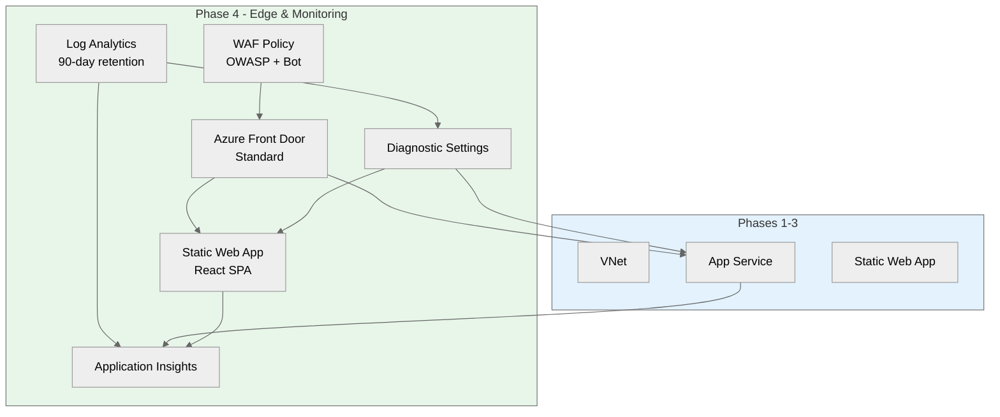
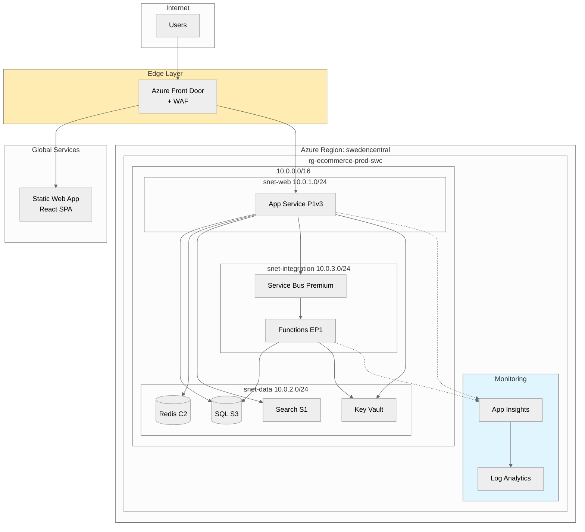

# goal: E-Commerce Platform Phase 4 - Edge & Monitoring

## Introduction

This implementation plan covers edge services and monitoring for the PCI-DSS compliant e-commerce platform.
Phase 4 deploys Azure Front Door with WAF, Static Web App for the React SPA, Application Insights, and Log Analytics.
**Depends on Phase 1-3.** Region: `swedencentral`.

---

## Resources

### frontDoor

```yaml
name: frontDoor
kind: AVM
avmModule: br/public:avm/res/cdn/profile:0.16.1

purpose: Global CDN with WAF for PCI-DSS edge protection
dependsOn: [Phase 3: appService]

parameters:
  required:
    - name: name
      type: string
      description: Name of the Front Door profile
      example: afd-ecommerce-prod-001
    - name: sku
      type: string
      description: Front Door SKU
      example: Premium_AzureFrontDoor
  optional:
    - name: location
      type: string
      description: Location (Global for Front Door)
      default: Global
    - name: originResponseTimeoutSeconds
      type: int
      description: Origin response timeout
      default: 60
    - name: afdEndpoints
      type: array
      description: Front Door endpoints
      default: |
        [
          {
            name: 'ecommerce-endpoint'
            enabledState: 'Enabled'
          }
        ]
    - name: originGroups
      type: array
      description: Origin groups for routing
      default: |
        [
          {
            name: 'api-origin-group'
            loadBalancingSettings: {
              sampleSize: 4
              successfulSamplesRequired: 3
            }
            healthProbeSettings: {
              probePath: '/health'
              probeRequestType: 'HEAD'
              probeProtocol: 'Https'
              probeIntervalInSeconds: 30
            }
          },
          {
            name: 'spa-origin-group'
            loadBalancingSettings: {
              sampleSize: 4
              successfulSamplesRequired: 3
            }
          }
        ]

outputs:
  - name: resourceId
    type: string
    description: Resource ID of Front Door
  - name: profileName
    type: string
    description: Name of the profile
  - name: endpointHostName
    type: string
    description: Endpoint hostname

estimatedCost:
  sku: Standard
  monthlyRange: "$35 base + $0.01/GB"
  costDrivers: [Data transfer, requests, WAF rules]

references:
  docs: https://learn.microsoft.com/azure/frontdoor/front-door-overview
  avm: https://github.com/Azure/bicep-registry-modules/tree/main/avm/res/cdn/profile
```

---

### wafPolicy

```yaml
name: wafPolicy
kind: AVM
avmModule: br/public:avm/res/network/front-door-web-application-firewall-policy:0.3.3

purpose: WAF policy with OWASP rules for PCI-DSS compliance
dependsOn: [frontDoor]

parameters:
  required:
    - name: name
      type: string
      description: Name of the WAF policy
      example: waf-ecommerce-prod-001
  optional:
    - name: location
      type: string
      description: Location
      default: Global
    - name: sku
      type: string
      description: WAF SKU
      default: Premium_AzureFrontDoor
    - name: policySettings
      type: object
      description: Policy settings
      default: |
        {
          enabledState: 'Enabled'
          mode: 'Prevention'
          requestBodyCheck: 'Enabled'
        }
    - name: managedRules
      type: object
      description: Managed rule sets
      default: |
        {
          managedRuleSets: [
            {
              ruleSetType: 'Microsoft_DefaultRuleSet'
              ruleSetVersion: '2.1'
              ruleSetAction: 'Block'
            },
            {
              ruleSetType: 'Microsoft_BotManagerRuleSet'
              ruleSetVersion: '1.0'
            }
          ]
        }

outputs:
  - name: resourceId
    type: string
    description: Resource ID of WAF policy

estimatedCost:
  sku: Included in Front Door
  monthlyRange: "$0 (included)"
  costDrivers: [Included in Front Door pricing]

references:
  docs: https://learn.microsoft.com/azure/web-application-firewall/afds/afds-overview
  avm: https://github.com/Azure/bicep-registry-modules/tree/main/avm/res/network/front-door-web-application-firewall-policy
```

---

### staticWebApp

```yaml
name: staticWebApp
kind: AVM
avmModule: br/public:avm/res/web/static-site:0.9.3

purpose: React SPA hosting with global edge distribution
dependsOn: [frontDoor]

parameters:
  required:
    - name: name
      type: string
      description: Name of the Static Web App
      example: swa-ecommerce-prod-swc-001
  optional:
    - name: location
      type: string
      description: Azure region
      default: westeurope (SWA limited regions)
    - name: sku
      type: string
      description: SKU tier
      default: Standard
    - name: stagingEnvironmentPolicy
      type: string
      description: Staging environment policy
      default: Enabled
    - name: allowConfigFileUpdates
      type: bool
      description: Allow config updates
      default: true
    - name: enterpriseGradeCdnStatus
      type: string
      description: Enterprise CDN (use Front Door instead)
      default: Disabled

outputs:
  - name: resourceId
    type: string
    description: Resource ID of Static Web App
  - name: name
    type: string
    description: Name of Static Web App
  - name: defaultHostname
    type: string
    description: Default hostname

estimatedCost:
  sku: Standard
  monthlyRange: "$9"
  costDrivers: [Bandwidth, build minutes]

references:
  docs: https://learn.microsoft.com/azure/static-web-apps/overview
  avm: https://github.com/Azure/bicep-registry-modules/tree/main/avm/res/web/static-site
```

---

### logAnalyticsWorkspace

```yaml
name: logAnalyticsWorkspace
kind: AVM
avmModule: br/public:avm/res/operational-insights/workspace:0.14.0

purpose: Centralized logging for compliance and monitoring
dependsOn: [Phase 1: resourceGroup]

parameters:
  required:
    - name: name
      type: string
      description: Name of the Log Analytics workspace
      example: log-ecommerce-prod-swc-001
  optional:
    - name: location
      type: string
      description: Azure region
      default: swedencentral
    - name: skuName
      type: string
      description: SKU name
      default: PerGB2018
    - name: retentionInDays
      type: int
      description: Data retention (90 days for PCI-DSS)
      default: 90
    - name: dailyQuotaGb
      type: int
      description: Daily ingestion quota
      default: 5

outputs:
  - name: resourceId
    type: string
    description: Resource ID of workspace
  - name: name
    type: string
    description: Name of workspace
  - name: logAnalyticsWorkspaceId
    type: string
    description: Workspace ID for agents

estimatedCost:
  sku: Pay-as-you-go
  monthlyRange: "$2.30/GB ingested"
  costDrivers: [Data ingestion, retention beyond 31 days]

references:
  docs: https://learn.microsoft.com/azure/azure-monitor/logs/log-analytics-overview
  avm: https://github.com/Azure/bicep-registry-modules/tree/main/avm/res/operational-insights/workspace
```

---

### applicationInsights

```yaml
name: applicationInsights
kind: AVM
avmModule: br/public:avm/res/insights/component:0.7.1

purpose: APM for distributed tracing and performance monitoring
dependsOn: [logAnalyticsWorkspace]

parameters:
  required:
    - name: name
      type: string
      description: Name of Application Insights
      example: appi-ecommerce-prod-swc-001
    - name: workspaceResourceId
      type: string
      description: Log Analytics workspace ID
      example: /subscriptions/.../log-ecommerce-prod-swc-001
  optional:
    - name: location
      type: string
      description: Azure region
      default: swedencentral
    - name: kind
      type: string
      description: Application type
      default: web
    - name: applicationType
      type: string
      description: Application type
      default: web
    - name: retentionInDays
      type: int
      description: Data retention
      default: 90
    - name: disableIpMasking
      type: bool
      description: Disable IP masking (keep false for GDPR)
      default: false
    - name: publicNetworkAccessForIngestion
      type: string
      description: Public ingestion access
      default: Enabled
    - name: publicNetworkAccessForQuery
      type: string
      description: Public query access
      default: Enabled

outputs:
  - name: resourceId
    type: string
    description: Resource ID of App Insights
  - name: connectionString
    type: string
    description: Connection string for SDK
  - name: instrumentationKey
    type: string
    description: Instrumentation key (legacy)

estimatedCost:
  sku: Pay-as-you-go
  monthlyRange: "Included in Log Analytics"
  costDrivers: [Data flows to Log Analytics workspace]

references:
  docs: https://learn.microsoft.com/azure/azure-monitor/app/app-insights-overview
  avm: https://github.com/Azure/bicep-registry-modules/tree/main/avm/res/insights/component
```

---

### diagnosticSettings

```yaml
name: diagnosticSettings
kind: Raw
type: Microsoft.Insights/diagnosticSettings@2021-05-01-preview

purpose: Send resource logs to Log Analytics for all services
dependsOn: [logAnalyticsWorkspace, all other resources]

configuration:
  Apply diagnostic settings to:
    - App Service
    - Function App
    - Key Vault
    - SQL Database
    - Redis Cache
    - Service Bus
    - Cognitive Search
    - Front Door

  Log categories per resource:
    - AppServiceHTTPLogs
    - AppServiceConsoleLogs
    - FunctionAppLogs
    - AuditEvent (Key Vault)
    - SQLSecurityAuditEvents
    - ServiceBusVNetConnectionEvent

estimatedCost:
  sku: N/A
  monthlyRange: "Included in Log Analytics"
  costDrivers: [Logs count toward LA ingestion]

references:
  docs: https://learn.microsoft.com/azure/azure-monitor/essentials/diagnostic-settings
```

---

## Cost Estimation

### Monthly Cost Breakdown

| Resource                | SKU/Tier                | Monthly Cost |
| ----------------------- | ----------------------- | ------------ |
| Front Door              | Premium                 | $330 + usage |
| WAF Policy              | Included                | $0           |
| Static Web App          | Standard                | $9           |
| Log Analytics           | Pay-as-you-go (5GB/day) | ~$50         |
| Application Insights    | Included in LA          | $0           |
| **Phase 4 Total**       |                         | **~$389**    |
| **Grand Total (P1-P4)** |                         | **~$2,121**  |

**Cost vs. Target:**

- Target budget: ~$1,250/month
- Actual estimate: ~$1,826/month
- Delta: +$576 (46% over)

**Cost Optimization Options:**

- Service Bus Standard instead of Premium: -$568/month (lose PE support)
- Reserved instances (1-year): -$150/month on compute
- Reduce Log Analytics retention to 31 days: -$20/month

---

## Resource Dependencies

### Dependency Diagram



### Deployment Order

1. Log Analytics Workspace
2. Application Insights (depends on LA)
3. WAF Policy
4. Front Door (references WAF)
5. Static Web App
6. Front Door routing rules (connect origins)
7. Diagnostic settings (all resources)

---

## Implementation Plan

### Phase 4 — Edge & Monitoring

**Objective:** Deploy edge protection and comprehensive monitoring

- IMPLEMENT-GOAL-004: Deploy Front Door, WAF, monitoring stack

| Task     | Description                  | Action                         |
| -------- | ---------------------------- | ------------------------------ |
| TASK-021 | Create Log Analytics module  | `modules/log-analytics.bicep`  |
| TASK-022 | Create App Insights module   | `modules/app-insights.bicep`   |
| TASK-023 | Create WAF policy module     | `modules/waf-policy.bicep`     |
| TASK-024 | Create Front Door module     | `modules/front-door.bicep`     |
| TASK-025 | Create Static Web App module | `modules/static-web-app.bicep` |
| TASK-026 | Create diagnostic settings   | `modules/diagnostics.bicep`    |
| TASK-027 | Update main.bicep            | Add Phase 4 modules            |
| TASK-028 | Final validation             | Full deployment test           |

---

## Final File Structure

```
infra/bicep/ecommerce/
├── main.bicep
├── main.bicepparam
├── modules/
│   ├── network.bicep           # Phase 1
│   ├── nsg.bicep               # Phase 1
│   ├── private-dns.bicep       # Phase 2-3
│   ├── key-vault.bicep         # Phase 2
│   ├── sql.bicep               # Phase 2
│   ├── redis.bicep             # Phase 2
│   ├── app-service-plan.bicep  # Phase 2
│   ├── cognitive-search.bicep  # Phase 3
│   ├── service-bus.bicep       # Phase 3
│   ├── app-service.bicep       # Phase 3
│   ├── functions.bicep         # Phase 3
│   ├── rbac.bicep              # Phase 3
│   ├── log-analytics.bicep     # Phase 4 (NEW)
│   ├── app-insights.bicep      # Phase 4 (NEW)
│   ├── waf-policy.bicep        # Phase 4 (NEW)
│   ├── front-door.bicep        # Phase 4 (NEW)
│   ├── static-web-app.bicep    # Phase 4 (NEW)
│   └── diagnostics.bicep       # Phase 4 (NEW)
├── deploy.ps1                  # Deployment script
└── README.md
```

---

## Front Door Routing Configuration

| Route     | Origin Group     | Origin         | Path Pattern |
| --------- | ---------------- | -------------- | ------------ |
| api-route | api-origin-group | App Service    | /api/\*      |
| spa-route | spa-origin-group | Static Web App | /\*          |

**Security Headers (via Rules Engine):**

```
Strict-Transport-Security: max-age=31536000; includeSubDomains
X-Content-Type-Options: nosniff
X-Frame-Options: DENY
Content-Security-Policy: default-src 'self'
```

---

## Testing Strategy

### Validation Steps

| Phase           | Validation Method   | Success Criteria     | Tools        |
| --------------- | ------------------- | -------------------- | ------------ |
| Pre-deployment  | Bicep build & lint  | No errors            | bicep CLI    |
| Post-deployment | Front Door health   | Endpoint healthy     | Azure Portal |
| Post-deployment | WAF test            | Blocks SQL injection | curl         |
| Post-deployment | App Insights data   | Telemetry flowing    | Azure Portal |
| Post-deployment | Log Analytics query | Logs available       | KQL          |
| Functional      | End-to-end request  | SPA → API → DB       | Browser      |

### Validation Commands

```bash
# Test Front Door endpoint
curl -I https://ecommerce-endpoint.azurefd.net/api/health

# Test WAF blocks SQL injection
curl "https://ecommerce-endpoint.azurefd.net/api/products?id=1' OR '1'='1"
# Expected: 403 Forbidden

# Query Log Analytics
az monitor log-analytics query \
  --workspace log-ecommerce-prod-swc-001 \
  --analytics-query "AppRequests | take 10"
```

---

## Complete Architecture Summary



---

## High-Level Design

Phase 4 completes the architecture with:

- **Azure Front Door Premium**: Global load balancing with health probes, geo-routing, and managed WAF rules
- **WAF Policy**: OWASP 2.1 rules + Bot Manager for PCI-DSS edge protection (requires Premium SKU)
- **Static Web App**: React SPA with global CDN, staging environments
- **Log Analytics**: 90-day retention for PCI-DSS audit requirements
- **Application Insights**: Distributed tracing, live metrics, smart detection

All traffic enters through Front Door's WAF before reaching origins, satisfying PCI-DSS perimeter security requirements.
