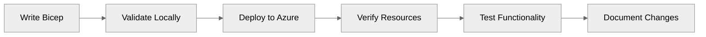
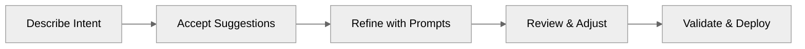

# Agentic InfraOps - Copilot Instructions

This file provides context and guidance for GitHub Copilot when assisting with this repository.

> **Agentic InfraOps** - Azure infrastructure engineered by agents. Verified. Well-Architected. Deployable.

## Quick Reference for AI Agents

**Essential Knowledge for Immediate Productivity:**

1. **Default Region**: Always use `swedencentral` (alternative: `germanywestcentral` when encountering quota issues)
2. **Unique Resource Names**: Generate `var uniqueSuffix = uniqueString(resourceGroup().id)` in main.bicep,
   pass to ALL modules
3. **Name Length Limits**: Key Vault ≤24 chars, Storage ≤24 chars (no hyphens), SQL ≤63 chars
4. **Azure SQL Auth Policy**: Azure AD-only auth for SQL Server
5. **Zone Redundancy**: App Service Plans need P1v4 SKU (not S1/P1v2) for zone redundancy
6. **Four-Step Workflow**: `@plan` → `azure-principal-architect` → `bicep-plan` → `bicep-implement`
   (each step requires approval)
7. **Deploy Script Pattern**: Use `[CmdletBinding(SupportsShouldProcess)]` + `$WhatIfPreference`
   (NOT explicit `$WhatIf` param)
8. **Dev Container**: Pre-configured Ubuntu 24.04 with all tools (Terraform, Azure CLI, Bicep, PowerShell 7)
9. **Line Endings**: Use `.gitattributes` with `* text=auto eol=lf` for cross-platform consistency

**Critical Files:**

- Agent definitions: `.github/agents/*.agent.md`
- Workflow guide: `docs/workflow/WORKFLOW.md`
- Quick start: `docs/guides/quickstart.md`
- Troubleshooting: `docs/guides/troubleshooting.md`
- Bicep implement agent: `.github/agents/bicep-implement.agent.md` (has unique suffix guidance)
- Diagram generator: `.github/agents/diagram-generator.agent.md` (Python architecture diagrams)
- Dev container config: `.devcontainer/devcontainer.json`
- Line ending rules: `.gitattributes` (normalizes CRLF→LF for cross-platform development)
- MCP configuration: `.vscode/mcp.json` (Azure Pricing MCP server)
- MCP server source: `mcp/azure-pricing-mcp/` (real-time Azure pricing tools)

## Regional Selection Guidelines

**Default Region**: `swedencentral` (sustainable operations with renewable energy)

**Alternative Region**: `germanywestcentral` (when encountering quota issues)

**When to Use Other Regions:**

### Geographic Latency Optimization

- **Americas**: Use `eastus`, `eastus2`, `westus2`, or `centralus` for users primarily in North/South America
- **Asia Pacific**: Use `southeastasia`, `eastasia`, or `australiaeast` for users in APAC region
- **Europe (other alternatives)**: Use `northeurope` if swedencentral/germanywestcentral don't meet requirements

### Compliance & Data Sovereignty

- **Germany**: Use `germanywestcentral` for German data residency requirements
- **Switzerland**: Use `switzerlandnorth` for Swiss banking/healthcare regulations
- **UK**: Use `uksouth` or `ukwest` for UK GDPR requirements
- **France**: Use `francecentral` for French data sovereignty
- **Specific Regulations**: Check compliance requirements at [Azure Compliance](https://learn.microsoft.com/azure/compliance/)

### Service Availability

- **Preview Features**: Some Azure preview features may only be available in specific regions
  (typically `eastus`, `westus2`, `swedencentral`)
- **VM/Database SKUs**: Not all VM sizes or database tiers are available in all regions
- **Check Availability**: Use [Azure Products by Region](https://azure.microsoft.com/global-infrastructure/services/)
  to verify service availability
- **Availability Zones**: Ensure the selected region supports availability zones if zone redundancy is required

### Cost Optimization

- Some regions have lower pricing for compute and storage resources
- Use Azure Pricing MCP tools (`azure_region_recommend`) for real-time regional price comparison
- Fallback: [Azure Pricing Calculator](https://azure.microsoft.com/pricing/calculator/) for manual estimates
- Consider egress costs for data transfer between regions

**Best Practice**: When deviating from `swedencentral`,
document the reason (latency/compliance/availability) in deployment parameters or README.

## Repository Purpose

**Agentic InfraOps** revolutionizes how IT Pros build Azure environments.
Powered by GitHub Copilot and coordinated AI agents,
it transforms requirements into architecture diagrams, validated designs, and deploy-ready Bicep/Terraform templates—all
aligned with Azure Well-Architected best practices and Azure Verified Modules.

The target audience is:

- **Primary**: System Integrator (SI) partners delivering Azure infrastructure projects
- **Secondary**: IT Pros learning cloud/IaC, customers evaluating agentic workflows

## Four-Step Agent Workflow Architecture

This repository uses a **4-step agent workflow** for Azure infrastructure development,
with optional pricing and diagram integrations:

```mermaid
%%{init: {'theme':'neutral'}}%%
graph LR
    P["@plan"] --> A[azure-principal-architect]
    A --> B[bicep-plan]
    B --> I[bicep-implement]
    MCP["💰 Azure Pricing MCP"] -.->|real-time costs| A
    MCP -.->|cost validation| B
    D[diagram-generator] -.->|visualization| A
    ADR[adr-generator] -.->|decisions| A
```



| Step | Agent                       | Purpose                                             | Optional Integrations            |
| ---- | --------------------------- | --------------------------------------------------- | -------------------------------- |
| 1    | `@plan` (Built-in)          | Create implementation plans with cost estimates     | -                                |
| 2    | `azure-principal-architect` | Azure Well-Architected Framework guidance (NO CODE) | 💰 Pricing MCP, 📊 Diagrams, ADR |
| 3    | `bicep-plan`                | Infrastructure planning with AVM modules            | 💰 Pricing MCP                   |
| 4    | `bicep-implement`           | Bicep code generation                               | ADR                              |

**Optional Integrations (during Step 2: Architecture):**

- **💰 Azure Pricing MCP** - Real-time Azure pricing via MCP server (automatic)
- **📊 diagram-generator** - Python architecture diagrams (ask: "generate diagram")
- **📝 adr-generator** - Document architectural decisions (ask: "create ADR")

**How to Use Custom Agents:**

1. Press `Ctrl+Shift+A` or click the **Agent** button in Copilot Chat
2. Select agent from dropdown: `@plan`, `azure-principal-architect`, `bicep-plan`, `bicep-implement`,
   `diagram-generator`, or `adr-generator`
3. Type your prompt and submit
4. **Wait for approval prompt** before proceeding to next step

**Recommended Workflow:**

```
Step 1: @plan (START HERE)
Prompt: Create deployment plan for HIPAA-compliant patient portal
[Plan agent generates requirements]
→ Approve to continue

Step 2: azure-principal-architect
[Provides WAF assessment with scores - NO CODE CREATION]
→ Approve to continue
→ Optional: Click "Generate Architecture Diagram" for visual

Step 3: bicep-plan
[Creates implementation plan in .bicep-planning-files/]
→ Approve to continue

Step 4: bicep-implement
[Generates Bicep templates, validates with bicep build/lint]
→ Approve to deploy or finalize
→ Optional: Click "Generate Architecture Diagram" for documentation
```

**Quick Workflow (Skip @plan):**

```
Step 1: azure-principal-architect
Prompt: Assess HIPAA-compliant patient portal architecture
→ Approve

Step 2: bicep-plan
Prompt: Create implementation plan with AVM modules
→ Approve

Step 3: bicep-implement
Prompt: Generate Bicep templates from the plan
→ Approve and deploy
```

📖 **Full Documentation:** See `docs/workflow/WORKFLOW.md`

**Critical Agent Behaviors:**

- **All agents require approval** before proceeding to next step (reply "yes", "approve", or provide feedback)
- **azure-principal-architect does NOT create code** - only provides architectural guidance
- **All agents default to `swedencentral` region** (alternative: `germanywestcentral`), unless explicitly specified
- **Bicep agents ALWAYS generate unique resource name suffixes** using `uniqueString(resourceGroup().id)`
  to prevent naming collisions
- **Key Vault names**: Must be ≤24 chars (pattern: `kv-{shortname}-{env}-{suffix}`)
- **App Service Plans**: Use P1v4 (Premium) or higher for zone redundancy (Standard SKU doesn't support it)
- **SQL Server**: Use Azure AD-only auth and grant logged in user appropriate admin permissions

## Repository Structure

```
azure-agentic-infraops/
├── .devcontainer/                       # Pre-configured dev environment
│   └── devcontainer.json                # Container configuration
├── .github/
│   ├── agents/                          # 5 custom agents (Plan is built-in)
│   │   ├── adr-generator.agent.md
│   │   ├── azure-principal-architect.agent.md
│   │   ├── bicep-plan.agent.md
│   │   ├── bicep-implement.agent.md
│   │   ├── diagram-generator.agent.md
│   │   └── infrastructure-specialist.agent.md  # Unified agent (optional)
│   └── copilot-instructions.md          # THIS FILE - AI agent guidance
├── .bicep-planning-files/               # Generated implementation plans
├── infra/bicep/                         # Generated Bicep templates
├── scenarios/
│   ├── README.md                        # Scenarios index
│   ├── S01-S09.../                      # Comprehensive scenarios
│   └── S10-quick-demos/                 # Simple prompt demos
└── docs/
    ├── README.md                        # Documentation hub
    ├── guides/                          # All guides consolidated
    │   ├── quickstart.md                # Quick start guide
    │   ├── copilot-getting-started.md   # Copilot setup guide
    │   ├── copilot-best-practices.md    # Copilot best practices
    │   └── troubleshooting.md           # Troubleshooting guide
    ├── workflow/
    │   └── WORKFLOW.md                  # Workflow documentation
    ├── value-proposition/               # ROI, time savings evidence
    ├── cost-estimates/                  # Azure pricing examples
    ├── adr/                             # Architecture Decision Records
    ├── diagrams/                        # Generated architecture diagrams
    └── presenter-toolkit/               # Demo delivery guides
```

### Naming Conventions

- **Resource Groups**: `rg-<project>-<env>`
- **Virtual Networks**: `vnet-<env>-<purpose>-<region>`
- **Subnets**: `snet-<tier>-<env>`
- **Storage Accounts**: `st<project><env><random>`
- **NSGs**: `nsg-<subnet>-<env>`

### Tags Required

All Azure resources should include:

```bicep
tags: {
  Environment: string    // dev, staging, prod
  ManagedBy: 'Bicep'    // or 'Terraform', 'ARM'
  Project: string       // Project name
  Owner: string         // Team or individual
  CostCenter: string    // Billing allocation (optional)
}
```

## Copilot Guidance for Code Generation

### Bicep Templates

When generating Bicep code:

1. **Always use latest API versions** (2023-05-01 or newer)
2. **Default location**: `swedencentral` (alternative: `germanywestcentral` if quota issues)
3. **CRITICAL - Unique resource names**: Generate suffix in main.bicep and pass to ALL modules:

   ```bicep
   var uniqueSuffix = uniqueString(resourceGroup().id)
   ```

4. **Name length constraints**:
   - Key Vault: ≤24 chars (e.g., `kv-contosop-dev-abc123` = 22 chars)
   - Storage Account: ≤24 chars, lowercase + numbers only, NO hyphens
   - SQL Server: ≤63 chars, lowercase + numbers + hyphens
5. **Include security by default**:
   - `supportsHttpsTrafficOnly: true`
   - `minimumTlsVersion: 'TLS1_2'`
   - `allowBlobPublicAccess: false`
   - NSG deny rules at priority 4096
6. **Azure Policy compliance for demos**:
   - SQL Server: UseAzure AD-only auth
   - App Service Plan: Use P1v4 (not S1/P1v2) for zone redundancy support
7. **Add descriptive comments** for all parameters and resources
8. **Include outputs** for resource IDs AND resource names (both are needed for downstream modules)
9. **Follow modular design** (separate files for network, storage, compute)
10. **Use symbolic references** for implicit dependencies (avoid explicit `dependsOn` unless necessary)
11. **Use `existing` keyword** when referencing resources in diagnostic settings or extension resources

Example parameter documentation:

```bicep
@description('Azure region for all resources')
@allowed([
  'swedencentral'
  'germanywestcentral'
  'northeurope'
])
param location string = 'swedencentral'

@description('Unique suffix for resource naming (generated from resource group ID)')
param uniqueSuffix string

@description('Environment name (dev, staging, prod)')
@allowed([
  'dev'
  'staging'
  'prod'
  'demo'
])
param environment string = 'dev'
```

### PowerShell Scripts

When generating PowerShell code:

1. **Use approved verbs** (Get-, Set-, New-, Remove-)
2. **Include comment-based help** with `.SYNOPSIS`, `.DESCRIPTION`, `.EXAMPLE`
3. **Add parameter validation**:

   ```powershell
   [Parameter(Mandatory = $true)]
   [ValidateNotNullOrEmpty()]
   [string]$ResourceGroupName
   ```

4. **Implement error handling** with `try/catch`
5. **Set strict mode**: `Set-StrictMode -Version Latest`
6. **Use splatting** for complex commands
7. **Add colored output** for better UX

### Documentation (Markdown)

**BEFORE generating any markdown, read `.github/instructions/markdown.instructions.md` and `docs/guides/markdown-style-guide.md`**

When generating documentation:

1. **Follow markdown standards** (ATX headers, 120-char line length, fenced code blocks with language)
2. **Use Mermaid diagrams** for architecture and workflows
3. **Include metrics** for time savings (e.g., "45 min → 10 min (78% reduction)")
4. **Add prerequisites** section with tool versions
5. **Provide multiple examples** (quick start, detailed walkthrough)
6. **Use emoji sparingly** for visual hierarchy (✅ ❌ ⚠️ 💡 🚀)
7. **Include troubleshooting** section
8. **Validate before committing**: Run `markdownlint '**/*.md' --ignore node_modules --config .markdownlint.json`

## Value Messaging

**Core Value Proposition**: "Agentic InfraOps is an **efficiency multiplier** for IT Pros,
reducing infrastructure development time by 60-90% while delivering Well-Architected,
deploy-ready Azure infrastructure through coordinated AI agents."

📊 **Time Savings Metrics**: See `docs/time-savings-evidence.md` for detailed methodology and scenario-specific data.

🎯 **Real-World Portfolio**: See `docs/copilot-portfolio-showcase.md` for actual projects built using agentic workflows.

**Messaging Focus**: Agentic Workflow (coordinated agents) • Well-Architected (Azure WAF aligned) •
Verified Modules (AVM) • Deploy-Ready (validated templates)

## Copilot Prompting Best Practices

### Effective Prompt Patterns

**For Infrastructure**:

```bicep
// Create an Azure [resource type] with [specific requirements]
// Include [security features]
// Use [parameters/variables]
```

**For Automation**:

```powershell
# Create a function to [task]
# Accept parameters: [list]
# Include error handling and verbose output
```

**For Documentation**:

```markdown
Generate a README for [purpose]
Include: overview, prerequisites, usage examples, troubleshooting
Use Mermaid diagrams for architecture
```

### Prompt Engineering Tips

1. **Be Specific**: "Create a VNet with 3 subnets (10.0.1.0/24, 10.0.2.0/24, 10.0.3.0/24)"
2. **Mention Security**: "with HTTPS only, TLS 1.2 minimum, no public access"
3. **Use Iterative Refinement**: Build complexity in steps
4. **Reference Context**: "use the subnet ID from the network module"
5. **Describe Intent**: "secure storage for application data" vs. "storage account"

## Common Patterns

### Azure Resource Deployment Workflow



### Copilot-Assisted Development Workflow



## Critical Deployment Patterns

### Resource Naming with Unique Suffixes

**Problem**: Azure resources like Key Vault, Storage Accounts, and SQL Servers require globally unique names.
Without suffixes, deployments fail with naming collisions.

**Solution Pattern:**

```bicep
// main.bicep - Generate suffix once
var uniqueSuffix = uniqueString(resourceGroup().id)

// Pass to all modules
module keyVault 'modules/key-vault.bicep' = {
  params: {
    uniqueSuffix: uniqueSuffix
    // ... other params
  }
}

// modules/key-vault.bicep - Apply to resource names
param uniqueSuffix string
var keyVaultName = 'kv-${take(replace(projectName, '-', ''), 8)}-${take(environment, 3)}-${take(uniqueSuffix, 6)}'
// Result: "kv-contosop-dev-abc123" (22 chars, within 24 limit)
```

**Key Points:**

- Use `take()` to control name length (Key Vault = 24 chars max)
- Remove hyphens for Storage Accounts (no special chars allowed)
- Shorten project names (e.g., "contoso-patient-portal" → "contosop")
- Apply suffix to ALL resources for consistency

### Diagnostic Settings Module Pattern

When creating diagnostic settings, pass resource **names** (not IDs) and use the `existing` keyword:

```bicep
// ❌ WRONG: Resource ID strings cause BCP036 error
module diagnosticsModule 'modules/diagnostics.bicep' = {
  params: {
    appServiceId: appServiceModule.outputs.appServiceId  // This fails!
  }
}

// ✅ CORRECT: Pass resource names, use existing keyword in module
module diagnosticsModule 'modules/diagnostics.bicep' = {
  params: {
    appServiceName: appServiceModule.outputs.appServiceName
    logAnalyticsWorkspaceId: logAnalyticsModule.outputs.workspaceId
  }
}

// In modules/diagnostics.bicep:
param appServiceName string

resource appService 'Microsoft.Web/sites@2023-12-01' existing = {
  name: appServiceName
}

resource diagnostics 'Microsoft.Insights/diagnosticSettings@2021-05-01-preview' = {
  name: 'diag-appservice'
  scope: appService  // ✅ Symbolic reference works
  properties: {
    workspaceId: logAnalyticsWorkspaceId
    logs: [...]
  }
}
```

**Why**: The `scope` property requires a resource symbolic reference, not a string.
Resource IDs are strings and cause `BCP036: The property "scope" expected a value of type "resource | tenant"` errors.

**Module Output Rule**: Always output BOTH `resourceId` AND `resourceName` from modules
to support downstream diagnostic settings.

### Azure Policy Workarounds for Demo Environments

**Common Policy Blockers:**

1. **SQL Server Azure AD-only authentication**: Use `azureADOnlyAuthentication: true`
2. **App Service Plan zone redundancy**: Must use Premium SKU (P1v4 recommended), not Standard
3. **Key Vault name length**: Policy doesn't block, but Azure enforces 24-char limit
4. **WAF matchVariable values**: Use `RequestHeader` (singular) not `RequestHeaders` - valid values are:
   `RemoteAddr`, `RequestMethod`, `QueryString`, `PostArgs`, `RequestUri`, `RequestHeader`, `RequestBody`,
   `Cookies`, `SocketAddr`
5. **WAF policy naming**: Names must start with letter, alphanumeric only (NO hyphens) -
   use `wafpolicy{project}{env}001`
6. **Storage Account allowSharedKeyAccess**: Many orgs block shared key access - use identity-based storage connections
7. **SQL Server diagnostic settings**: Don't use `SQLSecurityAuditEvents` category - use `auditingSettings` resource instead

**Implementation:**

```bicep
param tags object = {
  Environment: environment
  ManagedBy: 'Bicep'
  Project: projectName
  Owner: owner
}
```

### Azure Functions with Identity-Based Storage

When Azure Policy blocks `allowSharedKeyAccess`, use identity-based storage connections:

```bicep
// Storage account - Azure Policy compliant
resource storageAccount 'Microsoft.Storage/storageAccounts@2023-05-01' = {
  properties: {
    allowSharedKeyAccess: false // Required by Azure Policy
  }
}

// Function App with identity-based storage
resource functionApp 'Microsoft.Web/sites@2023-12-01' = {
  identity: { type: 'SystemAssigned' }
  properties: {
    siteConfig: {
      appSettings: [
        { name: 'AzureWebJobsStorage__accountName', value: storageAccount.name }
        { name: 'WEBSITE_RUN_FROM_PACKAGE', value: '1' }
        { name: 'FUNCTIONS_EXTENSION_VERSION', value: '~4' }
      ]
    }
  }
}

// Required RBAC roles for identity-based storage access
// Grant to Function App managed identity:
// - Storage Blob Data Owner (for blob triggers)
// - Storage Queue Data Contributor (for durable functions)
// - Storage Table Data Contributor (for durable functions checkpoints)
```

### Progressive Deployment Pattern

For complex infrastructure (10+ resources, multiple modules):

**Phase 1**: Foundation (networking, NSGs)
**Phase 2**: Platform services (Key Vault, SQL Server, App Service Plan)
**Phase 3**: Application tier (App Service, databases, private endpoints)
**Phase 4**: Configuration (secrets, RBAC, monitoring)

Between each phase: `bicep build` → `bicep lint` → `az deployment` → validate resources exist

**Why**: Helps isolate dependency issues, provides clear rollback points, makes debugging easier.

## Repository-Specific Context

### Technologies Used

- **IaC**: Bicep (primary), Terraform (optional)
- **Automation**: PowerShell 7+, Azure CLI, Bash scripts
- **Platform**: Azure (public cloud)
- **Tooling**: VS Code, GitHub Copilot, Azure CLI, Bicep CLI
- **Security Scanning**: PSScriptAnalyzer, Bicep lint
- **Version Control**: Git/GitHub with `.gitattributes` for line ending normalization
- **Documentation**: Markdown, Mermaid diagrams
- **Containerization**: Dev Containers with Ubuntu 24.04 LTS base

### Target Environments

- **Dev/Demo**: Low-cost resources (Standard LRS, B-series VMs)
- **Staging**: Standard tier, zone-redundant where applicable
- **Production**: Premium tier, geo-redundant, HA configurations

### Security Baseline

All demo code should follow these security principles:

- 🔒 **Encryption**: At rest and in transit (TLS 1.2+)
- 🚫 **No Public Access**: Use private endpoints where possible
- 🛡️ **Network Isolation**: NSGs on all subnets, deny by default
- 🔑 **Managed Identities**: Prefer over connection strings
- 📝 **Audit Logging**: Enable diagnostic settings
- 🔄 **Soft Delete**: Enable for storage and Key Vault

## File-Specific Instructions

### When Editing Bicep Files

- Use 2-space indentation
- Add `@description()` decorators for all parameters
- Group resources logically (NSGs before VNets)
- Include comprehensive outputs
- Add comments explaining complex logic
- **ALWAYS include `uniqueSuffix` parameter in modules**
- Default `location` to `swedencentral`

### When Editing PowerShell Deployment Scripts (deploy.ps1)

**Critical patterns:**

1. **Use `[CmdletBinding(SupportsShouldProcess)]`** - Provides automatic `-WhatIf` support

   - DO NOT add explicit `[switch]$WhatIf` parameter (causes conflict)
   - Use `$WhatIfPreference` automatic variable in script body

2. **Bicep lint handling**: Treat warnings as non-blocking (only fail on errors)

3. **Region validation**: Add allowed regions to ValidateSet

4. **Standard structure**: Prerequisites check → Bicep validation → Cost estimation →
   User confirmation → Deployment → Output display

5. **Auto-detect SQL Admin**: Use current Azure user if `SqlAdminGroupObjectId` not provided:

   ```powershell
   if (-not $SqlAdminGroupObjectId) {
       $signedInUser = az ad signed-in-user show 2>&1 | ConvertFrom-Json
       $SqlAdminGroupObjectId = $signedInUser.id
       $SqlAdminGroupName = $signedInUser.displayName
   }
   ```

6. **Professional output formatting**: Use ASCII art banners, boxed sections, colored status:

   ```powershell
   # ASCII banner for project branding
   Write-Host @"
       ╔═══════════════════════════════════════════════════════════════════════╗
       ║   PROJECT NAME - Azure Deployment                                     ║
       ╚═══════════════════════════════════════════════════════════════════════╝
   "@ -ForegroundColor Cyan

   # Boxed configuration display
   Write-Host "  ┌────────────────────────────────────────────────────────────────────┐"
   Write-Host "  │  DEPLOYMENT CONFIGURATION                                          │"
   Write-Host "  └────────────────────────────────────────────────────────────────────┘"

   # Numbered progress steps
   Write-Host "  [1/3] " -ForegroundColor DarkGray -NoNewline
   Write-Host "Step description" -ForegroundColor Yellow

   # Tree-style sub-steps
   Write-Host "      └─ Sub-step detail" -ForegroundColor Gray

   # Status indicators
   Write-Host "  ✓ " -ForegroundColor Green -NoNewline; Write-Host "Success"
   Write-Host "  ⚠ " -ForegroundColor Yellow -NoNewline; Write-Host "Warning"
   Write-Host "  ✗ " -ForegroundColor Red -NoNewline; Write-Host "Error"
   ```

7. **Change summary from what-if**: Parse and display resource counts:

   ```powershell
   $whatIfText = $whatIfResult -join "`n"
   $createCount = [regex]::Matches($whatIfText, "(?m)^\s*\+\s").Count

   Write-Host "  │  + Create: $createCount resources" -ForegroundColor Green
   ```

### When Editing PowerShell Scripts (General)

- Use 4-space indentation, follow PSScriptAnalyzer rules
- Set `Set-StrictMode -Version Latest` and `$ErrorActionPreference = 'Stop'`
- Use Write-Verbose, Write-Warning, Write-Error appropriately

### When Editing Markdown Files

Key requirements:

- ATX headers, fenced code blocks with language, 120-char line length
- Use `-` for bullets, LF line endings (via `.gitattributes`)
- Validate: `npm run lint:md`

### When Creating .gitattributes Files

For cross-platform development (Windows/Linux/macOS):

```gitattributes
# Auto-normalize all text files to LF
* text=auto eol=lf

# Explicit LF for code files
*.bicep text eol=lf
*.tf text eol=lf
*.md text eol=lf
*.sh text eol=lf
*.ps1 text working-tree-encoding=UTF-8 eol=lf
*.json text eol=lf
*.yml text eol=lf
*.yaml text eol=lf

# Binary files
*.png binary
*.jpg binary
*.zip binary
*.exe binary
```

**Critical Pattern**: PowerShell files need `working-tree-encoding=UTF-8` to preserve BOM while using LF

## Suitable Tasks for Copilot Coding Agent

### Tasks Well-Suited for Copilot

- **Bug fixes**: Correcting issues in Bicep templates, PowerShell scripts, or documentation
- **Test coverage**: Adding validation scripts or test cases for demos
- **Documentation updates**: Improving README files, adding examples, updating guides
- **Code refactoring**: Improving existing scripts or templates for clarity
- **Template generation**: Creating new Bicep modules or PowerShell functions

### Tasks to Keep Manual

- **Complex multi-demo refactoring**: Changes affecting multiple demos
- **Architecture decisions**: Demo structure, learning paths, partner toolkit design
- **Production deployments**: Actual Azure deployments to live environments
- **Security reviews**: Validating security implications of changes

### Issue Description Best Practices

- ✅ **Be specific**: "Add NSG rules to network.bicep for web tier allowing HTTP/HTTPS"
- ✅ **Include acceptance criteria**: "Must include outputs for NSG ID and include comments"
- ✅ **Reference files**: "Update infra/bicep/project-name/network.bicep"
- ❌ **Avoid vague requests**: "Make the infrastructure better"

## Questions to Ask Users

When users request changes or additions:

1. **Audience**: "Is this for partners, IT Pros, or executives?"
2. **Complexity**: "Should this be beginner, intermediate, or advanced?"
3. **Duration**: "Is this a 30-min demo or deep-dive content?"
4. **Environment**: "Is this for dev/demo or production deployment?"
5. **Metrics**: "Do you have time savings data to include?"
6. **Scope**: "Is this suitable for Copilot coding agent or needs human review?"

## Development Environment

### Option 1: Dev Container (Recommended)

This repository includes a pre-configured dev container with all tools installed:

**Included Tools:** Terraform (latest) with tfsec/Checkov • Azure CLI with Bicep CLI • PowerShell 7+ • Git •
Go, Python, Node.js runtimes • 25+ VS Code extensions • Azure Pricing MCP Server (auto-setup)

**Quick Start:**

```bash
git clone https://github.com/jonathan-vella/azure-agentic-infraops.git
code azure-agentic-infraops
# F1 → "Dev Containers: Reopen in Container" → Wait 3-5 min
az --version && bicep --version && pwsh --version
```

**MCP Server Setup:** The dev container automatically sets up the Azure Pricing MCP server via `post-create.sh`. To verify:

1. Open Command Palette (`Ctrl+Shift+P`)
2. Run: **MCP: List Servers**
3. Verify `azure-pricing` shows 6 tools

### Option 2: Manual Setup

Required tools: VS Code • GitHub Copilot extension • Azure CLI 2.50+ • Bicep CLI 0.20+ •
PowerShell 7+ • Git 2.30+ • Terraform 1.5+ (for Terraform demos)

**Azure Pricing MCP Server (Manual Setup):**

```bash
cd mcp/azure-pricing-mcp
python -m venv .venv
source .venv/bin/activate  # Windows: .venv\Scripts\activate
pip install -r requirements.txt
```

The MCP configuration is already in `.vscode/mcp.json` - just refresh the server in VS Code.

### Local Validation Commands

```bash
# Bicep (replace with your project path)
bicep build infra/bicep/{project}/main.bicep
bicep lint infra/bicep/{project}/main.bicep

# Markdown
npm run lint:md
```

### Azure Subscription Requirements

- Azure subscription with Contributor access
- Resource groups: `rg-agentic-<project>-<env>`
- Clean up resources after testing

## Resources

- [Azure Bicep Documentation](https://learn.microsoft.com/azure/azure-resource-manager/bicep/)
- [Terraform Azure Provider](https://registry.terraform.io/providers/hashicorp/azurerm/latest/docs)
- [PowerShell Best Practices](https://learn.microsoft.com/powershell/scripting/developer/cmdlet/cmdlet-development-guidelines)
- [Azure Naming Conventions](https://learn.microsoft.com/azure/cloud-adoption-framework/ready/azure-best-practices/naming-and-tagging)
- [GitHub Copilot for Azure](https://learn.microsoft.com/azure/developer/github/github-copilot-azure)
- [GitHub Copilot Best Practices](https://docs.github.com/en/copilot/tutorials/coding-agent/get-the-best-results)
- [VS Code Dev Containers](https://code.visualstudio.com/docs/devcontainers/containers)
- [Plan Agent Documentation](https://code.visualstudio.com/docs/copilot/chat/chat-planning)

---

## Terraform Workflow (Alternative to Bicep)

**When to Use Terraform**: Multi-cloud environments, existing Terraform investment, team expertise in HCL.

**When to Use Bicep**: Azure-only deployments, native Azure integration, need latest Azure features first.

**Terraform Best Practices** (When generating Terraform code):

1. Use latest provider versions (azurerm 3.0+)
2. Modular design: Separate network, compute, data modules
3. State management: Use Azure Storage backend
4. Security scanning: Run `tfsec .` and `checkov -d .` before commit
5. Validation workflow: `terraform init` → `terraform validate` → `terraform plan`

---

**Repository Mission**: Agentic InfraOps—Azure infrastructure engineered by agents.
From requirements to deployed Bicep/Terraform templates,
aligned with Azure Well-Architected best practices and Azure Verified Modules.
