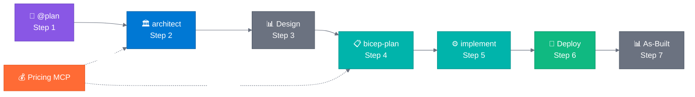

# Agentic InfraOps

> **Version 3.6.0** | [Changelog](VERSION.md)

🔗 **Shortlink**: [aka.ms/agenticinfraops](https://aka.ms/agenticinfraops)

---

> **Azure infrastructure engineered by agents. Verified. Well-Architected. Deployable.**
>
> Agentic InfraOps revolutionizes how IT Pros build Azure environments. Powered by GitHub Copilot
> and coordinated AI agents, it transforms requirements into architecture diagrams, validated designs,
> and deploy-ready Bicep/Terraform templates—all aligned with Azure Well-Architected best practices
> and Azure Verified Modules. Real-time pricing, compliance checks, and automation included.

📖 **[Quick Start Guide](docs/guides/quickstart.md)** |
📋 **[Full Workflow Docs](docs/workflow/WORKFLOW.md)** |
🎯 **[Scenarios](scenarios/)** |
💰 **[Azure Pricing MCP](mcp/azure-pricing-mcp/)**

<h2>🎬 The Workflow</h2>

<!-- markdownlint-disable MD013 -->

  

<!-- markdownlint-enable MD013 -->

<!-- markdownlint-disable MD013 -->

<!-- markdownlint-enable MD013 -->

**Agent Legend**

| Color | Agent/Phase                      | Role                                   |
| ----- | -------------------------------- | -------------------------------------- |
| 🟣    | `@plan`                          | Gather and refine requirements         |
| 🔵    | `azure-principal-architect`      | WAF assessment (NO code)               |
| ⚫    | Design / As-Built Artifacts      | Diagrams & ADRs (`-des`/`-ab` suffix)  |
| 🟢    | `bicep-plan` / `bicep-implement` | Implementation plan & Bicep generation |
| 🟠    | `Azure Pricing MCP`              | Real-time cost estimation              |
| 🟩    | Deploy / As-Built                | Azure deployment + documentation       |

| Step | Agent/Phase                 | What It Does                                 |
| ---- | --------------------------- | -------------------------------------------- |
| 1    | `@plan`                     | Gather requirements → `01-*`                 |
| 2    | `azure-principal-architect` | WAF assessment (NO code) 💰 → `02-*`         |
| 3    | Design Artifacts            | Design diagrams + ADRs (`-des`) → `03-*`     |
| 4    | `bicep-plan`                | Implementation plan + governance 💰 → `04-*` |
| 5    | `bicep-implement`           | Generate & validate Bicep → `05-*`           |
| 6    | Deploy                      | Deploy to Azure → `06-*`                     |
| 7    | As-Built Artifacts          | As-built diagrams, ADRs, docs → `07-*`       |

> **💰** = Azure Pricing MCP integration. Steps 3 & 7 are optional.

---

## Quick Start

**Get up and running in 5 steps:**

<!-- markdownlint-disable MD013 -->

| Step | Action                    | Details                                                                                                                  |
| ---- | ------------------------- | ------------------------------------------------------------------------------------------------------------------------ |
| 1️⃣   | **Install Prerequisites** | [Docker Desktop](https://docker.com/products/docker-desktop/) + [VS Code](https://code.visualstudio.com/) + [Copilot][1] |
| 2️⃣   | **Clone & Open**          | `git clone https://github.com/jonathan-vella/azure-agentic-infraops.git` then `code azure-agentic-infraops`              |
| 3️⃣   | **Open in Dev Container** | Press `F1` → "Dev Containers: Reopen in Container" (wait ~2 min)                                                         |
| 4️⃣   | **Open Copilot Chat**     | Press `Ctrl+Alt+I` → Click **Agent** button (`Ctrl+Shift+A`) → Select `@plan`                                            |
| 5️⃣   | **Try It**                | Type: `@plan Create a web app with Azure App Service and SQL Database`                                                   |

<!-- markdownlint-enable MD013 -->

[1]: https://marketplace.visualstudio.com/items?itemName=GitHub.copilot

Each agent asks for approval before proceeding. Say `yes` to continue, or provide feedback to refine.

📖 **[Full Quick Start Guide →](docs/guides/quickstart.md)**
(includes troubleshooting, demo scenarios, deployment instructions)

### Using the Accelerator

To simplify bootstrapping agentic infrastructure operations on Azure, we recommend starting with the
[azure-agentic-infraops-accelerator](https://github.com/jonathan-vella/azure-agentic-infraops-accelerator)
template repository. Click "Use this template" on the accelerator to generate a new repository
pre-configured for Azure Agentic InfraOps and use it alongside this repository for adaptable deployments
and workflows.

---

## Project Structure

| Directory                | Purpose                                      |
| ------------------------ | -------------------------------------------- |
| `.github/agents/`        | Agent definitions (7 agents for 7-step flow) |
| `agent-output/`          | Generated artifacts per project              |
| `mcp/azure-pricing-mcp/` | 💰 Real-time Azure pricing MCP server        |
| `infra/bicep/`           | Generated Bicep templates                    |
| `docs/`                  | Documentation, guides, diagrams              |
| `scenarios/`             | 11 hands-on learning scenarios               |

---

<h2>🎯 Scenarios</h2>

**11 hands-on scenarios** from beginner to advanced (15-45 min each):

| Level            | Topics                                                                |
| ---------------- | --------------------------------------------------------------------- |
| **Beginner**     | Bicep/Terraform baselines, documentation generation, diagrams as code |
| **Intermediate** | Service validation, troubleshooting, SBOM generation                  |
| **Advanced**     | Full agentic workflow, async coding agent                             |

📖 **[Full Scenarios Guide →](scenarios/README.md)**

---

## Why Agentic InfraOps?

> **Efficiency multiplier**: Reduce infrastructure development time by 60-90% while delivering Well-Architected,
> deploy-ready Azure infrastructure.

| Benefit             | Details                                                                                                                     |
| ------------------- | --------------------------------------------------------------------------------------------------------------------------- |
| **AVM-First**       | Azure Verified Modules for policy-compliant deployments ([ADR-003](docs/adr/ADR-003-avm-first-approach.md))                 |
| **Time Savings**    | Quantified evidence: 45 min vs 18+ hours ([time-savings-evidence](docs/value-proposition/time-savings-evidence.md))         |
| **Real Portfolios** | See real projects built with agentic workflows ([portfolio showcase](docs/value-proposition/copilot-portfolio-showcase.md)) |

---

<h2>📋 Requirements</h2>

| Requirement            | Details                                                                                                                          |
| ---------------------- | -------------------------------------------------------------------------------------------------------------------------------- |
| **VS Code**            | With [GitHub Copilot](https://marketplace.visualstudio.com/items?itemName=GitHub.copilot) extension                              |
| **Dev Container**      | [Docker Desktop](https://www.docker.com/products/docker-desktop/) or [GitHub Codespaces](https://github.com/features/codespaces) |
| **Azure subscription** | For deployments (optional for learning)                                                                                          |

**Included in Dev Container:**

- ✅ Azure CLI with Bicep extension
- ✅ PowerShell 7+ and Python 3.10+
- ✅ All required VS Code extensions
- ✅ Azure Pricing MCP server (auto-configured)

---

**Looking for a quick start?** Check out the agentic InfraOps accelerator template:
[azure-agentic-infraops-accelerator](https://github.com/jonathan-vella/azure-agentic-infraops-accelerator).

---

[Contributing](CONTRIBUTING.md) | [License (MIT)](LICENSE)
