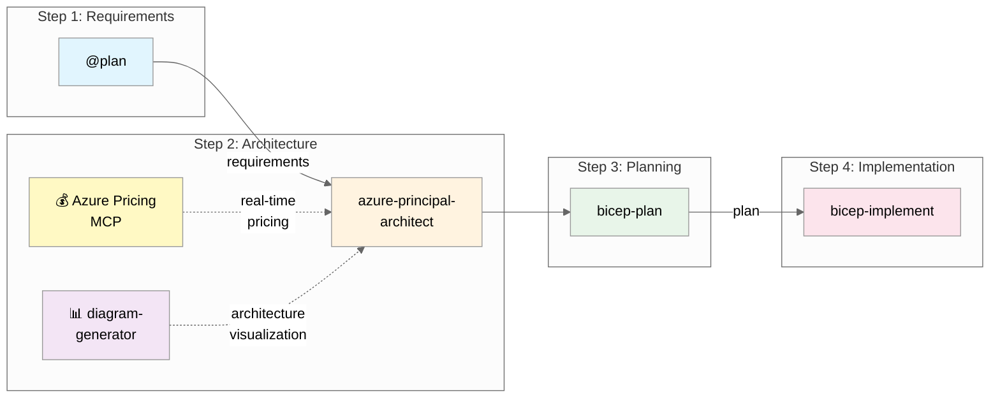

# Agentic InfraOps

> **Version 3.1.0** | Last Updated: December 3, 2025 | [Changelog](VERSION.md)

[](https://github.com/jonathan-vella/azure-agentic-infraops)
[](https://azure.microsoft.com)
[](https://github.com/features/copilot)
[](https://learn.microsoft.com/azure/well-architected/)

[](LICENSE)
[](https://code.visualstudio.com/docs/devcontainers/containers)

---

> **Azure infrastructure engineered by agents. Verified. Well-Architected. Deployable.**
>
> Agentic InfraOps revolutionizes how IT Pros build Azure environments. Powered by GitHub Copilot
> and coordinated AI agents, it transforms requirements into architecture diagrams, validated designs,
> and deploy-ready Bicep/Terraform templates—all aligned with Azure Well-Architected best practices
> and Azure Verified Modules. Real-time pricing, compliance checks, and automation included.

📖 **[Quick Start Guide](docs/getting-started/QUICKSTART.md)** | 📋 **[Full Workflow Docs](docs/workflow/WORKFLOW.md)** | 🎯 **[Scenarios](scenarios/)** | 💰 **[Azure Pricing MCP](mcp/azure-pricing-mcp/)**

<!-- TODO: Add animated demo GIF showing the workflow in action
     To create: Use https://github.com/charmbracelet/vhs or screen recording
     Target: ~30 second GIF showing @plan → architecture → diagram → bicep flow
-->

## The Workflow



| Step | Agent                       | What It Does                                          | Optional Integrations       |
| ---- | --------------------------- | ----------------------------------------------------- | --------------------------- |
| 1    | `@plan`                     | Gather requirements and create implementation plan    | -                           |
| 2    | `azure-principal-architect` | Azure Well-Architected Framework assessment (NO code) | 💰 Pricing MCP, 📊 Diagrams |
| 3    | `bicep-plan`                | Create detailed implementation plan with AVM modules  | 💰 Pricing MCP              |
| 4    | `bicep-implement`           | Generate and validate Bicep templates                 | -                           |

**Optional agent:** `adr-generator` (Architecture Decision Records) - use after any step

---

## 💰 Azure Pricing MCP Server

This repository includes a **Model Context Protocol (MCP) server** that provides **real-time Azure pricing data** to GitHub Copilot agents. No more guessing costs or manually checking the Azure Pricing Calculator!

### What It Does

| Tool                     | Purpose                           | Example Use                                |
| ------------------------ | --------------------------------- | ------------------------------------------ |
| `azure_price_search`     | Query Azure retail prices         | "What's the price of P1v4 App Service?"    |
| `azure_region_recommend` | Find cheapest regions for a SKU   | "Where is Azure SQL S3 cheapest?"          |
| `azure_cost_estimate`    | Calculate monthly/yearly costs    | "Estimate costs for 2x P1v4 + SQL S3"      |
| `azure_price_compare`    | Compare prices across regions     | "Compare App Service costs: Sweden vs. US" |
| `azure_discover_skus`    | List available SKUs for a service | "What Redis Cache SKUs are available?"     |

### Auto-Configured

The MCP server is **pre-configured** in the Dev Container. Just open in VS Code and it works!

📖 **[Full MCP Documentation](mcp/azure-pricing-mcp/README.md)**

---

## Quick Start

### 1. Open in Dev Container

```bash
git clone https://github.com/jonathan-vella/azure-agentic-infraops.git
code azure-agentic-infraops
# F1 → "Dev Containers: Reopen in Container"
```

### 2. Start the Workflow

1. Open GitHub Copilot Chat (`Ctrl+Alt+I`)
2. Click the **Agent** button or press `Ctrl+Shift+A`
3. Select `@plan` and describe your infrastructure

### 3. Example Conversation

```
You: @plan Create a HIPAA-compliant patient portal with Azure App Service and SQL Database

Plan Agent: [Generates requirements plan]
            Do you approve this plan?

You: yes

[Handoff to azure-principal-architect]

Architect: [Provides WAF assessment - Security, Reliability, Performance scores]
           [Uses Azure Pricing MCP for real-time cost estimates]

           💰 Cost Estimate (via MCP):
           • App Service P1v4: $206/mo
           • Azure SQL S3: $150/mo
           • Total: ~$356/mo

           Do you approve? Or ask for a diagram?

You: generate diagram, then approve

Architect: [Triggers diagram-generator]
           ✅ Created docs/diagrams/patient-portal/architecture.py
           ✅ Generated architecture.png

           Architecture approved. Continue to planning?

You: yes

[Handoff to bicep-plan]

Planner: [Creates implementation plan with AVM modules]
         Do you approve this plan?

You: yes

[Handoff to bicep-implement]

Implementer: [Generates Bicep templates]
             ✅ bicep build passed
             ✅ bicep lint passed
             Ready to deploy?
```

---

## Workflow Details

Each step requires your approval before proceeding:

| Your Response     | What Happens             |
| ----------------- | ------------------------ |
| `yes` / `approve` | Continue to next step    |
| Feedback text     | Agent refines its output |
| `no`              | Return to previous step  |

📖 **[Full Workflow Documentation](docs/workflow/WORKFLOW.md)**

---

## Project Structure

```
azure-agentic-infraops/
├── .github/agents/              # Agent definitions
│   ├── azure-principal-architect.agent.md
│   ├── bicep-plan.agent.md
│   ├── bicep-implement.agent.md
│   ├── diagram-generator.agent.md
│   └── adr-generator.agent.md
├── .vscode/mcp.json             # MCP server configuration
├── mcp/azure-pricing-mcp/       # 💰 Azure Pricing MCP Server
│   ├── src/azure_pricing_mcp/   # Server source code
│   ├── README.md                # MCP documentation
│   └── requirements.txt         # Python dependencies
├── .bicep-planning-files/       # Generated implementation plans
├── infra/bicep/                 # Generated Bicep templates
├── docs/
│   ├── README.md                # Documentation hub
│   ├── getting-started/         # Quick start & prerequisites
│   ├── workflow/                # Workflow documentation
│   ├── guides/                  # Troubleshooting, how-tos
│   ├── value-proposition/       # ROI, time savings, executive pitch
│   ├── cost-estimates/          # Azure pricing examples
│   ├── adr/                     # Architecture Decision Records
│   ├── diagrams/                # Generated architecture diagrams
│   └── presenter-toolkit/       # Demo delivery guides
└── scenarios/
    ├── README.md                # Scenarios index
    ├── S01-S09/                 # Comprehensive learning scenarios
    └── S10-quick-demos/         # Simple prompt-based demos
```

---

## Scenarios Overview

Learn by doing with **10 hands-on scenarios**:

| #   | Scenario                 | Time      | Difficulty   | Description                            |
| --- | ------------------------ | --------- | ------------ | -------------------------------------- |
| S01 | Bicep Baseline           | 30 min    | Beginner     | Secure hub-spoke network foundation    |
| S02 | Terraform Baseline       | 30 min    | Beginner     | Multi-cloud IaC with Terraform         |
| S03 | Five-Agent Workflow      | 45 min    | Advanced     | End-to-end HIPAA patient portal        |
| S04 | Documentation Generation | 20 min    | Beginner     | Auto-generate docs from code           |
| S05 | Service Validation       | 30 min    | Intermediate | Automated compliance testing           |
| S06 | Troubleshooting          | 25 min    | Intermediate | Diagnose infrastructure issues         |
| S07 | SBOM Generator           | 20 min    | Intermediate | Software Bill of Materials             |
| S08 | Diagrams as Code         | 20 min    | Beginner     | Python-generated architecture diagrams |
| S09 | Coding Agent             | 30 min    | Advanced     | Async implementation via GitHub Issues |
| S10 | Quick Demos              | 15-30 min | Varies       | Single-prompt demo scenarios           |

📖 **[Full Scenarios Guide](scenarios/README.md)** — Learning paths, time savings, and deep-dive details

---

## Requirements

- **VS Code** with GitHub Copilot extension
- **Azure subscription** (for deployments)
- **Dev Container** support (Docker Desktop or GitHub Codespaces)

The Dev Container includes: Azure CLI, Bicep CLI, PowerShell 7, Python 3.12, and the Azure Pricing MCP server.

---

## Contributing

Contributions welcome! See [CONTRIBUTING.md](CONTRIBUTING.md).

## License

MIT License — see [LICENSE](LICENSE).
