# Agentic InfraOps

> **Version 5.2.0** | [Changelog](VERSION.md)

🔗 **Shortlink**: [aka.ms/agenticinfraops](https://aka.ms/agenticinfraops)

---

> **Azure infrastructure engineered by agents. Verified. Well-Architected. Deployable.**
>
> Agentic InfraOps revolutionizes how IT Pros build Azure environments. Powered by GitHub Copilot
> and coordinated AI agents, it transforms requirements into architecture diagrams, validated designs,
> and deploy-ready Bicep templates—all aligned with Azure Well-Architected best practices
> and Azure Verified Modules. Real-time pricing, compliance checks, and automation included.

📖 **[Quick Start Guide](docs/getting-started/quickstart.md)** |
📋 **[Full Workflow Docs](docs/reference/workflow.md)** |
🎯 **[Scenarios](scenarios/)** |
💰 **[Azure Pricing MCP](mcp/azure-pricing-mcp/)**

## Using the Accelerator

**Primary entry point for new projects.** Use the accelerator template to bootstrap a repository that is already
configured for the Agentic InfraOps workflow before you dive into the steps below.

- Start with the
  [azure-agentic-infraops-accelerator](https://github.com/jonathan-vella/azure-agentic-infraops-accelerator)
  template repository.
- Select "Use this template" to generate your project repository.
- Use the generated repository alongside this one for adaptable deployments and workflows.

<h2>🎬 The Workflow</h2>

<!-- markdownlint-disable MD013 -->

  

<!-- markdownlint-enable MD013 -->

<!-- markdownlint-disable MD013 -->

<!-- markdownlint-enable MD013 -->

```mermaid
%%{init: {'theme':'base', 'themeVariables': {'primaryColor': '#0078D4', 'primaryTextColor': '#ffffff', 'primaryBorderColor': '#005A9E', 'lineColor': '#6B7280', 'secondaryColor': '#00B4AB', 'tertiaryColor': '#8957E5', 'background': '#ffffff', 'mainBkg': '#ffffff', 'nodeBorder': '#005A9E', 'clusterBkg': '#F3F4F6', 'titleColor': '#1F2937', 'edgeLabelBackground': '#ffffff'}}}%%
graph LR
    P["🎯 Requirements<br/>Step 1"]:::plan --> A["🏛️ Azure Architect<br/>Step 2"]:::architect
    A --> D3["📊 Design Artifacts<br/>Step 3"]:::artifact
    D3 --> B["📋 Bicep Plan<br/>Step 4"]:::bicep
    B --> I["⚙️ Bicep Implement<br/>Step 5"]:::bicep
    I --> DEP["🚀 Deploy<br/>Step 6"]:::deploy
    DEP --> D7["📄 Workload Docs<br/>Step 7"]:::artifact
    MCP["💰 Pricing MCP"]:::pricing -.->|costs| A
    MCP -.->|validation| B

    classDef plan fill:#8957E5,stroke:#6B46C1,color:#fff
    classDef architect fill:#0078D4,stroke:#005A9E,color:#fff
    classDef bicep fill:#00B4AB,stroke:#008F89,color:#fff
    classDef pricing fill:#FF6B35,stroke:#E55A25,color:#fff
    classDef artifact fill:#6B7280,stroke:#4B5563,color:#fff
    classDef deploy fill:#10B981,stroke:#059669,color:#fff
```

**Agent Legend**

| Color | Phase        | Description                            |
| :---: | ------------ | -------------------------------------- |
|  🟣   | Requirements | Gather and refine project requirements |
|  🔵   | Architecture | WAF assessment and design decisions    |
|  ⚫   | Design/Docs  | Diagrams, ADRs, and documentation      |
|  🟢   | Bicep        | Implementation planning and code gen   |
|  🟠   | Pricing      | Real-time Azure cost estimation (MCP)  |
|  🟩   | Deployment   | Azure resource provisioning            |

| Step | Phase          | Agent                            | Output     |
| :--: | -------------- | -------------------------------- | ---------- |
|  1   | Requirements   | Requirements                     | `01-*`     |
|  2   | Architecture   | Azure Principal Architect 💰     | `02-*`     |
|  3   | Design         | Diagram Generator, ADR Generator | `03-des-*` |
|  4   | Planning       | Bicep Plan 💰                    | `04-*`     |
|  5   | Implementation | Bicep Implement                  | `05-*`     |
|  6   | Deployment     | Deploy Agent                     | `06-*`     |
|  7   | Documentation  | Workload Documentation Generator | `07-*`     |

> **💰** = Azure Pricing MCP integration. Steps 3 & 7 are optional.

---

## Quick Start

**Get up and running in 5 steps:**

<!-- markdownlint-disable MD013 -->

| Step | Action                    | Details                                                                                                                  |
| ---- | ------------------------- | ------------------------------------------------------------------------------------------------------------------------ |
| 1️⃣   | **Install Prerequisites** | [Docker Desktop](https://docker.com/products/docker-desktop/) + [VS Code](https://code.visualstudio.com/) + [Copilot][1] |
| 2️⃣   | **Clone & Open**          | `git clone https://github.com/jonathan-vella/azure-agentic-infraops.git` then `code azure-agentic-infraops`              |
| 3️⃣   | **Open in Dev Container** | Press `F1` → "Dev Containers: Reopen in Container" (wait ~2 min)                                                         |
| 4️⃣   | **Open Copilot Chat**     | Press `Ctrl+Alt+I` → Select **Requirements** from the agent picker dropdown                                              |
| 5️⃣   | **Try It**                | Type: `Create a web app with Azure App Service and SQL Database`                                                         |

<!-- markdownlint-enable MD013 -->

[1]: https://marketplace.visualstudio.com/items?itemName=GitHub.copilot

Each agent asks for approval before proceeding. Say `yes` to continue, or provide feedback to refine.

📖 **[Full Quick Start Guide →](docs/getting-started/quickstart.md)**
(includes troubleshooting, demo scenarios, deployment instructions)

---

## Project Structure

| Directory                | Purpose                                      |
| ------------------------ | -------------------------------------------- |
| `.github/agents/`        | Agent definitions (9 agents for 7-step flow) |
| `agent-output/`          | Generated artifacts per project              |
| `mcp/azure-pricing-mcp/` | 💰 Real-time Azure pricing MCP server        |
| `infra/bicep/`           | Generated Bicep templates                    |
| `docs/`                  | Documentation, guides, diagrams              |
| `scenarios/`             | 8 hands-on learning scenarios                |

### Sample Outputs

Explore complete workflow outputs in `agent-output/`:

| Project                                      | Description                   | Highlights                                    |
| -------------------------------------------- | ----------------------------- | --------------------------------------------- |
| [agent-testing](agent-output/agent-testing/) | Agent validation framework    | 16 resources, full 7-step + health validation |
| [static-webapp](agent-output/static-webapp/) | Static Web App with Functions | Production-ready SWA pattern                  |
| [ecommerce](agent-output/ecommerce/)         | E-commerce platform           | Multi-tier architecture                       |

---

<h2>🎯 Scenarios</h2>

**8 hands-on scenarios** from beginner to advanced (15-45 min each):

| Level            | Topics                                                              |
| ---------------- | ------------------------------------------------------------------- |
| **Beginner**     | Bicep baseline, diagrams as code                                    |
| **Intermediate** | Documentation generation, service validation, troubleshooting, SBOM |
| **Advanced**     | Full agentic workflow, async coding agent                           |

📖 **[Full Scenarios Guide →](scenarios/README.md)**

---

## Why Agentic InfraOps?

> **Efficiency multiplier**: Reduce infrastructure development time by 60-90% while delivering Well-Architected,
> deploy-ready Azure infrastructure.

| Benefit             | Details                                                                                                             |
| ------------------- | ------------------------------------------------------------------------------------------------------------------- |
| **AVM-First**       | Azure Verified Modules for policy-compliant deployments ([ADR-003](docs/adr/ADR-003-avm-first-approach.md))         |
| **Time Savings**    | Quantified evidence: 45 min vs 18+ hours ([time-savings-evidence](docs/presenter/time-savings-evidence.md))         |
| **Real Portfolios** | See real projects built with agentic workflows ([portfolio showcase](docs/presenter/copilot-portfolio-showcase.md)) |

---

<h2>📋 Requirements</h2>

| Requirement            | Details                                                                                                                          |
| ---------------------- | -------------------------------------------------------------------------------------------------------------------------------- |
| **VS Code**            | With [GitHub Copilot](https://marketplace.visualstudio.com/items?itemName=GitHub.copilot) extension                              |
| **Dev Container**      | [Docker Desktop](https://www.docker.com/products/docker-desktop/) or [GitHub Codespaces](https://github.com/features/codespaces) |
| **Azure subscription** | For deployments (optional for learning)                                                                                          |

**Included in Dev Container:**

- ✅ Azure CLI with Bicep extension
- ✅ PowerShell 7+ and Python 3.10+
- ✅ All required VS Code extensions
- ✅ Azure Pricing MCP server (auto-configured)

---

**Looking for a quick start?** Check out the agentic InfraOps accelerator template:
[azure-agentic-infraops-accelerator](https://github.com/jonathan-vella/azure-agentic-infraops-accelerator).

---

[Contributing](CONTRIBUTING.md) | [License (MIT)](LICENSE)
