# Agentic InfraOps

> **Version 7.4.0** | [Version info](VERSION.md) | [Changelog](CHANGELOG.md)

[-0078D4?style=for-the-badge&logo=microsoftazure>)](https://github.com/microsoft/mcp/blob/main/servers/Azure.Mcp.Server/README.md)

🔗 **Shortlink**: [aka.ms/agenticinfraops](https://aka.ms/agenticinfraops)

---

> **Azure infrastructure engineered by agents. Verified. Well-Architected. Deployable.**
>
> Agentic InfraOps is an IT Pro–focused workflow for building and operating Azure environments with
> guardrailed AI agents. It combines Microsoft’s \*Azure MCP Server for live, RBAC-aware Azure
> context with a structured 7-step workflow, WAF-aligned decisioning, and AVM-first Bicep generation.
> The result: requirements → validated architecture → deploy-ready templates → as-built documentation
> and health checks, with fewer portal clicks and more repeatable governance.

📖 **[Quick Start Guide](docs/getting-started/quickstart.md)** |
🚀 **[Accelerator Template](https://github.com/jonathan-vella/azure-agentic-infraops-accelerator)** |
📋 **[Full Workflow Docs](docs/reference/workflow.md)** |
🎯 **[Scenarios](scenarios/)** |
🧩 **[Azure MCP Server (GA)](https://github.com/microsoft/mcp/blob/main/servers/Azure.Mcp.Server/README.md)** |
💰 **[Pricing MCP add-on](mcp/azure-pricing-mcp/)**

## Start Here: Accelerator Template (Recommended)

If you are implementing this workflow for a real environment, start with the accelerator template.
It is pre-wired with the Agentic InfraOps workflow, automation, and repo structure so you can focus
on requirements and governance, not setup.

- Template repository:
  [azure-agentic-infraops-accelerator](https://github.com/jonathan-vella/azure-agentic-infraops-accelerator)
- Use the accelerator when you want a clean workload repo that adopts this workflow.
- Use this repo when you want to review the agents, guardrails, and example outputs.

## MCP Spotlight: Microsoft Azure MCP Server

- The core enabler behind “agents with real Azure context”, not guesses
- RBAC-aware: tools operate within your existing Azure permissions model
- Accelerates day-0 to day-2 operations: discovery, validation, and troubleshooting workflows
- Reduces context switching: fewer portal loops, faster repeatable operations
- Broad coverage (40+ Azure service areas): platform, monitoring, governance, and more
- Works with Copilot Agent mode and multiple IDEs/clients
- This repo also includes a Pricing MCP add-on for cost-aware SKU decisions

Learn more:

- Azure MCP Server README:
  https://github.com/microsoft/mcp/blob/main/servers/Azure.Mcp.Server/README.md
- Microsoft Learn:
  https://learn.microsoft.com/azure/developer/azure-mcp-server/

---

## Quick Start (Reference Repo / Learning Mode)

For production adoption, start with the accelerator template above.
For evaluation and learning, follow the steps below.

<h2>🎬 The Workflow</h2>

<!-- markdownlint-disable MD013 -->

  

<!-- markdownlint-enable MD013 -->

<!-- markdownlint-disable MD013 -->

<!-- markdownlint-enable MD013 -->

```mermaid
%%{init: {'theme':'base', 'themeVariables': {'primaryColor': '#0078D4', 'primaryTextColor': '#ffffff', 'primaryBorderColor': '#005A9E', 'lineColor': '#6B7280', 'secondaryColor': '#00B4AB', 'tertiaryColor': '#8957E5', 'background': '#ffffff', 'mainBkg': '#ffffff', 'nodeBorder': '#005A9E', 'clusterBkg': '#F3F4F6', 'titleColor': '#1F2937', 'edgeLabelBackground': '#ffffff'}}}%%
graph LR
    P["🎯 Requirements<br/>Step 1"]:::plan --> A["🏛️ Architect<br/>Step 2"]:::architect
    A --> D3["📊 Design Artifacts<br/>Step 3"]:::artifact
    D3 --> B["📋 Bicep Plan<br/>Step 4"]:::bicep
    B --> I["⚙️ Bicep Code<br/>Step 5"]:::bicep
    I --> DEP["🚀 Deploy<br/>Step 6"]:::deploy
    DEP --> D7["📄 Docs<br/>Step 7"]:::artifact
    DEP -.->|validate| DX["🔍 Diagnose"]:::diagnose
  AZMCP["🧩 Azure MCP Server (GA)"]:::mcp -.->|Azure context| A
  AZMCP -.->|validation| B
  AZMCP -.->|diagnostics| DX
  MCP["💰 Pricing MCP (add-on)"]:::pricing -.->|costs| A

    classDef plan fill:#8957E5,stroke:#6B46C1,color:#fff
    classDef architect fill:#0078D4,stroke:#005A9E,color:#fff
    classDef bicep fill:#00B4AB,stroke:#008F89,color:#fff
    classDef pricing fill:#FF6B35,stroke:#E55A25,color:#fff
  classDef mcp fill:#1D4ED8,stroke:#1E40AF,color:#fff
    classDef artifact fill:#6B7280,stroke:#4B5563,color:#fff
    classDef deploy fill:#10B981,stroke:#059669,color:#fff
    classDef diagnose fill:#EF4444,stroke:#DC2626,color:#fff
```

**Agent Legend**

| Color | Phase        | Description                                  |
| :---: | ------------ | -------------------------------------------- |
|  🟣   | Requirements | Gather and refine project requirements       |
|  🔵   | Architecture | WAF assessment and design decisions          |
|  ⚫   | Design/Docs  | Diagrams, ADRs, and documentation            |
|  🟢   | Bicep        | Implementation planning and code gen         |
|  🔷   | MCP          | Live Azure context and operational tools     |
|  🟠   | Pricing      | Real-time Azure cost estimation (MCP)        |
|  🟩   | Deployment   | Azure resource provisioning                  |
|  🔴   | Diagnose     | Resource health validation & troubleshooting |

| Step | Phase          | Agent(s)            | Output     |
| :--: | -------------- | ------------------- | ---------- |
|  1   | Requirements   | `@requirements`     | `01-*`     |
|  2   | Architecture   | `@architect` 🧩 💰  | `02-*`     |
|  3   | Design         | `@diagram`, `@adr`  | `03-des-*` |
|  4   | Planning       | `@bicep-plan` 🧩 💰 | `04-*`     |
|  5   | Implementation | `@bicep-code`       | `05-*`     |
|  6   | Deployment     | `@deploy`           | `06-*`     |
|  7   | Documentation  | `@docs`             | `07-*`     |
|  —   | Validation     | `@diagnose` 🧩      | `08-*`     |

> **🧩** = Microsoft Azure MCP Server integration.
> **💰** = Pricing MCP add-on integration.
> Steps 3, 7 & Validation are optional.
> **9 agents total** for the complete workflow.

---

**Get up and running in 5 steps:**

<!-- markdownlint-disable MD013 -->

| Step | Action                    | Details                                                                                                                  |
| ---- | ------------------------- | ------------------------------------------------------------------------------------------------------------------------ |
| 1️⃣   | **Install Prerequisites** | [Docker Desktop](https://docker.com/products/docker-desktop/) + [VS Code](https://code.visualstudio.com/) + [Copilot][1] |
| 2️⃣   | **Clone & Open**          | `git clone https://github.com/jonathan-vella/azure-agentic-infraops.git` then `code azure-agentic-infraops`              |
| 3️⃣   | **Open in Dev Container** | Press `F1` → "Dev Containers: Reopen in Container" (wait ~2 min)                                                         |
| 4️⃣   | **Open Copilot Chat**     | Press `Ctrl+Alt+I` → Select **Requirements** from the agent picker dropdown                                              |
| 5️⃣   | **Try It**                | Type: `Create a web app with Azure App Service and SQL Database`                                                         |

<!-- markdownlint-enable MD013 -->

[1]: https://marketplace.visualstudio.com/items?itemName=GitHub.copilot

Each agent asks for approval before proceeding. Say `yes` to continue, or provide feedback to refine.

📖 **[Full Quick Start Guide →](docs/getting-started/quickstart.md)**
(includes troubleshooting, demo scenarios, deployment instructions)

---

## Guardrails for IT Pros

Agentic InfraOps is designed to be safe, repeatable, and governance-friendly.

- Custom Copilot agents codify the workflow:
  see `.github/agents/`
- Repository-wide instruction system enforces standards (Markdown, Bicep, agents):
  see `.github/instructions/`
- Drift-guard workflows protect templates and docs structure:
  see `.github/workflows/`
- AVM-first + CAF naming + required tags are built into the workflow defaults:
  see `.github/agents/_shared/defaults.md`

## Project Structure

| Directory                | Purpose                                          |
| ------------------------ | ------------------------------------------------ |
| `.github/agents/`        | Agent definitions (9 agents for 7-step flow)     |
| `.github/instructions/`  | Guardrails and standards (lint + consistency)    |
| `.github/workflows/`     | Drift guard + automation workflows               |
| `agent-output/`          | Generated artifacts per project                  |
| `.vscode/mcp.json`       | Local MCP wiring for the Pricing MCP add-on      |
| `mcp/azure-pricing-mcp/` | 💰 Pricing MCP add-on (real-time retail pricing) |
| `infra/bicep/`           | Generated Bicep templates                        |
| `docs/`                  | Documentation, guides, diagrams                  |
| `scenarios/`             | 8 hands-on learning scenarios                    |

### Sample Outputs

Explore complete workflow outputs in `agent-output/`:

| Project                                      | Description                   | Highlights                                    |
| -------------------------------------------- | ----------------------------- | --------------------------------------------- |
| [agent-testing](agent-output/agent-testing/) | Agent validation framework    | 16 resources, full 7-step + health validation |
| [static-webapp](agent-output/static-webapp/) | Static Web App with Functions | Production-ready SWA pattern                  |
| [ecommerce](agent-output/ecommerce/)         | E-commerce platform           | Multi-tier architecture                       |

---

<h2>🎯 Scenarios</h2>

**8 hands-on scenarios** from beginner to advanced (15-45 min each):

| Level            | Topics                                                              |
| ---------------- | ------------------------------------------------------------------- |
| **Beginner**     | Bicep baseline, diagrams as code                                    |
| **Intermediate** | Documentation generation, service validation, troubleshooting, SBOM |
| **Advanced**     | Full agentic workflow, async coding agent                           |

📖 **[Full Scenarios Guide →](scenarios/README.md)**

---

## Why Agentic InfraOps?

> **Efficiency multiplier**: Reduce infrastructure development time by 60-90% while delivering Well-Architected,
> deploy-ready Azure infrastructure.

| Benefit             | Details                                                                                                             |
| ------------------- | ------------------------------------------------------------------------------------------------------------------- |
| **AVM-First**       | Azure Verified Modules for policy-compliant deployments ([ADR-003](docs/adr/ADR-003-avm-first-approach.md))         |
| **Time Savings**    | Quantified evidence: 45 min vs 18+ hours ([time-savings-evidence](docs/presenter/time-savings-evidence.md))         |
| **Real Portfolios** | See real projects built with agentic workflows ([portfolio showcase](docs/presenter/copilot-portfolio-showcase.md)) |

---

<h2>📋 Requirements</h2>

| Requirement            | Details                                                                                                                          |
| ---------------------- | -------------------------------------------------------------------------------------------------------------------------------- |
| **VS Code**            | With [GitHub Copilot](https://marketplace.visualstudio.com/items?itemName=GitHub.copilot) extension                              |
| **Dev Container**      | [Docker Desktop](https://www.docker.com/products/docker-desktop/) or [GitHub Codespaces](https://github.com/features/codespaces) |
| **Azure subscription** | For deployments (optional for learning)                                                                                          |

**Included in Dev Container:**

- ✅ Azure CLI with Bicep extension
- ✅ PowerShell 7+ and Python 3.10+
- ✅ All required VS Code extensions
- ✅ Pricing MCP add-on (auto-configured)
- ✅ Works best with the Azure MCP Server extension installed

---

**Looking for a quick start?** Check out the agentic InfraOps accelerator template:
[azure-agentic-infraops-accelerator](https://github.com/jonathan-vella/azure-agentic-infraops-accelerator).

---

[Contributing](CONTRIBUTING.md) | [License (MIT)](LICENSE)
