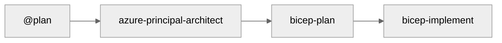

# GitHub Copilot Azure Infrastructure Workflow - Version History

## Semantic Versioning

This repository follows [Semantic Versioning 2.0.0](https://semver.org/):

- **MAJOR.MINOR.PATCH** (e.g., 1.2.3)
- **MAJOR**: Breaking changes to workflow or agents
- **MINOR**: New agents, significant features
- **PATCH**: Bug fixes, documentation updates

---

## Version 2.1.0 (2025-12-03) - MCP Integration & E-Commerce Demo 💰

### Summary

Enhanced MCP integration with prominent featuring across documentation. Completed E-Commerce platform deployment with Azure Policy compliance fixes. Updated all App Service Plans to P1v4 SKU.

### Added

- **Azure Pricing MCP Integration**: Real-time pricing during architecture phase
- **E-Commerce Demo**: Complete 61-resource PCI-DSS compliant infrastructure
- **Azure Policy Compliance Section**: Added to instruction files for common blockers
- **Enhanced Workflow Diagram**: Side activities (MCP, diagrams) during architect phase

### Changed

- **App Service Plan SKU**: Upgraded from P1v2/P1v3 to P1v4 for zone redundancy support
- **Monthly Cost Estimates**: Updated to ~$2,212/mo (P1v4 pricing)
- **README.md**: Complete rewrite with MCP badge and dedicated section
- **WORKFLOW.md**: Restructured with MCP integration documentation
- **Workflow Visualization**: 4-step with optional integrations pattern

### Fixed

- **WAF Policy Naming**: Alphanumeric only (no hyphens)
- **Functions Storage**: Identity-based connections for Azure Policy compliance
- **SQL Diagnostic Settings**: Removed unsupported `SQLSecurityAuditEvents` category
- **Service Bus Subnet**: Fixed private endpoint subnet reference

---

## Version 2.0.0 (2025-12-01) - Workflow Focus 🔄

### Summary

Repository restructured to focus exclusively on the 4-step agent workflow for Azure infrastructure development. Removed legacy scenarios and resources to provide a clean, focused experience.

### Changed

- **Repository Focus**: Now centered on the 4-step agent workflow
- **Simplified Structure**: Removed scenarios, resources folders
- **Clean Slate**: Empty `demos/`, `infra/bicep/`, `docs/adr/`, `docs/diagrams/` ready for generated content

### Core Components

#### Custom Agents (6 agents)

- **azure-principal-architect** - WAF assessment (NO CODE)
- **bicep-plan** - Implementation planning with AVM modules
- **bicep-implement** - Bicep code generation
- **diagram-generator** - Python architecture diagrams
- **adr-generator** - Architecture Decision Records
- **infrastructure-specialist** - Unified agent (optional)

#### Documentation

- `docs/WORKFLOW.md` - Complete workflow guide
- `.github/copilot-instructions.md` - AI agent guidance
- `README.md` - Quick start and overview

### Workflow



---

## Version Schema

```text
MAJOR.MINOR.PATCH

MAJOR (Breaking Changes):
- Workflow architecture changes
- Agent API changes

MINOR (New Features):
- New agents
- Significant documentation additions

PATCH (Improvements):
- Bug fixes
- Documentation updates
```

---

**Current Version**: **2.1.0**
**Release Date**: December 3, 2025
**Status**: Production Ready ✅
