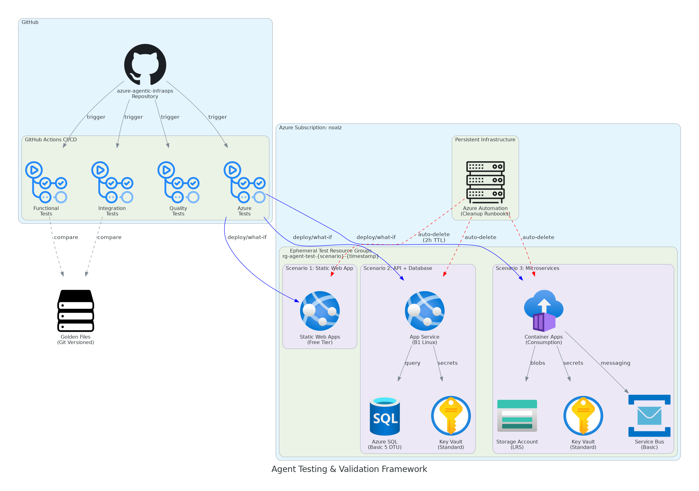

# ADR-0001: Ephemeral Test Infrastructure with GitHub Actions Orchestration

## Status

**Proposed** — Awaiting approval before implementation.

## Context

The Agentic InfraOps project uses 9 custom GitHub Copilot agents that work together
in a 7-step workflow to deliver Azure infrastructure from requirements through
deployment and operations. These agents require comprehensive testing and validation
to ensure:

1. **Functional correctness** — Each agent produces expected outputs
2. **Integration validation** — Agents work together in the 7-step workflow
3. **Quality assurance** — Outputs meet documentation and code standards
4. **Regression prevention** — Changes don't break existing functionality
5. **Automation readiness** — Tests can run in CI/CD pipelines

**Technical Constraints:**

- **CON-001**: Budget limited to $50-100/month for Azure test resources
- **CON-002**: Tests must complete in < 30 minutes for fast PR feedback
- **CON-003**: No dedicated test infrastructure team to manage persistent resources
- **CON-004**: Tests run infrequently (~20 times/month)

**Business Requirements:**

- **BUS-001**: Platform engineering team (1-5 developers) needs reliable testing
- **BUS-002**: SI partners and customers need confidence in agent quality
- **BUS-003**: Test framework should be low-maintenance and self-healing

**CAF Alignment:**

- Resource naming: `rg-agent-test-{scenario}-{timestamp}`
- Required tags: Environment, ManagedBy, Project, Owner, TTL
- Region: swedencentral (primary), germanywestcentral (fallback)

**WAF Pillar Priorities:**

| Pillar                 | Priority | Rationale                                 |
| ---------------------- | -------- | ----------------------------------------- |
| Cost Optimization      | **High** | Maximize value within $50-100/month       |
| Operational Excellence | **High** | Fully automated, minimal maintenance      |
| Performance            | Medium   | Fast feedback loops for developers        |
| Security               | Medium   | No sensitive data, internal testing only  |
| Reliability            | Low      | Ephemeral resources, acceptable for tests |

## Decision

We will implement an **ephemeral test infrastructure** pattern with **GitHub Actions
as the orchestration layer** and **automatic resource cleanup** via Azure Automation.

### Architecture Overview

**Key Components:**

1. **GitHub Actions CI/CD** — Orchestrates all test execution
   - Functional tests (per-agent isolation)
   - Integration tests (workflow hand-offs)
   - Quality tests (linting, validation)
   - Azure tests (what-if, deployment)

2. **Golden Files in Git** — Version-controlled baseline outputs
   - No database required for test data
   - Semantic diff comparison (ignoring timestamps/UUIDs)
   - PR-based approval workflow with `golden-approved` label

3. **Ephemeral Azure Resources** — Created per test run, destroyed after validation
   - Resource groups: `rg-agent-test-{scenario}-{timestamp}`
   - Cheapest SKUs: B1 App Service, Basic SQL, Free Static Web Apps
   - Auto-cleanup after 2 hours via Azure Automation

4. **Azure Subscription** — Using existing `noalz` subscription
   - Subscription ID: `00858ffc-dded-4f0f-8bbf-e17fff0d47d9`
   - Service principal with Contributor on test RGs, Reader on subscription

**Test Scenarios:**

| Scenario       | Resources                            | Purpose                      |
| -------------- | ------------------------------------ | ---------------------------- |
| Static Web App | SWA (Free)                           | Smoke tests, fast validation |
| API + Database | App Service B1, SQL Basic, Key Vault | Common web pattern           |
| Microservices  | Container Apps, Service Bus, Storage | Complex deployments          |

## Consequences

### Positive

- **POS-001**: **Minimal cost** — Estimated ~$1-5/month vs $50-100 budget (95% savings)
- **POS-002**: **Zero maintenance** — No persistent infrastructure to patch or monitor
- **POS-003**: **Self-healing** — Failed tests leave no orphaned resources (2h auto-cleanup)
- **POS-004**: **Fast iteration** — Changes to tests don't require infrastructure updates
- **POS-005**: **Git as source of truth** — All test data version-controlled, auditable

### Negative

- **NEG-001**: **Cold start latency** — Each test run provisions resources from scratch (~2-5 min)
- **NEG-002**: **No persistent metrics** — Test history not stored centrally (only in GH Actions)
- **NEG-003**: **Azure dependency** — Cannot test without Azure connectivity
- **NEG-004**: **Rate limits** — Frequent test runs may hit Azure API throttling
- **NEG-005**: **Cleanup reliability** — If Azure Automation fails, manual cleanup required

## Alternatives Considered

### Alternative 1: Persistent Test Environment

- **ALT-001**: **Description**: Maintain always-on test resources (App Service, SQL, etc.)
  that tests connect to and verify against.
- **ALT-001**: **Rejection Reason**: Estimated $200-300/month for persistent resources
  exceeds budget. Requires ongoing maintenance, patching, and monitoring.

### Alternative 2: Azure DevTest Labs

- **ALT-002**: **Description**: Use Azure DevTest Labs to manage test environments
  with auto-shutdown and cost controls.
- **ALT-002**: **Rejection Reason**: Additional complexity and learning curve.
  DevTest Labs is optimized for VM-based workloads, not PaaS testing.

### Alternative 3: Containerized Mock Environment

- **ALT-003**: **Description**: Run all tests against Docker containers simulating
  Azure services (Azurite for Storage, SQL Server container, etc.)
- **ALT-003**: **Rejection Reason**: Cannot validate actual Azure deployments,
  policy compliance, or real API behavior. Mocks drift from production APIs.

### Alternative 4: Azure Deployment Environments

- **ALT-004**: **Description**: Use Azure Deployment Environments for on-demand
  dev/test infrastructure with templates.
- **ALT-004**: **Rejection Reason**: Requires Azure Dev Center setup, additional
  complexity. Ephemeral RG pattern achieves same result with less overhead.

## Implementation Notes

- **IMP-001**: Create GitHub Actions workflow with matrix strategy for parallel test
  scenarios. Use `workflow_dispatch` for manual triggers and `schedule` for nightly runs.

- **IMP-002**: Implement service principal with workload identity federation (OIDC)
  for secure, credential-less authentication from GitHub Actions.

- **IMP-003**: Add Azure Automation runbook that queries resources with `TTL` tag
  and deletes resource groups older than 2 hours. Schedule every 30 minutes.

- **IMP-004**: Implement golden file diff bot that posts PR comments with semantic
  diff summary. Require `golden-approved` label for baseline updates.

- **IMP-005**: Success criteria:
  - Full test suite < 30 minutes
  - Azure costs < $10/month
  - Pass rate ≥ 95%
  - Zero orphaned resources after 24 hours

## References

- **REF-001**: [02-architecture-assessment.md](02-architecture-assessment.md) — WAF pillar scores
- **REF-002**: [03-des-cost-estimate.md](03-des-cost-estimate.md) — Detailed cost breakdown
- **REF-003**: [03-des-diagram.py](03-des-diagram.py) — Architecture diagram source
- **REF-004**: [Azure Well-Architected Framework](https://learn.microsoft.com/azure/well-architected/)
- **REF-005**: [GitHub Actions OIDC with Azure](https://docs.github.com/actions/deployment/security-hardening-your-deployments/configuring-openid-connect-in-azure)
- **REF-006**: [Azure Automation Runbooks](https://learn.microsoft.com/azure/automation/automation-runbook-types)

---

_ADR generated by @adr agent | 2026-01-22 | Step 3 (Design Phase)_
