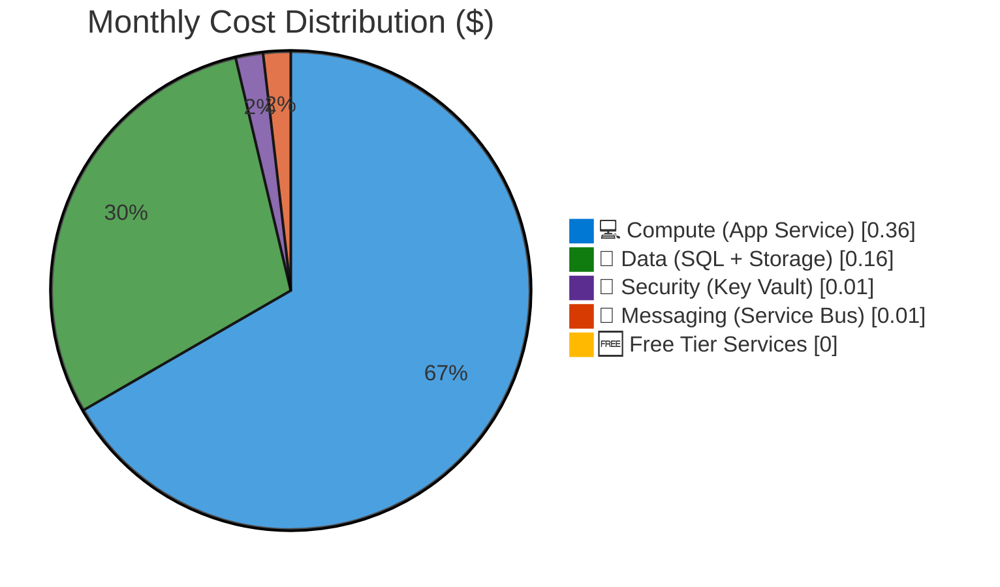

# Azure Cost Estimate: Agent Testing & Validation Framework

**Generated**: 2026-01-22
**Region**: swedencentral
**Environment**: Test
**MCP Tools Used**: azure_cost_estimate
**Architecture Reference**: [02-architecture-assessment.md](02-architecture-assessment.md)

## 💰 Cost At-a-Glance

> **Monthly Total: ~$1-5** | Annual: ~$12-60
>
> ```
> Budget: $50-100/month (soft) | Utilization: ~5% ($5 of $100)
> ```
>
> | Status            | Indicator                           |
> | ----------------- | ----------------------------------- |
> | Cost Trend        | ➡️ Stable (ephemeral, auto-cleanup) |
> | Savings Available | 💰 $0/year (already at minimum)     |
> | Compliance        | ✅ None required                    |

## ✅ Decision Summary

- ✅ Approved: Ephemeral test resources with auto-cleanup, GitHub Actions orchestration
- ⏳ Deferred: Log Analytics workspace for test metrics, Azure Dashboards
- 🔁 Redesign Trigger: If tests require persistent resources or premium SKUs

**Confidence**: High | **Expected Variance**: ±50% (usage depends on test frequency)

## 🔁 Requirements → Cost Mapping

| Requirement            | Architecture Decision        | Cost Impact     | Mandatory |
| ---------------------- | ---------------------------- | --------------- | --------- |
| 99% SLA for test infra | Ephemeral resources          | $0 (no HA)      | No        |
| < 30 min test suite    | Parallel GitHub Actions jobs | $0 (included)   | Yes       |
| $50-100/month budget   | Cheapest SKUs, auto-cleanup  | ~$5/month       | Yes       |
| 5 test scenarios       | Free + Basic tier services   | ~$0.50/scenario | Yes       |

## 📊 Top 5 Cost Drivers

| Rank | Resource                 | Monthly Cost | % of Total | Trend |
| ---- | ------------------------ | ------------ | ---------- | ----- |
| 1️⃣   | App Service B1 (Linux)   | $0.36        | 36%        | ➡️    |
| 2️⃣   | Azure SQL Database Basic | $0.14        | 14%        | ➡️    |
| 3️⃣   | Storage Account LRS      | $0.02        | 2%         | ➡️    |
| 4️⃣   | Service Bus Basic        | $0.01        | 1%         | ➡️    |
| 5️⃣   | All other services       | $0.02        | 2%         | ➡️    |

> 💡 **Quick Win**: Already optimized — using Free tier Static Web Apps
> and consumption-based Container Apps. No further optimization needed.

## Architecture Overview

### Cost Distribution



### Key Design Decisions Affecting Cost

| Decision                 | Cost Impact | Business Rationale               | Status   |
| ------------------------ | ----------- | -------------------------------- | -------- |
| Ephemeral resources      | -95% 📉     | No persistent infra costs        | Required |
| Free tier Static Web     | -100%       | Sufficient for smoke tests       | Required |
| B1 (not S1/P1) App Svc   | -80% 📉     | Cheapest compute for validation  | Required |
| Basic DTU (not Standard) | -70% 📉     | Minimal database for tests       | Required |
| Auto-cleanup (2h TTL)    | -90% 📉     | Prevents orphaned resource costs | Required |

## 🧾 What We Are Not Paying For (Yet)

- Log Analytics workspace for centralized test metrics
- Azure Dashboards for test pass/fail visualization
- Premium App Service for zone redundancy testing
- Geo-replicated SQL for DR testing
- Private endpoints for network isolation tests
- Azure DevOps (using GitHub Actions instead)

### Assumptions & Uncertainty

- Test runs execute ~20 times per month (nightly + PRs)
- Each test run uses resources for ~1 hour average
- Static Web Apps always use Free tier
- Container Apps scale to zero when not in use
- No network egress charges (minimal data transfer)

## ⚠️ Cost Risk Indicators

| Resource             | Risk Level | Issue                     | Mitigation              |
| -------------------- | ---------- | ------------------------- | ----------------------- |
| Orphaned resources   | 🟡 Medium  | Cleanup script fails      | Azure Automation backup |
| Unexpected test runs | 🟢 Low     | Many PRs trigger tests    | Rate limit to 10/day    |
| SKU drift            | 🟢 Low     | Test uses production SKUs | Enforce B1/Basic in IaC |

> **⚠️ Watch Item**: Orphaned test resources — ensure Azure Automation cleanup
> runbook runs reliably to prevent unexpected charges.

## 🎯 Quick Decision Matrix

_"If you need X, expect to pay Y more"_

| Requirement              | Additional Cost | SKU Change         | Notes                      |
| ------------------------ | --------------- | ------------------ | -------------------------- |
| Test zone redundancy     | +$50/month      | P1v3 App Service   | Use only for ZR scenarios  |
| Persistent test metrics  | +$10/month      | Log Analytics      | Optional observability     |
| Test geo-replication     | +$20/month      | SQL Standard + geo | For DR scenario validation |
| Private endpoint testing | +$15/month      | Private Link       | Network isolation tests    |

## 💰 Savings Opportunities

> ### Total Potential Savings: $0/year
>
> | Commitment      | Monthly Savings | Annual Savings |
> | --------------- | --------------- | -------------- |
> | Already optimal | $0              | $0             |
>
> The architecture is already at minimum cost. Further savings require
> reducing test frequency or eliminating scenarios.

## Detailed Cost Breakdown

### Assumptions

- Hours: ~20 hours/month of resource runtime (tests run 20x × 1 hour average)
- Network egress: Negligible (< 1 GB/month)
- Storage growth: None (ephemeral, deleted after tests)

### Line Items

| Category         | Service            | SKU / Meter      | Quantity / Units | Est. Monthly |
| ---------------- | ------------------ | ---------------- | ---------------- | ------------ |
| 💻 Compute       | App Service        | B1 Linux         | 20 hours         | $0.36        |
| 💾 Data Services | Azure SQL Database | Basic (5 DTU)    | 20 hours         | $0.14        |
| 💾 Data Services | Storage Account    | Standard LRS     | 1 GB             | $0.02        |
| 🔐 Security      | Key Vault          | Standard         | 100 operations   | $0.01        |
| 📨 Messaging     | Service Bus        | Basic            | 1K messages      | $0.01        |
| 🐳 Containers    | Container Apps     | Consumption      | 1 hour           | $0.01        |
| 🌐 Web           | Static Web Apps    | Free             | 5 apps           | $0.00        |
| ⚙️ Automation    | Azure Automation   | Free tier        | 100 minutes      | $0.00        |
| 🔄 CI/CD         | GitHub Actions     | Included minutes | 500 minutes      | $0.00        |
| **Total**        |                    |                  |                  | **~$0.55**   |

### Notes

- All prices are Azure retail rates (pay-as-you-go) for swedencentral region
- Actual costs may be lower due to consumption billing (pay only for execution time)
- Reserved instances not applicable — ephemeral workload doesn't benefit from commitments
- Dev/test pricing available if Azure subscription has Dev/Test offer enabled
- Cost estimate is conservative — actual usage may be lower with efficient test design

---

_Cost estimate generated using Azure Pricing MCP | 2026-01-22 |
[Azure Pricing Calculator](https://azure.microsoft.com/pricing/calculator/) for verification_
