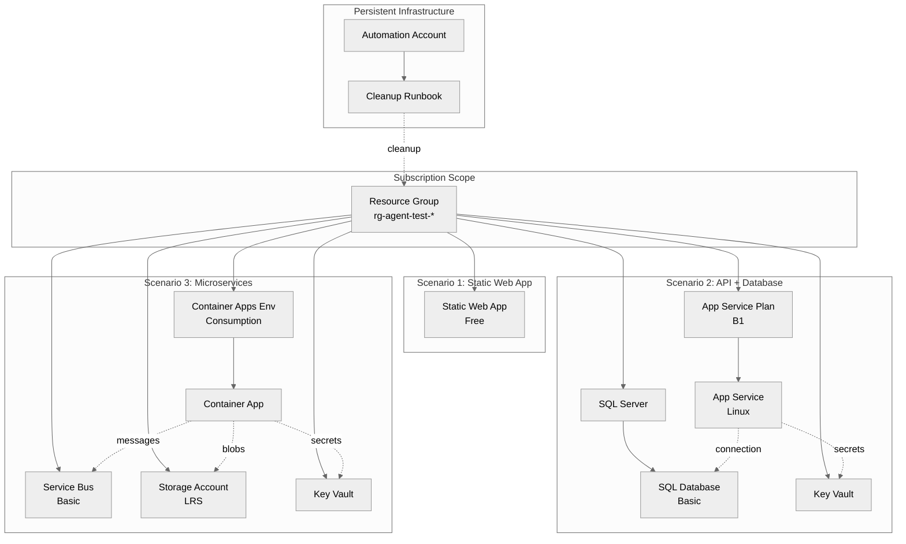

# Step 4: Implementation Plan - Agent Testing Framework

> Generated by bicep-plan agent | 2026-01-22

## Overview

This implementation plan details the Bicep Infrastructure as Code for the **Agent Testing
& Validation Framework**. The architecture follows an **ephemeral resource** pattern where
test resources are created on-demand, validated, and automatically cleaned up after 2 hours.

### Governance Alignment

This plan complies with governance constraints discovered in
[04-governance-constraints.md](04-governance-constraints.md).

Key constraints applied:

- No blocking policies detected (audit mode only)
- PCI DSS v4 and GDPR initiatives in audit mode
- CAF naming and tagging standards applied
- Security defaults (TLS 1.2, HTTPS-only) enforced

---

## Resource Inventory

| Resource              | Type                                             | SKU/Tier     | Dependencies       | AVM Module                               |
| --------------------- | ------------------------------------------------ | ------------ | ------------------ | ---------------------------------------- |
| Resource Group        | Microsoft.Resources/resourceGroups               | N/A          | None               | N/A                                      |
| App Service Plan      | Microsoft.Web/serverfarms                        | B1 (Linux)   | Resource Group     | ✅ avm/res/web/serverfarm                |
| App Service           | Microsoft.Web/sites                              | N/A          | App Service Plan   | ✅ avm/res/web/site                      |
| Azure SQL Server      | Microsoft.Sql/servers                            | N/A          | Resource Group     | ✅ avm/res/sql/server                    |
| Azure SQL Database    | Microsoft.Sql/servers/databases                  | Basic (5DTU) | SQL Server         | ✅ (included in server)                  |
| Key Vault             | Microsoft.KeyVault/vaults                        | Standard     | Resource Group     | ✅ avm/res/key-vault/vault               |
| Storage Account       | Microsoft.Storage/storageAccounts                | Standard LRS | Resource Group     | ✅ avm/res/storage/storage-account       |
| Container Apps Env    | Microsoft.App/managedEnvironments                | Consumption  | Resource Group     | ✅ avm/res/app/managed-environment       |
| Container App         | Microsoft.App/containerApps                      | Consumption  | Container Apps Env | ✅ avm/res/app/container-app             |
| Service Bus Namespace | Microsoft.ServiceBus/namespaces                  | Basic        | Resource Group     | ✅ avm/res/service-bus/namespace         |
| Static Web App        | Microsoft.Web/staticSites                        | Free         | Resource Group     | ✅ avm/res/web/static-site               |
| Automation Account    | Microsoft.Automation/automationAccounts          | Free         | Resource Group     | ✅ avm/res/automation/automation-account |
| Automation Runbook    | Microsoft.Automation/automationAccounts/runbooks | N/A          | Automation Account | ❌ Raw Bicep                             |

---

## Module Structure

```
infra/bicep/agent-testing/
├── main.bicep                      # Orchestration module
├── main.bicepparam                 # Parameter file
├── modules/
│   ├── resource-group.bicep        # Subscription-scoped RG creation
│   ├── app-service.bicep           # App Service Plan + Web App
│   ├── sql-database.bicep          # Azure SQL Server + Database
│   ├── key-vault.bicep             # Key Vault with access policies
│   ├── storage-account.bicep       # Storage Account
│   ├── container-apps.bicep        # Container Apps Environment + App
│   ├── service-bus.bicep           # Service Bus Namespace
│   ├── static-web-app.bicep        # Static Web App
│   └── automation-cleanup.bicep    # Automation Account + Runbook
├── scripts/
│   └── cleanup-test-resources.ps1  # PowerShell runbook for cleanup
└── deploy.ps1                      # Deployment script with what-if
```

---

## Implementation Tasks

### Task 1: main.bicep (Orchestration)

```yaml
name: main.bicep
kind: Raw
type: Microsoft.Resources/deployments
purpose: Orchestrate all test infrastructure modules

parameters:
  required:
    - name: environment
      type: string
      description: Environment name (always 'test')
      example: "test"
    - name: location
      type: string
      description: Azure region
      example: "swedencentral"
    - name: projectName
      type: string
      description: Project identifier
      example: "agent-testing"
  optional:
    - name: scenarioName
      type: string
      description: Test scenario being deployed
      default: "all"
    - name: deployScenario1
      type: bool
      description: Deploy Static Web App scenario
      default: true
    - name: deployScenario2
      type: bool
      description: Deploy API + Database scenario
      default: true
    - name: deployScenario3
      type: bool
      description: Deploy Microservices scenario
      default: true
    - name: deployCleanupAutomation
      type: bool
      description: Deploy cleanup automation
      default: true

variables:
  - name: uniqueSuffix
    value: uniqueString(resourceGroup().id)
    governance: "CAF naming convention for globally unique resources"
  - name: tags
    value: |
      {
        Environment: 'test'
        ManagedBy: 'Bicep'
        Project: projectName
        Owner: 'platform-engineering'
        TTL: '2h'
      }

outputs:
  - name: staticWebAppUrl
    type: string
    description: URL of deployed Static Web App
  - name: appServiceUrl
    type: string
    description: URL of deployed App Service
  - name: containerAppUrl
    type: string
    description: URL of deployed Container App
```

---

### Task 2: modules/static-web-app.bicep (Scenario 1)

```yaml
name: static-web-app
kind: AVM
avmModule: br/public:avm/res/web/static-site:0.7.0
purpose: Deploy Static Web App for smoke tests

parameters:
  required:
    - name: name
      type: string
      description: Static Web App name
      example: "stapp-test-agent-swc-abc123"
    - name: location
      type: string
      description: Azure region
      example: "swedencentral"
    - name: tags
      type: object
      description: Resource tags
  optional:
    - name: sku
      type: string
      description: SKU tier
      default: "Free"

outputs:
  - name: defaultHostname
    type: string
    description: Default hostname URL
  - name: resourceId
    type: string
    description: Resource ID

estimatedCost:
  sku: Free
  monthlyRange: "$0"
  costDrivers: ["No cost - Free tier"]

references:
  docs: https://learn.microsoft.com/azure/static-web-apps/
  avm: https://github.com/Azure/bicep-registry-modules/tree/main/avm/res/web/static-site
```

---

### Task 3: modules/app-service.bicep (Scenario 2 - Compute)

```yaml
name: app-service
kind: AVM
avmModule: br/public:avm/res/web/site:0.12.0
purpose: Deploy App Service for API testing

parameters:
  required:
    - name: name
      type: string
      description: Web App name
      example: "app-test-agent-swc-abc123"
    - name: serverFarmResourceId
      type: string
      description: App Service Plan resource ID
    - name: location
      type: string
      description: Azure region
    - name: tags
      type: object
      description: Resource tags
  optional:
    - name: kind
      type: string
      description: App kind
      default: "app,linux"
    - name: httpsOnly
      type: bool
      description: Enforce HTTPS
      default: true
      governance: "Required by PCI DSS v4 (audit)"

outputs:
  - name: defaultHostname
    type: string
    description: Default hostname URL
  - name: systemAssignedMIPrincipalId
    type: string
    description: Managed identity principal ID

estimatedCost:
  sku: B1 Linux
  monthlyRange: "$0.36 (20 hours)"
  costDrivers: ["Compute hours", "Ephemeral deployment"]

references:
  docs: https://learn.microsoft.com/azure/app-service/
  avm: https://github.com/Azure/bicep-registry-modules/tree/main/avm/res/web/site
```

**Companion Module: App Service Plan**

```yaml
name: app-service-plan
kind: AVM
avmModule: br/public:avm/res/web/serverfarm:0.4.0
purpose: Hosting plan for App Service

parameters:
  required:
    - name: name
      type: string
      example: "plan-test-agent-swc-abc123"
    - name: skuName
      type: string
      default: "B1"
    - name: skuCapacity
      type: int
      default: 1
```

---

### Task 4: modules/sql-database.bicep (Scenario 2 - Data)

```yaml
name: sql-database
kind: AVM
avmModule: br/public:avm/res/sql/server:0.11.0
purpose: Deploy Azure SQL Server and Database for data testing

parameters:
  required:
    - name: name
      type: string
      description: SQL Server name (globally unique)
      example: "sql-test-agent-swc-abc123"
    - name: location
      type: string
      description: Azure region
    - name: tags
      type: object
      description: Resource tags
    - name: administratorLogin
      type: string
      description: SQL admin username
      default: "sqladmin"
    - name: administratorLoginPassword
      type: securestring
      description: SQL admin password
  optional:
    - name: databases
      type: array
      description: Databases to create
      default: |
        [
          {
            name: 'testdb'
            sku: { name: 'Basic', tier: 'Basic' }
          }
        ]
    - name: minimalTlsVersion
      type: string
      default: "1.2"
      governance: "Required by PCI DSS v4 (audit)"

outputs:
  - name: fullyQualifiedDomainName
    type: string
    description: SQL Server FQDN
  - name: resourceId
    type: string
    description: Server resource ID

estimatedCost:
  sku: Basic (5 DTU)
  monthlyRange: "$0.14 (20 hours)"
  costDrivers: ["DTU hours", "Storage minimal"]

references:
  docs: https://learn.microsoft.com/azure/azure-sql/
  avm: https://github.com/Azure/bicep-registry-modules/tree/main/avm/res/sql/server
```

---

### Task 5: modules/key-vault.bicep (Scenario 2 & 3 - Security)

```yaml
name: key-vault
kind: AVM
avmModule: br/public:avm/res/key-vault/vault:0.11.0
purpose: Secure secrets storage for test scenarios

parameters:
  required:
    - name: name
      type: string
      description: Key Vault name (globally unique, max 24 chars)
      example: "kv-test-swc-abc123"
    - name: location
      type: string
      description: Azure region
    - name: tags
      type: object
      description: Resource tags
  optional:
    - name: sku
      type: string
      default: "standard"
    - name: enableSoftDelete
      type: bool
      default: false
      description: Disabled for test cleanup
    - name: enablePurgeProtection
      type: bool
      default: false
      description: Disabled for test cleanup

outputs:
  - name: uri
    type: string
    description: Key Vault URI
  - name: resourceId
    type: string
    description: Resource ID

estimatedCost:
  sku: Standard
  monthlyRange: "$0.01"
  costDrivers: ["Operations count (minimal)"]

references:
  docs: https://learn.microsoft.com/azure/key-vault/
  avm: https://github.com/Azure/bicep-registry-modules/tree/main/avm/res/key-vault/vault
```

---

### Task 6: modules/storage-account.bicep (Scenario 3 - Storage)

```yaml
name: storage-account
kind: AVM
avmModule: br/public:avm/res/storage/storage-account:0.14.0
purpose: Blob storage for microservices scenario

parameters:
  required:
    - name: name
      type: string
      description: Storage account name (lowercase, no hyphens, max 24 chars)
      example: "sttestagentswcabc123"
    - name: location
      type: string
      description: Azure region
    - name: tags
      type: object
      description: Resource tags
  optional:
    - name: skuName
      type: string
      default: "Standard_LRS"
    - name: allowBlobPublicAccess
      type: bool
      default: false
      governance: "Required by PCI DSS v4 (audit)"
    - name: supportsHttpsTrafficOnly
      type: bool
      default: true
      governance: "Required by PCI DSS v4 (audit)"
    - name: minimumTlsVersion
      type: string
      default: "TLS1_2"
      governance: "Required by PCI DSS v4 (audit)"

outputs:
  - name: primaryBlobEndpoint
    type: string
    description: Blob storage endpoint
  - name: resourceId
    type: string
    description: Resource ID

estimatedCost:
  sku: Standard LRS
  monthlyRange: "$0.02"
  costDrivers: ["Storage (1 GB)", "Transactions minimal"]

references:
  docs: https://learn.microsoft.com/azure/storage/
  avm: https://github.com/Azure/bicep-registry-modules/tree/main/avm/res/storage/storage-account
```

---

### Task 7: modules/container-apps.bicep (Scenario 3 - Compute)

```yaml
name: container-apps
kind: AVM
avmModule: br/public:avm/res/app/managed-environment:0.8.0
purpose: Deploy Container Apps Environment and sample app

parameters:
  required:
    - name: name
      type: string
      description: Environment name
      example: "cae-test-agent-swc-abc123"
    - name: location
      type: string
      description: Azure region
    - name: tags
      type: object
      description: Resource tags
  optional:
    - name: zoneRedundant
      type: bool
      default: false
      description: No zone redundancy for tests

outputs:
  - name: defaultDomain
    type: string
    description: Default domain for container apps
  - name: resourceId
    type: string
    description: Environment resource ID

estimatedCost:
  sku: Consumption
  monthlyRange: "$0.01"
  costDrivers: ["vCPU seconds", "Memory GB-seconds", "Requests"]

references:
  docs: https://learn.microsoft.com/azure/container-apps/
  avm: https://github.com/Azure/bicep-registry-modules/tree/main/avm/res/app/managed-environment
```

---

### Task 8: modules/service-bus.bicep (Scenario 3 - Messaging)

```yaml
name: service-bus
kind: AVM
avmModule: br/public:avm/res/service-bus/namespace:0.10.0
purpose: Message queue for microservices testing

parameters:
  required:
    - name: name
      type: string
      description: Service Bus namespace name
      example: "sb-test-agent-swc-abc123"
    - name: location
      type: string
      description: Azure region
    - name: tags
      type: object
      description: Resource tags
  optional:
    - name: skuName
      type: string
      default: "Basic"
    - name: queues
      type: array
      default: |
        [{ name: 'test-queue' }]

outputs:
  - name: serviceBusEndpoint
    type: string
    description: Service Bus endpoint
  - name: resourceId
    type: string
    description: Namespace resource ID

estimatedCost:
  sku: Basic
  monthlyRange: "$0.01"
  costDrivers: ["Message operations (minimal)"]

references:
  docs: https://learn.microsoft.com/azure/service-bus/
  avm: https://github.com/Azure/bicep-registry-modules/tree/main/avm/res/service-bus/namespace
```

---

### Task 9: modules/automation-cleanup.bicep (Persistent)

```yaml
name: automation-cleanup
kind: AVM
avmModule: br/public:avm/res/automation/automation-account:0.11.0
purpose: Automated cleanup of expired test resources

parameters:
  required:
    - name: name
      type: string
      description: Automation account name
      example: "aa-agent-testing-swc"
    - name: location
      type: string
      description: Azure region
    - name: tags
      type: object
      description: Resource tags
  optional:
    - name: skuName
      type: string
      default: "Free"

runbooks:
  - name: cleanup-test-resources
    type: PowerShell
    schedule: Every 30 minutes
    purpose: Delete resource groups with TTL tag older than 2 hours
    script: scripts/cleanup-test-resources.ps1

outputs:
  - name: resourceId
    type: string
    description: Automation account resource ID

estimatedCost:
  sku: Free
  monthlyRange: "$0"
  costDrivers: ["500 minutes free tier"]

references:
  docs: https://learn.microsoft.com/azure/automation/
  avm: https://github.com/Azure/bicep-registry-modules/tree/main/avm/res/automation/automation-account
```

---

### Task 10: deploy.ps1 (Deployment Script)

```yaml
name: deploy.ps1
kind: PowerShell
purpose: Orchestrate Bicep deployment with validation

features:
  - Parameter validation with [CmdletBinding(SupportsShouldProcess)]
  - $WhatIfPreference support
  - Bicep lint verification before deployment
  - Bicep build verification
  - What-If preview with confirmation
  - Deployment execution
  - Output display and logging
  - Error handling with cleanup option

parameters:
  - name: ResourceGroupName
    type: string
    mandatory: true
  - name: Location
    type: string
    default: "swedencentral"
  - name: ScenarioName
    type: string
    default: "all"
  - name: SkipWhatIf
    type: switch
    default: false
  - name: CleanupOnFailure
    type: switch
    default: true
```

---

## Dependency Graph



---

## Naming Conventions

| Resource           | Pattern                                | Example                         |
| ------------------ | -------------------------------------- | ------------------------------- |
| Resource Group     | rg-agent-test-{scenario}-{timestamp}   | rg-agent-test-api-20260122T1145 |
| App Service Plan   | plan-test-{project}-{region}-{suffix}  | plan-test-agent-swc-a1b2c3      |
| App Service        | app-test-{project}-{region}-{suffix}   | app-test-agent-swc-a1b2c3       |
| SQL Server         | sql-test-{project}-{region}-{suffix}   | sql-test-agent-swc-a1b2c3       |
| Key Vault          | kv-test-{region}-{suffix}              | kv-test-swc-a1b2c3              |
| Storage Account    | sttest{project}{suffix}                | sttestagenta1b2c3               |
| Container Apps Env | cae-test-{project}-{region}-{suffix}   | cae-test-agent-swc-a1b2c3       |
| Service Bus        | sb-test-{project}-{region}-{suffix}    | sb-test-agent-swc-a1b2c3        |
| Static Web App     | stapp-test-{project}-{region}-{suffix} | stapp-test-agent-swc-a1b2c3     |
| Automation Account | aa-{project}-{region}                  | aa-agent-testing-swc            |

---

## Security Configuration

| Resource        | Security Setting         | Value                                       | Governance      |
| --------------- | ------------------------ | ------------------------------------------- | --------------- |
| All resources   | Required tags            | Environment, ManagedBy, Project, Owner, TTL | CAF             |
| Storage Account | allowBlobPublicAccess    | `false`                                     | PCI DSS (audit) |
| Storage Account | supportsHttpsTrafficOnly | `true`                                      | PCI DSS (audit) |
| Storage Account | minimumTlsVersion        | `TLS1_2`                                    | PCI DSS (audit) |
| SQL Server      | minimalTlsVersion        | `1.2`                                       | PCI DSS (audit) |
| App Service     | httpsOnly                | `true`                                      | PCI DSS (audit) |
| Key Vault       | enableSoftDelete         | `false`                                     | Test cleanup    |
| Key Vault       | enablePurgeProtection    | `false`                                     | Test cleanup    |

---

## Estimated Implementation Time

| Task                           | Estimated Duration |
| ------------------------------ | ------------------ |
| main.bicep orchestration       | 30 minutes         |
| Scenario 1 module (SWA)        | 15 minutes         |
| Scenario 2 modules (3 files)   | 45 minutes         |
| Scenario 3 modules (4 files)   | 60 minutes         |
| Automation cleanup module      | 30 minutes         |
| Deployment script (deploy.ps1) | 20 minutes         |
| Testing and validation         | 60 minutes         |
| **Total**                      | **~4.5 hours**     |

---

## Approval Gate

> **📋 Implementation Plan Ready**
>
> - **12 Azure resources** planned across 3 test scenarios
> - **10 Bicep modules** to create (8 AVM, 2 raw)
> - **Governance constraints** addressed (PCI DSS, GDPR audit mode)
> - **CAF naming conventions** applied with uniqueSuffix pattern
> - **Security defaults** enforced (TLS 1.2, HTTPS-only, no public blobs)
>
> **Estimated Cost**: ~$1-5/month (well under $100 budget)
>
> **Estimated Implementation**: ~4.5 hours
>
> Reply **"approve"** to proceed to bicep-code, or provide feedback.

---

_Plan generated by bicep-plan agent following Azure Well-Architected Framework guidelines._
