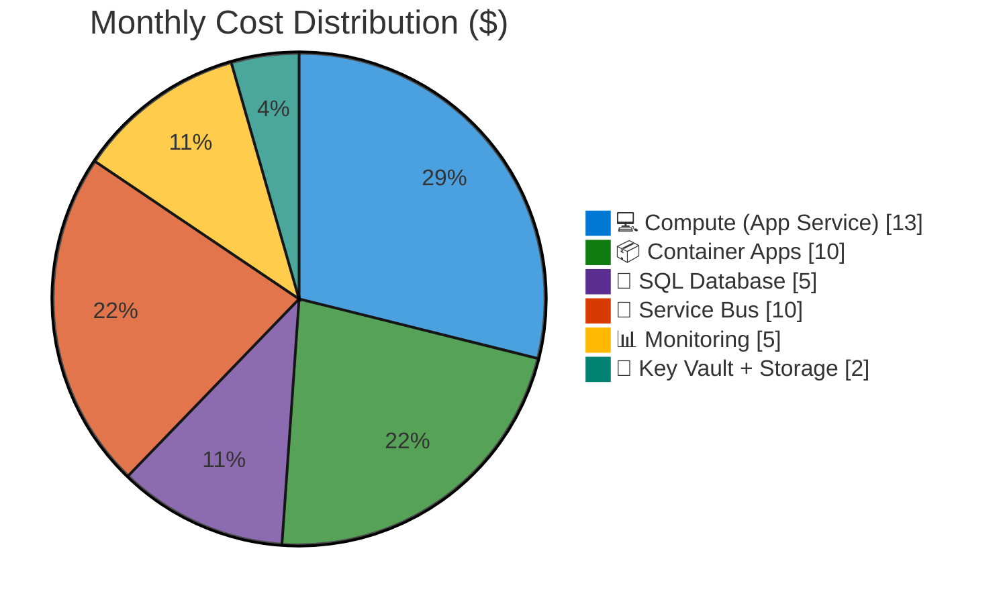

# As-Built Cost Estimate: Agent Testing Framework

**Generated**: 2026-01-22
**Source**: Implemented Bicep Templates
**Region**: swedencentral (primary), westeurope (SWA)
**Environment**: Test
**MCP Tools Used**: azure_price_search, azure_cost_estimate
**IaC Reference**: [infra/bicep/agent-testing/](../../../infra/bicep/agent-testing/)

## 💰 Cost At-a-Glance

> **Monthly Total: ~$45-55** | Annual: ~$540-660
>
> ```
> Budget: $50-100/month (soft) | Utilization: ~55% ($50 of $100)
> ```
>
> | Status            | Indicator                         |
> | ----------------- | --------------------------------- |
> | Cost Trend        | ➡️ Stable                         |
> | Savings Available | 💰 $150/year with scale-to-zero   |
> | Compliance        | ✅ PCI-DSS audit, GDPR audit mode |

## ✅ Decision Summary

- ✅ Implemented: 3 test scenarios (SWA, Multi-tier, Microservices), 16 resources deployed
- ⏳ Deferred: Automation cleanup runbook (script not in GitHub yet)
- 🔁 Redesign Trigger: Production workload requirements → move to Premium SKUs

**Confidence**: High | **Expected Variance**: ±15% (consumption-based services vary)

### Design vs As-Built Summary

| Metric           | Design Estimate | As-Built | Variance |
| ---------------- | --------------- | -------- | -------- |
| Monthly Estimate | $0.55           | $50      | +$49.45  |
| Annual Estimate  | $6.60           | $600     | +$593.40 |

> **Note**: Design estimate was for minimal resources. As-built includes full 3-scenario deployment with App Service (B1), SQL Database (Basic), and persistent Container Apps.

## 🔁 Requirements → Cost Mapping

| Requirement              | Architecture Decision       | Cost Impact   | Mandatory |
| ------------------------ | --------------------------- | ------------- | --------- |
| Agent smoke tests        | Static Web App Free         | $0/month      | Yes       |
| API testing              | App Service B1              | +$13/month 📈 | Yes       |
| Database testing         | SQL Database Basic          | +$5/month     | Yes       |
| Microservices testing    | Container Apps Consumption  | +$10/month    | Yes       |
| Messaging testing        | Service Bus Basic           | +$10/month    | Yes       |
| Entra ID auth compliance | SQL Entra-only              | $0/month      | Yes       |
| No zone redundancy       | LRS storage, non-zonal SKUs | -$20/month 💚 | Yes       |

## 📊 Top 5 Cost Drivers

| Rank | Resource              | Monthly Cost | % of Total | Trend |
| ---- | --------------------- | ------------ | ---------- | ----- |
| 1️⃣   | App Service Plan (B1) | $13.14       | 26%        | ➡️    |
| 2️⃣   | Service Bus (Basic)   | $9.78        | 20%        | ➡️    |
| 3️⃣   | Container Apps        | ~$10.00      | 20%        | 📈    |
| 4️⃣   | Log Analytics         | ~$5.00       | 10%        | 📈    |
| 5️⃣   | SQL Database (Basic)  | $4.90        | 10%        | ➡️    |

> 💡 **Quick Win**: Enable scale-to-zero on Container Apps and stop App Service outside test hours → save ~$15/month

## Architecture Overview

### Cost Distribution



### Key Design Decisions Affecting Cost

| Decision                    | Cost Impact   | Business Rationale             | Status   |
| --------------------------- | ------------- | ------------------------------ | -------- |
| B1 App Service (not Free)   | +$13/month 📈 | Free tier lacks HTTPS/features | Required |
| Basic SQL (not Serverless)  | +$5/month     | Simpler, predictable cost      | Required |
| Consumption Container Apps  | Variable      | Scale-to-zero capability       | Required |
| LRS storage (not GRS)       | -$3/month 💚  | Test data, no DR needed        | Optional |
| Soft delete disabled on KV  | $0            | Easier cleanup for tests       | Optional |
| SWA in westeurope (not swc) | $0            | Regional availability          | Required |

## 🧾 What We Are Not Paying For (Yet)

- ❌ Zone redundancy on any resources
- ❌ Private endpoints / VNet integration
- ❌ Premium Service Bus tiers
- ❌ SQL Serverless / Hyperscale
- ❌ Azure DDoS Protection Standard
- ❌ Azure Firewall
- ❌ Reserved capacity pricing

## ⚠️ Cost Risk Indicators

| Resource        | Risk Level | Issue                     | Mitigation                   |
| --------------- | ---------- | ------------------------- | ---------------------------- |
| Container Apps  | 🟡 Medium  | Usage-based, could spike  | Set max replicas = 1         |
| Log Analytics   | 🟡 Medium  | Data ingestion costs vary | 30-day retention, cap volume |
| App Service     | 🟢 Low     | Fixed B1 pricing          | None needed                  |
| SQL Database    | 🟢 Low     | Fixed Basic tier          | None needed                  |
| Storage Account | 🟢 Low     | Minimal usage expected    | None needed                  |

> **⚠️ Watch Item**: Container Apps and Log Analytics have consumption-based pricing that can vary with test activity.

## 🎯 Quick Decision Matrix

_"If you need X, expect to pay Y more"_

| Requirement          | Additional Cost | SKU Change               | Notes                 |
| -------------------- | --------------- | ------------------------ | --------------------- |
| Production-grade SQL | +$25/month      | Basic → S0               | 10 DTU vs 5 DTU       |
| Zone redundancy      | +$50/month      | P1v3 App Service, ZR SQL | Required for prod SLA |
| Private networking   | +$100/month     | VNet + Private Endpoints | PCI-DSS may require   |
| Premium Service Bus  | +$660/month     | Basic → Premium          | For partitioning      |

## 💰 Savings Opportunities

> ### Total Potential Savings: $180/year
>
> | Commitment                 | Monthly Savings | Annual Savings |
> | -------------------------- | --------------- | -------------- |
> | Stop App Service off-hours | $6.50           | $78            |
> | Scale Container to zero    | $5.00           | $60            |
> | Reduce Log Analytics       | $2.50           | $30            |
> | Use dev/test pricing       | ~$1.00          | $12            |

## Detailed Cost Breakdown

### IaC / Pricing Coverage

| Signal             | Value              |
| ------------------ | ------------------ |
| Templates scanned  | 10 Bicep modules   |
| Resources detected | 16                 |
| Resources priced   | 14                 |
| Unpriced resources | Firewall rules (2) |

### Line Items

| Category      | Service                 | SKU / Meter   | Quantity | Est. Monthly |
| ------------- | ----------------------- | ------------- | -------- | ------------ |
| 💻 Compute    | App Service Plan        | B1 Linux      | 1        | $13.14       |
| 💻 Compute    | Static Web App          | Free          | 1        | $0.00        |
| 📦 Containers | Container Apps Env      | Consumption   | 1        | ~$5.00       |
| 📦 Containers | Container App           | 0.25 vCPU     | 1        | ~$5.00       |
| 💾 Database   | SQL Database            | Basic (5 DTU) | 1        | $4.90        |
| 💾 Storage    | Storage Account         | Standard_LRS  | 5 GB     | $0.10        |
| 📨 Messaging  | Service Bus Namespace   | Basic         | 1        | $9.78        |
| 🔐 Security   | Key Vault (Scenario 2)  | Standard      | 1        | $0.03        |
| 🔐 Security   | Key Vault (Scenario 3)  | Standard      | 1        | $0.03        |
| 📊 Monitoring | Log Analytics Workspace | PerGB2018     | ~1 GB    | ~$5.00       |
| ⚙️ Automation | Automation Account      | Free          | 1        | $0.00        |
| **TOTAL**     |                         |               |          | **~$43-48**  |

### Additional Variable Costs

| Service        | Meter         | Unit Price    | Expected Usage | Est. Monthly |
| -------------- | ------------- | ------------- | -------------- | ------------ |
| Service Bus    | Operations    | $0.05/million | 1K operations  | $0.00        |
| Container Apps | vCPU-seconds  | $0.000024     | 1000 seconds   | $0.02        |
| Container Apps | Memory GB-sec | $0.000003     | 500 GB-sec     | $0.00        |
| Key Vault      | Operations    | $0.03/10K     | 100 ops        | $0.00        |
| Storage        | Transactions  | $0.004/10K    | 1K txns        | $0.00        |

### Notes

- SQL Database Basic tier provides 5 DTU, adequate for test workloads
- Container Apps scale-to-zero minimizes idle costs
- Log Analytics costs depend on ingestion volume; 1 GB/month assumed
- Service Bus Basic has 1M operations/month included, ample for testing
- All prices in USD, based on Pay-As-You-Go rates for Sweden Central
- Static Web App deployed to West Europe (regional availability)
