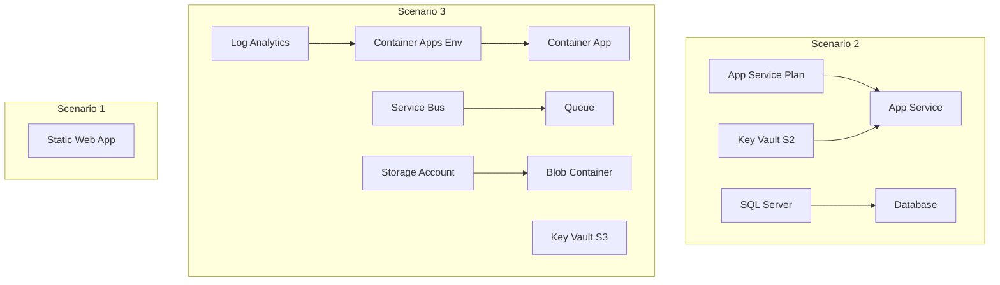

# Agent Testing Framework - Resource Inventory

> **Status**: As-Built | **Generated**: 2026-01-22
>
> Complete inventory of deployed Azure resources for the Agent Testing Framework.

---

## Summary

| Category    | Count  | Monthly Cost Est. |
| ----------- | ------ | ----------------- |
| Compute     | 3      | ~$15              |
| Database    | 2      | ~$5               |
| Storage     | 1      | <$1               |
| Networking  | 0      | $0                |
| Security    | 2      | <$1               |
| Monitoring  | 1      | ~$5               |
| Integration | 1      | ~$10              |
| Automation  | 1      | Free              |
| **Total**   | **16** | **~$45-55**       |

---

## Resource Listing

### Scenario 1: Static Web App

| Resource Name                       | Type                      | SKU  | Location   | Purpose                               |
| ----------------------------------- | ------------------------- | ---- | ---------- | ------------------------------------- |
| stapp-test-agent-testing-weu-chw5en | Microsoft.Web/staticSites | Free | westeurope | Smoke test target for SWA agent tests |

### Scenario 2: Multi-tier (API + Database)

| Resource Name                      | Type                            | SKU      | Location      | Purpose                    |
| ---------------------------------- | ------------------------------- | -------- | ------------- | -------------------------- |
| plan-test-agent-testing-swc-chw5en | Microsoft.Web/serverFarms       | B1       | swedencentral | App Service compute tier   |
| app-test-agent-testing-swc-chw5en  | Microsoft.Web/sites             | -        | swedencentral | Web API application        |
| sql-test-agent-testing-swc-chw5en  | Microsoft.Sql/servers           | -        | swedencentral | SQL Server (Entra ID auth) |
| testdb                             | Microsoft.Sql/servers/databases | Basic    | swedencentral | Test database (5 DTU)      |
| kv-s2-swc-chw5ensf                 | Microsoft.KeyVault/vaults       | Standard | swedencentral | Secrets management         |

### Scenario 3: Microservices

| Resource Name                         | Type                                     | SKU          | Location      | Purpose                |
| ------------------------------------- | ---------------------------------------- | ------------ | ------------- | ---------------------- |
| cae-test-agent-testing-swc-chw5en     | Microsoft.App/managedEnvironments        | Consumption  | swedencentral | Container Apps hosting |
| ca-cae-test-agent-testi               | Microsoft.App/containerApps              | -            | swedencentral | Sample container app   |
| log-cae-test-agent-testing-swc-chw5en | Microsoft.OperationalInsights/workspaces | PerGB2018    | swedencentral | Container logs         |
| sb-test-agent-testing-swc-chw5en      | Microsoft.ServiceBus/namespaces          | Basic        | swedencentral | Message queue          |
| test-queue                            | Microsoft.ServiceBus/namespaces/queues   | -            | swedencentral | Test queue             |
| sttestagenttchw5ensf                  | Microsoft.Storage/storageAccounts        | Standard_LRS | swedencentral | Blob storage           |
| test-data                             | Blob container                           | -            | swedencentral | Test data container    |
| kv-s3-swc-chw5ensf                    | Microsoft.KeyVault/vaults                | Standard     | swedencentral | Secrets management     |

### Shared/Automation

| Resource Name        | Type                                    | SKU  | Location      | Purpose           |
| -------------------- | --------------------------------------- | ---- | ------------- | ----------------- |
| aa-agent-testing-swc | Microsoft.Automation/automationAccounts | Free | swedencentral | TTL-based cleanup |

---

## Resource Details

### SQL Server Configuration

| Property       | Value                                                  |
| -------------- | ------------------------------------------------------ |
| Server Name    | sql-test-agent-testing-swc-chw5en                      |
| FQDN           | sql-test-agent-testing-swc-chw5en.database.windows.net |
| Authentication | **Entra ID Only**                                      |
| SQL Auth       | Disabled                                               |
| Admin          | jonathan@lordofthecloud.eu                             |
| TLS Version    | 1.2                                                    |
| Zone Redundant | No                                                     |
| Backup Storage | Local (LRS)                                            |

### App Service Configuration

| Property         | Value                                                       |
| ---------------- | ----------------------------------------------------------- |
| App Name         | app-test-agent-testing-swc-chw5en                           |
| URL              | https://app-test-agent-testing-swc-chw5en.azurewebsites.net |
| Runtime          | Linux                                                       |
| HTTPS Only       | Yes                                                         |
| TLS Version      | 1.2                                                         |
| Managed Identity | System-assigned                                             |

### Container Apps Environment

| Property         | Value                                                 |
| ---------------- | ----------------------------------------------------- |
| Environment Name | cae-test-agent-testing-swc-chw5en                     |
| Domain           | happysky-0bc10407.swedencentral.azurecontainerapps.io |
| Workload Profile | Consumption                                           |
| Zone Redundant   | No                                                    |
| Log Destination  | Log Analytics                                         |

### Storage Account Configuration

| Property           | Value                                               |
| ------------------ | --------------------------------------------------- |
| Account Name       | sttestagenttchw5ensf                                |
| Blob Endpoint      | https://sttestagenttchw5ensf.blob.core.windows.net/ |
| Replication        | LRS                                                 |
| Access Tier        | Hot                                                 |
| HTTPS Only         | Yes                                                 |
| Public Blob Access | Disabled                                            |
| TLS Version        | 1.2                                                 |

---

## Tags

All resources are tagged with:

| Tag         | Value                |
| ----------- | -------------------- |
| Environment | test                 |
| ManagedBy   | Bicep                |
| Owner       | platform-engineering |
| Project     | agent-testing        |
| Scenario    | all                  |
| TTL         | 2h                   |

---

## Dependencies

---

## IaC Reference

| File                                        | Purpose                |
| ------------------------------------------- | ---------------------- |
| `infra/bicep/agent-testing/main.bicep`      | Orchestration template |
| `infra/bicep/agent-testing/main.bicepparam` | Parameter file         |
| `infra/bicep/agent-testing/modules/*.bicep` | Resource modules       |
