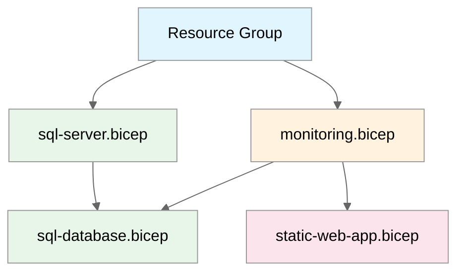

# Step 4: Implementation Plan - static-webapp-test

> Generated by bicep-plan agent | 2024-12-17

## Overview

This plan defines the Bicep implementation for a static web application with Azure SQL Database backend.

---

## Resource Inventory

| Resource             | Type                                       | SKU   | Dependencies   |
| -------------------- | ------------------------------------------ | ----- | -------------- |
| Resource Group       | `Microsoft.Resources/resourceGroups`       | N/A   | None           |
| Static Web App       | `Microsoft.Web/staticSites`                | Free  | Resource Group |
| SQL Server           | `Microsoft.Sql/servers`                    | N/A   | Resource Group |
| SQL Database         | `Microsoft.Sql/servers/databases`          | S0    | SQL Server     |
| Log Analytics        | `Microsoft.OperationalInsights/workspaces` | Free  | Resource Group |
| Application Insights | `Microsoft.Insights/components`            | Basic | Log Analytics  |

---

## Module Structure

```
infra/bicep/static-webapp-test/
├── main.bicep              # Orchestration
├── main.bicepparam         # Parameter file
├── modules/
│   ├── static-web-app.bicep
│   ├── sql-server.bicep
│   ├── sql-database.bicep
│   └── monitoring.bicep
└── deploy.ps1              # Deployment script
```

---

## Implementation Tasks

### Task 1: main.bicep (Orchestration)

**Purpose**: Main entry point, orchestrates all modules

**Parameters**:

- `location` (string): Azure region (default: swedencentral)
- `environment` (string): Environment name (dev/staging/prod)
- `projectName` (string): Project identifier
- `sqlAdminObjectId` (string): Azure AD object ID for SQL admin

**Variables**:

- `uniqueSuffix`: Generated from `uniqueString(resourceGroup().id)`
- `tags`: Standard tags object

**Modules Called**:

1. `monitoring.bicep` - Deploy first (dependency for diagnostics)
2. `sql-server.bicep` - SQL logical server with Azure AD auth
3. `sql-database.bicep` - SQL database S0 tier
4. `static-web-app.bicep` - Static Web App with integrated Functions

### Task 2: modules/monitoring.bicep

**Resources**:

- Log Analytics Workspace (Free tier, 30-day retention)
- Application Insights (connected to Log Analytics)

**Outputs**:

- `logAnalyticsWorkspaceId`
- `applicationInsightsId`
- `applicationInsightsConnectionString`

### Task 3: modules/sql-server.bicep

**Resources**:

- SQL Server (Azure AD-only authentication)
- Azure AD Administrator assignment
- Firewall rule (Allow Azure services)

**Key Configuration**:

```bicep
administrators: {
  administratorType: 'ActiveDirectory'
  principalType: 'User'
  login: sqlAdminName
  sid: sqlAdminObjectId
  tenantId: tenant().tenantId
  azureADOnlyAuthentication: true  // Required by policy
}
```

**Outputs**:

- `sqlServerName`
- `sqlServerFqdn`

### Task 4: modules/sql-database.bicep

**Resources**:

- SQL Database (Standard S0, 10 DTU)

**Key Configuration**:

```bicep
sku: {
  name: 'Standard'
  tier: 'Standard'
  capacity: 10  // 10 DTU = S0
}
properties: {
  collation: 'SQL_Latin1_General_CP1_CI_AS'
  maxSizeBytes: 268435456000  // 250 GB
}
```

**Outputs**:

- `databaseName`
- `connectionString` (template for app settings)

### Task 5: modules/static-web-app.bicep

**Resources**:

- Static Web App (Free tier)

**Key Configuration**:

```bicep
sku: {
  name: 'Free'
  tier: 'Free'
}
properties: {
  repositoryUrl: ''  // Set after deployment
  branch: 'main'
  buildProperties: {
    appLocation: '/'
    apiLocation: 'api'
    outputLocation: 'build'
  }
}
```

**Outputs**:

- `staticWebAppName`
- `staticWebAppUrl`
- `staticWebAppId`

### Task 6: deploy.ps1 (Deployment Script)

**Features**:

- Parameter validation
- Bicep lint/build verification
- What-If preview
- Deployment execution
- Output display

---

## Dependency Graph



---

## Naming Conventions

| Resource       | Pattern                        | Example                             |
| -------------- | ------------------------------ | ----------------------------------- |
| Resource Group | `rg-{project}-{env}`           | `rg-static-webapp-test-dev`         |
| Static Web App | `stapp-{project}-{env}`        | `stapp-static-webapp-test-dev`      |
| SQL Server     | `sql-{project}-{env}-{suffix}` | `sql-static-webapp-test-dev-abc123` |
| SQL Database   | `sqldb-{project}-{env}`        | `sqldb-static-webapp-test-dev`      |
| Log Analytics  | `log-{project}-{env}`          | `log-static-webapp-test-dev`        |
| App Insights   | `appi-{project}-{env}`         | `appi-static-webapp-test-dev`       |

---

## Security Configuration

| Resource       | Security Setting | Value                             |
| -------------- | ---------------- | --------------------------------- |
| SQL Server     | Authentication   | Azure AD-only                     |
| SQL Server     | Public network   | Enabled (Azure services)          |
| SQL Server     | TLS Version      | 1.2                               |
| Static Web App | HTTPS            | Enforced                          |
| Static Web App | Auth             | Azure AD (configured post-deploy) |

---

## Estimated Implementation Time

| Task               | Estimated Duration |
| ------------------ | ------------------ |
| Bicep modules      | 15 minutes         |
| Testing/validation | 10 minutes         |
| Deployment         | 5 minutes          |
| **Total**          | **~30 minutes**    |

---

## Approval Gate

> **📋 Implementation Plan Ready**
>
> - 6 Azure resources planned
> - 5 Bicep modules to create
> - Governance constraints addressed
> - CAF naming conventions applied
>
> Reply **"approve"** to proceed to bicep-implement, or provide feedback.

---

_Plan generated by bicep-plan agent following Azure Well-Architected Framework guidelines._
