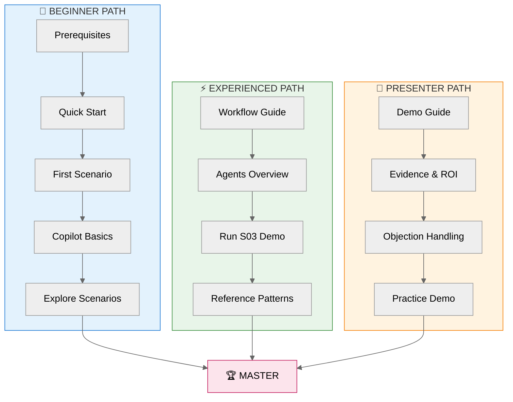

# 📚 Documentation Hub

> **Agentic InfraOps v3.6.0** — Azure infrastructure engineered by agents
>
> 🔗 [aka.ms/agenticinfraops](https://aka.ms/agenticinfraops)

---

## 🎯 Choose Your Path

---

### 🌱 Beginner Path

**New to GitHub Copilot or Infrastructure as Code** | ⏱️ 2-4 hours

Start here if you're new to AI-assisted development or Azure IaC.

- [ ] **Step 1**: Check [prerequisites](getting-started/quickstart.md#prerequisites) (15 min)
- [ ] **Step 2**: Complete [Quick Start](getting-started/quickstart.md) — clone, open Dev Container (10 min)
- [ ] **Step 3**: Run [your first scenario](getting-started/first-scenario.md) — S01 Bicep Baseline (30 min)
- [ ] **Step 4**: Learn [Copilot basics](guides/copilot-getting-started.md) (30 min)
- [ ] **Step 5**: Explore [more scenarios](../scenarios/) at your own pace (2+ hrs)

| Step | What You'll Do | Time | Link |
| ---- | -------------- | ---- | ---- |
| 1 | Verify prerequisites | 15 min | [Prerequisites](getting-started/quickstart.md#prerequisites) |
| 2 | Clone & open Dev Container | 10 min | [Quick Start](getting-started/quickstart.md) |
| 3 | Complete S01 scenario | 30 min | [First Scenario](getting-started/first-scenario.md) |
| 4 | Learn Copilot basics | 30 min | [Copilot Getting Started](guides/copilot-getting-started.md) |
| 5 | Explore scenarios | 2+ hrs | [Scenarios Index](../scenarios/) |

---

### ⚡ Experienced Path

**Know IaC, want to learn the agentic workflow** | ⏱️ 30-60 min

Start here if you're familiar with Bicep/Terraform and want to leverage the 7-step agent workflow.

| Step | What You'll Do | Time | Link |
| ---- | -------------- | ---- | ---- |
| 1 | Understand 7-step workflow | 10 min | [Workflow Guide](reference/workflow.md) |
| 2 | Review agent capabilities | 10 min | [Agents Overview](reference/agents-overview.md) |
| 3 | Run S03 Agentic Workflow | 30 min | [S03 Scenario](../scenarios/S03-five-agent-workflow/) |
| 4 | Reference patterns | Ongoing | [Bicep Patterns](reference/bicep-patterns.md) |

**Quick Jump**: [Defaults](reference/defaults.md) ·
[Agents](reference/agents-overview.md) ·
[Workflow](reference/workflow.md) ·
[Patterns](reference/bicep-patterns.md)

---

### 🎤 Presenter Path

**Preparing demos or customer presentations** | ⏱️ 15-30 min

Start here if you're preparing to demo Agentic InfraOps or present to stakeholders.

| Step | What You'll Do | Time | Link |
| ---- | -------------- | ---- | ---- |
| 1 | Review demo guide | 10 min | [Demo Delivery Guide](presenter/demo-delivery-guide.md) |
| 2 | Gather evidence | 5 min | [Time Savings Evidence](presenter/time-savings-evidence.md) |
| 3 | Prepare objection responses | 5 min | [Objection Handling](presenter/objection-handling.md) |
| 4 | Run practice demo | 15 min | [Presenter Toolkit](presenter/) |

**Quick Jump**: [Executive Pitch](presenter/executive-pitch.md) ·
[ROI Calculator](presenter/roi-calculator.md) ·
[Portfolio Showcase](presenter/portfolio-showcase.md)

---

## 🔍 Quick Find

| I want to... | Go to... |
| ------------ | -------- |
| Get started in 10 minutes | [Quick Start](getting-started/quickstart.md) |
| Understand the 7-step workflow | [Workflow Guide](reference/workflow.md) |
| See all 7 agents at a glance | [Agents Overview](reference/agents-overview.md) |
| Find region/naming defaults | [Defaults Reference](reference/defaults.md) |
| Learn Bicep deployment patterns | [Bicep Patterns](reference/bicep-patterns.md) |
| Troubleshoot an issue | [Troubleshooting](guides/troubleshooting.md) |
| Prepare a customer demo | [Presenter Toolkit](presenter/) |
| Find a specific scenario | [Scenarios Index](../scenarios/) |
| Understand a term | [Glossary](GLOSSARY.md) |

---

<strong>📁 All Documentation</strong> (click to expand)

### Getting Started

| Document | Description |
| -------- | ----------- |
| [Quick Start](getting-started/quickstart.md) | 10-minute setup + first demo |
| [First Scenario](getting-started/first-scenario.md) | Step-by-step S01 walkthrough |
| [Learning Paths](getting-started/learning-paths.md) | Role-based comprehensive paths |

### Guides

| Document | Description |
| -------- | ----------- |
| [Copilot Getting Started](guides/copilot-getting-started.md) | Install, configure, first steps |
| [Copilot Best Practices](guides/copilot-best-practices.md) | Prompting tips, validation |
| [Model Selection](guides/copilot-model-selection.md) | Choosing the right AI model |
| [Dev Containers Setup](guides/dev-containers-setup.md) | Docker setup, alternatives |
| [Troubleshooting](guides/troubleshooting.md) | Common issues and solutions |
| [Markdown Style Guide](guides/markdown-style-guide.md) | Documentation standards |

### Reference

| Document | Description |
| -------- | ----------- |
| [Defaults](reference/defaults.md) | Regions, naming, tags, SKUs |
| [Agents Overview](reference/agents-overview.md) | All 7 agents comparison |
| [Workflow](reference/workflow.md) | Canonical 7-step diagram |
| [Bicep Patterns](reference/bicep-patterns.md) | Deployment patterns |
| [Glossary](GLOSSARY.md) | Terms and acronyms |

### Presenter Resources

| Document | Description |
| -------- | ----------- |
| [Presenter Toolkit](presenter/) | Demo guides, checklists |
| [Executive Pitch](presenter/executive-pitch.md) | C-level presentation |
| [Time Savings Evidence](presenter/time-savings-evidence.md) | ROI data |
| [Portfolio Showcase](presenter/portfolio-showcase.md) | Real-world examples |
| [Objection Handling](presenter/objection-handling.md) | Common objections |
| [ROI Calculator](presenter/roi-calculator.md) | Calculate savings |

### Architecture

| Document | Description |
| -------- | ----------- |
| [Workflow Guide](workflow/WORKFLOW.md) | Detailed workflow documentation |
| [ADR Index](adr/) | Architecture Decision Records |
| [Cost Estimates](cost-estimates/) | Azure pricing examples |
| [Diagrams](diagrams/) | Generated architecture diagrams |

---

<strong>🎯 Scenarios by Difficulty</strong> (click to expand)

### 🟢 Beginner

| Scenario | Description | Time |
| -------- | ----------- | ---- |
| [S01 Bicep Baseline](../scenarios/S01-bicep-baseline/) | Hub-spoke network with Bicep | 30 min |
| [S02 Terraform Baseline](../scenarios/S02-terraform-baseline/) | Same topology with Terraform | 30 min |
| [S09 Diagrams as Code](../scenarios/S08-diagrams-as-code/) | Python architecture diagrams | 20 min |

### 🟡 Intermediate

| Scenario | Description | Time |
| -------- | ----------- | ---- |
| [S05 Documentation Gen](../scenarios/S04-documentation-generation/) | Auto-generate docs from code | 90 min |
| [S06 Service Validation](../scenarios/S05-service-validation/) | Automated UAT and load testing | 30 min |
| [S07 Troubleshooting](../scenarios/S06-troubleshooting/) | Diagnose infrastructure issues | 25 min |
| [S08 SBOM Generator](../scenarios/S07-sbom-generator/) | Software Bill of Materials | 75 min |

### 🔴 Advanced

| Scenario | Description | Time |
| -------- | ----------- | ---- |
| [S03 Agentic Workflow](../scenarios/S03-five-agent-workflow/) | Full 7-step agent workflow | 45-60 min |
| [S04 E-Commerce Platform](../scenarios/S04-ecommerce-platform/) | PCI-DSS compliant retail | 60-90 min |
| [S10 Coding Agent](../scenarios/S09-coding-agent/) | Async GitHub Issues automation | 30 min |

---

## 🔗 Quick Links

- 📖 [Main README](../README.md) — Repository overview
- 🎯 [Scenarios](../scenarios/) — Learning scenarios and demos
- 💰 [Azure Pricing MCP](../mcp/azure-pricing-mcp/) — Real-time pricing tools
- 🤖 [Agent Definitions](../.github/agents/) — Custom agent configuration

---

**Version**: 3.6.0 | [Back to Main README](../README.md)
