# Documentation Hub

> Agentic InfraOps | [Version info](../VERSION.md)
>
> 🔗 [aka.ms/agenticinfraops](https://aka.ms/agenticinfraops)

Welcome to the Agentic InfraOps documentation center.
Choose your path based on experience level.

```mermaid
%%{init: {'theme':'neutral'}}%%
flowchart LR
    subgraph Start["🎯 Choose Your Path"]
        B["🟢 Beginner<br/>New to IaC/Copilot"]
        E["🟡 Experienced<br/>Know IaC, new to agents"]
        P["🔴 Presenter<br/>Delivering demos"]
    end

    subgraph Resources
        QS["📖 Quick Start"]
        REF["📚 Reference Docs"]
        DEMO["🎬 Demo Toolkit"]
    end

    B --> QS
    E --> REF
    P --> DEMO
```

| Path               | Start Here                                   |
| ------------------ | -------------------------------------------- |
| 🟢 **Beginner**    | [Quick Start](getting-started/quickstart.md) |
| 🟡 **Experienced** | [Reference Docs](reference/)                 |
| 🔴 **Presenter**   | [Demo Toolkit](presenter/)                   |

---

## 🟢 Beginner Path — New to IaC or Copilot

**Goal**: Get running in 15 minutes, understand the basics

| Step | Resource                                                     | Time   |
| ---- | ------------------------------------------------------------ | ------ |
| 1    | [Quick Start](getting-started/quickstart.md)                 | 10 min |
| 2    | [Your First Scenario](getting-started/first-scenario.md)     | 15 min |
| 3    | [Copilot Getting Started](guides/copilot-getting-started.md) | 10 min |
| 4    | Run [S01-bicep-baseline](../scenarios/S01-bicep-baseline/)   | 20 min |

📚 **Next**: [Learning Paths](getting-started/learning-paths.md) for structured progression

---

## 🟡 Experienced Path — Know IaC, New to Agents

**Goal**: Understand agent workflow, run advanced scenarios

| Step | Resource                                                       | Time   |
| ---- | -------------------------------------------------------------- | ------ |
| 1    | [Reference: Workflow](reference/workflow.md)                   | 5 min  |
| 2    | [Reference: Agents Overview](reference/agents-overview.md)     | 5 min  |
| 3    | Run [S02-agentic-workflow](../scenarios/S02-agentic-workflow/) | 30 min |
| 4    | [Reference: Bicep Patterns](reference/bicep-patterns.md)       | 10 min |

📚 **Deep Dive**: Use the reference docs above first.
ADRs are archived and only referenced via explicitly labeled direct links.

---

## 🔴 Presenter Path — Delivering Demos

**Goal**: Prepare for customer/partner presentations

| Step | Resource                                                    | Time   |
| ---- | ----------------------------------------------------------- | ------ |
| 1    | [Executive Pitch](presenter/executive-pitch.md)             | 10 min |
| 2    | [Time Savings Evidence](presenter/time-savings-evidence.md) | 10 min |
| 3    | [Objection Handling](presenter/objection-handling.md)       | 10 min |
| 4    | [ROI Calculator](presenter/roi-calculator.md)               | 5 min  |

📚 **Full Toolkit**: [Presenter Hub](presenter/)

---

## 📊 Reference Materials (Single Source of Truth)

| Document                                        | Purpose                               |
| ----------------------------------------------- | ------------------------------------- |
| [Defaults](reference/defaults.md)               | Regions, naming, tags, SKUs, security |
| [Workflow](reference/workflow.md)               | Canonical 7-step agent workflow       |
| [Agents Overview](reference/agents-overview.md) | All agents comparison with examples   |
| [Bicep Patterns](reference/bicep-patterns.md)   | Unique suffix, diagnostics, policies  |
| [Glossary](GLOSSARY.md)                         | Terms and acronyms (AVM, WAF, MCP)    |

---

## Docs Inventory

Use this table to understand what's canonical.

| Section            | Purpose                           | Audience                  | Canonical entrypoint                                          |
| ------------------ | --------------------------------- | ------------------------- | ------------------------------------------------------------- |
| `getting-started/` | Onboarding and first run          | New users and evaluators  | [docs/getting-started/README.md](getting-started/README.md)   |
| `guides/`          | How-to guides and troubleshooting | IT Pros and contributors  | [docs/guides/README.md](guides/README.md)                     |
| `reference/`       | Canonical patterns and workflow   | Platform engineers        | [docs/reference/README.md](reference/README.md)               |
| `presenter/`       | Demo assets and talk tracks       | Presenters                | [docs/presenter/README.md](presenter/README.md)               |
| `diagrams/`        | Diagram index for this repo       | IT Pros and presenters    | [docs/diagrams/README.md](diagrams/README.md)                 |
| `adr/`             | Architecture decision records     | Readers needing rationale | `docs/_superseded/adr/README.md` (Archived; direct link only) |

---

## 🗂️ Additional Resources

| Section                                      | Description                           |
| -------------------------------------------- | ------------------------------------- |
| [Workflow Guide](reference/workflow.md)      | Complete 7-step workflow with Mermaid |
| [Diagrams](diagrams/README.md)               | Diagram catalog and how to regenerate |
| [All Guides](guides/)                        | Consolidated how-to guides            |
| [Troubleshooting](guides/troubleshooting.md) | Common issues and solutions           |

---

## 🛠️ Copilot Customization

| Section                                                | Description                |
| ------------------------------------------------------ | -------------------------- |
| [Agent Definitions](../.github/agents/)                | Custom agent `.md` files   |
| [Shared Foundation](../.github/agents/_shared/)        | Common patterns for agents |
| [Instructions](../.github/instructions/)               | Coding standards files     |
| [Markdown Style Guide](guides/markdown-style-guide.md) | Documentation standards    |

---

## Quick Links

- 📖 [Main README](../README.md) — Repository overview
- 🎯 [Scenarios](../scenarios/) — Learning scenarios (S01-S08)
- 💰 [Azure Pricing MCP](../mcp/azure-pricing-mcp/) — Real-time pricing tools

---

[Back to Main README](../README.md)
