# Documentation Hub

> **Agentic InfraOps v3.6.0** |
> 🔗 [aka.ms/agenticinfraops](https://aka.ms/agenticinfraops)

Welcome to the Agentic InfraOps documentation center. Choose your path based on experience level.

```mermaid
%%{init: {'theme':'neutral'}}%%
flowchart LR
    subgraph Start["🎯 Choose Your Path"]
        B["🟢 Beginner<br/>New to IaC/Copilot"]
        E["🟡 Experienced<br/>Know IaC, new to agents"]
        P["🔴 Presenter<br/>Delivering demos"]
    end

    subgraph Resources
        QS["Quick Start"]
        REF["Reference Docs"]
        DEMO["Demo Toolkit"]
    end

    B --> QS
    E --> REF
    P --> DEMO

    click QS "https://github.com/jonathan-vella/azure-agentic-infraops/blob/main/docs/getting-started/QUICKSTART.md"
    click REF "https://github.com/jonathan-vella/azure-agentic-infraops/tree/main/docs/reference"
    click DEMO "https://github.com/jonathan-vella/azure-agentic-infraops/tree/main/docs/presenter-toolkit"
```

---

## 🟢 Beginner Path — New to IaC or Copilot

**Goal**: Get running in 15 minutes, understand the basics

| Step | Resource                                                     | Time   |
| ---- | ------------------------------------------------------------ | ------ |
| 1    | [Quick Start](getting-started/quickstart.md)                 | 10 min |
| 2    | [Your First Scenario](getting-started/first-scenario.md)     | 15 min |
| 3    | [Copilot Getting Started](guides/copilot-getting-started.md) | 10 min |
| 4    | Run [S01-bicep-baseline](../scenarios/S01-bicep-baseline/)   | 20 min |

📚 **Next**: [Learning Paths](getting-started/learning-paths.md) for structured progression

---

## 🟡 Experienced Path — Know IaC, New to Agents

**Goal**: Understand agent workflow, run advanced scenarios

| Step | Resource                                                       | Time   |
| ---- | -------------------------------------------------------------- | ------ |
| 1    | [Reference: Workflow](reference/workflow.md)                   | 5 min  |
| 2    | [Reference: Agents Overview](reference/agents-overview.md)     | 5 min  |
| 3    | Run [S03-agentic-workflow](../scenarios/S03-agentic-workflow/) | 30 min |
| 4    | [Reference: Bicep Patterns](reference/bicep-patterns.md)       | 10 min |

📚 **Deep Dive**: [ADR-003 AVM-First](adr/ADR-003-avm-first-approach.md) | [ADR-004 Regions](adr/ADR-004-region-defaults.md)

---

## 🔴 Presenter Path — Delivering Demos

**Goal**: Prepare for customer/partner presentations

| Step | Resource                                                    | Time   |
| ---- | ----------------------------------------------------------- | ------ |
| 1    | [Demo Delivery Guide](presenter/demo-delivery-guide.md)     | 15 min |
| 2    | [Time Savings Evidence](presenter/time-savings-evidence.md) | 10 min |
| 3    | [Objection Handling](presenter/objection-handling.md)       | 10 min |
| 4    | [ROI Calculator](presenter/roi-calculator.md)               | 5 min  |

📚 **Full Toolkit**: [Presenter Hub](presenter/) | [Visual Elements](presenter/visual-elements-guide.md)

---

## 📊 Reference Materials (Single Source of Truth)

| Document                                        | Purpose                               |
| ----------------------------------------------- | ------------------------------------- |
| [Defaults](reference/defaults.md)               | Regions, naming, tags, SKUs, security |
| [Workflow](reference/workflow.md)               | Canonical 7-step agent workflow       |
| [Agents Overview](reference/agents-overview.md) | All agents comparison with examples   |
| [Bicep Patterns](reference/bicep-patterns.md)   | Unique suffix, diagnostics, policies  |
| [Glossary](GLOSSARY.md)                         | Terms and acronyms (AVM, WAF, MCP)    |

---

## 🗂️ Additional Resources

| Section                                      | Description                           |
| -------------------------------------------- | ------------------------------------- |
| [Workflow Guide](workflow/WORKFLOW.md)       | Complete 7-step workflow with Mermaid |
| [Architecture Decisions](adr/)               | ADRs documenting design choices       |
| [Cost Estimates](cost-estimates/)            | Azure pricing examples                |
| [Diagrams](diagrams/)                        | Generated architecture diagrams       |
| [All Guides](guides/)                        | Consolidated how-to guides            |
| [Troubleshooting](guides/troubleshooting.md) | Common issues and solutions           |

---

## 🛠️ Copilot Customization

| Section                                                | Description                |
| ------------------------------------------------------ | -------------------------- |
| [Agent Definitions](../.github/agents/)                | Custom agent `.md` files   |
| [Shared Foundation](../.github/agents/shared/)         | Common patterns for agents |
| [Instructions](../.github/instructions/)               | Coding standards files     |
| [Markdown Style Guide](guides/markdown-style-guide.md) | Documentation standards    |

---

## Quick Links

- 📖 [Main README](../README.md) — Repository overview
- 🎯 [Scenarios](../scenarios/) — Learning scenarios (S01-S11)
- 💰 [Azure Pricing MCP](../mcp/azure-pricing-mcp/) — Real-time pricing tools
- 📚 [Portfolio Showcase](presenter/copilot-portfolio-showcase.md) — Real-world examples

---

**Version**: 3.6.0 | [Back to Main README](../README.md)
