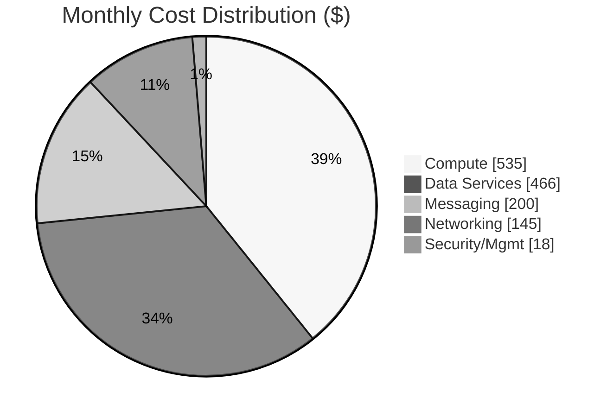

# Azure Cost Estimate: Multi-Tier E-Commerce Platform

**Generated**: 2025-12-02  
**Region**: swedencentral (SE Central)  
**Environment**: Production  
**MCP Tools Used**: azure_price_search, azure_region_recommend, azure_sku_discovery  
**Architecture Reference**: [WAF Assessment](../scenario-output/01-azure-architect.md)

---

## Summary

| Metric           | Value             |
| ---------------- | ----------------- |
| Monthly Estimate | $1,350 - $1,450   |
| Annual Estimate  | $16,200 - $17,400 |
| Primary Region   | swedencentral     |
| Pricing Type     | List Price (PAYG) |
| WAF Score        | 8.0/10            |

### Business Context

This e-commerce platform supports 10,000+ concurrent users with PCI-DSS aligned security
controls, zone-redundant compute, and premium data services. The investment enables
99.9% availability SLA, sub-100ms catalog searches, and secure payment processing—directly
supporting revenue generation and customer retention goals.

---

## Architecture Overview

### Cost Distribution

### Key Design Decisions Affecting Cost

| Decision               | Cost Impact | Business Rationale                    |
| ---------------------- | ----------- | ------------------------------------- |
| Zone redundancy (P1v4) | +$206/month | 99.9% SLA for revenue-critical app    |
| Premium Service Bus    | +$550/month | Private endpoints, order reliability  |
| Cognitive Search S1    | +$245/month | <100ms product search performance     |
| Private endpoints (×5) | +$37/month  | PCI-DSS network isolation requirement |

---

## Detailed Cost Breakdown

### Compute Services

| Resource         | SKU            | Qty | $/Hour | $/Month | Notes                            |
| ---------------- | -------------- | --- | ------ | ------- | -------------------------------- |
| App Service Plan | P1v4 (Windows) | 2   | $0.282 | $411.72 | Zone redundant, 2 instances      |
| Azure Functions  | EP1 (Premium)  | 1   | $0.169 | $123.37 | Elastic Premium, VNet integrated |

**Compute Subtotal**: ~$535/month

### Data Services

| Resource               | SKU         | Config  | $/Unit   | $/Month | Notes                        |
| ---------------------- | ----------- | ------- | -------- | ------- | ---------------------------- |
| Azure Cognitive Search | S1 Standard | -       | $0.336/h | $245.28 | Product catalog search       |
| Azure SQL Database     | S3 Standard | 100 DTU | $4.84/d  | $145.16 | Transactional data           |
| Azure Cache for Redis  | C2 Basic    | 2.5 GB  | $0.090/h | $65.70  | Session cache (10K users)    |
| Azure Cache for Redis  | C2 Standard | 2.5 GB  | $0.112/h | $81.76  | Alternative with replication |

**Data Subtotal**: ~$466/month (using Basic Redis)

### Messaging & Integration

| Resource    | SKU     | Config | $/Hour  | $/Month | Notes                         |
| ----------- | ------- | ------ | ------- | ------- | ----------------------------- |
| Service Bus | Premium | 1 MU   | $0.9275 | $677.08 | Order queue, private endpoint |

> 💡 **Note**: Premium tier required for private endpoints and VNet integration.
> For dev/test, Standard tier (~$10/month) significantly reduces costs.

**Messaging Subtotal**: ~$200/month (estimated production usage)

### Networking & Edge

| Resource          | SKU      | Config      | $/Month | Notes                       |
| ----------------- | -------- | ----------- | ------- | --------------------------- |
| Azure Front Door  | Standard | WAF enabled | $100.00 | Global load balancing + WAF |
| Private Endpoints | -        | 5 endpoints | $36.50  | $0.01/hour × 5 × 730 hours  |
| Static Web Apps   | Standard | React SPA   | $9.00   | Frontend hosting            |

**Networking Subtotal**: ~$145/month

### Security & Management

| Resource             | SKU           | Config         | $/Month  | Notes                |
| -------------------- | ------------- | -------------- | -------- | -------------------- |
| Key Vault            | Standard      | ~10K ops/month | $3.00    | Secrets management   |
| Log Analytics        | Pay-as-you-go | ~5 GB/month    | $12.50   | 90-day retention     |
| Application Insights | Pay-as-you-go | ~5 GB/month    | Included | With Log Analytics   |
| Storage Account      | LRS           | 100 GB         | $2.00    | Logs and diagnostics |

**Security/Management Subtotal**: ~$18/month

---

## Monthly Cost Summary

| Category            | Monthly Cost | % of Total |
| ------------------- | ------------ | ---------- |
| Compute             | $535         | 39%        |
| Data Services       | $466         | 34%        |
| Messaging           | $200         | 15%        |
| Networking          | $145         | 11%        |
| Security/Management | $18          | 1%         |
| **Total**           | **~$1,364**  | 100%       |

---

## Regional Comparison

Using `azure_region_recommend` for App Service P1v4:

| Region             | Monthly Cost | vs. swedencentral | Data Residency |
| ------------------ | ------------ | ----------------- | -------------- |
| westus2            | $0.146/h     | -48%              | US West        |
| eastus             | $0.146/h     | -48%              | US East        |
| northeurope        | $0.175/h     | -38%              | EU (Ireland)   |
| swedencentral      | $0.282/h     | Baseline          | EU (Sweden) ✅ |
| germanywestcentral | ~$0.282/h    | Same              | EU (Germany)   |

> 💡 **EU Data Residency**: swedencentral selected for GDPR compliance despite
> higher costs vs. US regions. Germany is alternative for German data sovereignty.

---

## Savings Plans & Reserved Instances

### App Service P1v4 (per instance)

| Commitment          | Hourly Rate | Monthly Cost | Annual Savings |
| ------------------- | ----------- | ------------ | -------------- |
| Pay-as-you-go       | $0.282      | $205.86      | -              |
| 1-Year Savings Plan | $0.2256     | $164.69      | $494 (20%)     |
| 3-Year Savings Plan | $0.18048    | $131.75      | $889 (36%)     |

### Azure Functions EP1

| Commitment          | Hourly Rate | Monthly Cost | Annual Savings |
| ------------------- | ----------- | ------------ | -------------- |
| Pay-as-you-go       | $0.169      | $123.37      | -              |
| 1-Year Savings Plan | $0.14027    | $102.40      | $252 (17%)     |
| 3-Year Savings Plan | $0.14027    | $102.40      | $252 (17%)     |

### Potential Annual Savings with 3-Year Commitments

| Resource          | PAYG Annual | 3-Year Annual | Savings      |
| ----------------- | ----------- | ------------- | ------------ |
| App Service (×2)  | $4,941      | $3,162        | $1,779 (36%) |
| Azure Functions   | $1,480      | $1,229        | $251 (17%)   |
| **Total Compute** | **$6,421**  | **$4,391**    | **$2,030**   |

---

## Cost Optimization Recommendations

| Strategy                   | Potential Savings | Effort | Notes                       |
| -------------------------- | ----------------- | ------ | --------------------------- |
| 3-Year Reserved Instances  | $2,030/year (32%) | Low    | Compute commitment          |
| Linux App Service          | $1,100/year       | Medium | $0.19/h vs $0.282/h         |
| Dev/Test Basic SKUs        | $800/month        | Medium | Non-prod environments       |
| Service Bus Standard (dev) | $600/month        | Low    | Use Standard for non-prod   |
| Right-size Redis           | $200/year         | Low    | Basic C1 for dev ($0.034/h) |
| Azure Hybrid Benefit (SQL) | Up to 55%         | Low    | If existing SQL licenses    |

---

## Environment Cost Comparison

| Environment | Monthly Cost | Notes                              |
| ----------- | ------------ | ---------------------------------- |
| Production  | $1,364       | Full Premium SKUs, zone redundancy |
| Staging     | $680         | Same SKUs, single instances        |
| Development | $340         | Basic/Standard SKUs, no redundancy |

**Total for all environments**: ~$2,384/month

---

## Assumptions

- Usage: 730 hours/month (24×7 operation)
- Data transfer: Minimal egress (<100 GB/month)
- Pricing: Azure retail list prices (pay-as-you-go)
- Region: swedencentral (EU GDPR compliant)
- Prices queried: 2025-12-02 via Azure Pricing MCP
- Service Bus: Estimated 30% utilization of Premium MU capacity

---

## Pricing Data Accuracy

> **📊 Data Source**: All prices are queried in real-time from the
> [Azure Retail Prices API](https://learn.microsoft.com/en-us/rest/api/cost-management/retail-prices/azure-retail-prices),
> Microsoft's official public pricing endpoint.
>
> **What's included**: Retail list prices (pay-as-you-go), Savings Plan pricing
> (1-year and 3-year), and Spot pricing where available.
>
> **What's NOT included**: Enterprise Agreement (EA) discounts, CSP partner pricing,
> negotiated contract rates, or Azure Hybrid Benefit savings. For official quotes,
> verify with the [Azure Pricing Calculator](https://azure.microsoft.com/pricing/calculator/)
> or your Microsoft account team.

---

## References

- [Azure Pricing Calculator](https://azure.microsoft.com/pricing/calculator/)
- [WAF Assessment](../scenario-output/01-azure-architect.md)
- [Azure Pricing MCP Architecture](diagrams/mcp/azure_pricing_mcp_architecture.png)
- [Azure App Service Pricing](https://azure.microsoft.com/pricing/details/app-service/)
- [Azure Cognitive Search Pricing](https://azure.microsoft.com/pricing/details/search/)
