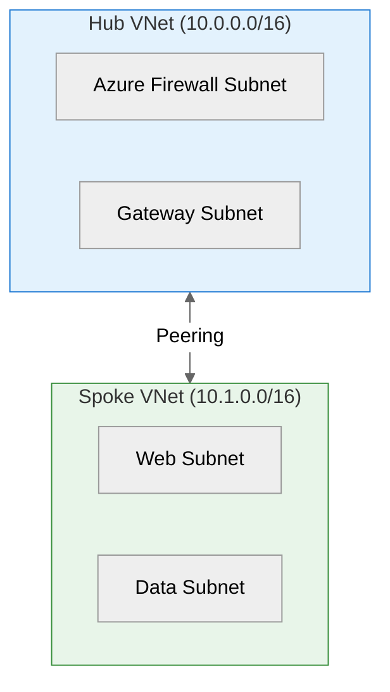

# Your First Scenario: S01 Bicep Baseline

> **Version 5.3.0** | Step-by-step walkthrough for absolute beginners
>
> ⏱️ **Time**: 30 minutes | 🟢 **Difficulty**: Beginner

This guide walks you through S01 Bicep Baseline in detail, explaining every step and what to expect.

---

## What You'll Build

A secure hub-spoke network foundation in Azure:



---

## Prerequisites

Before starting, ensure you've completed the [Quick Start](quickstart.md):

- [ ] Repository cloned and open in VS Code
- [ ] Dev Container running
- [ ] Copilot Chat accessible (`Ctrl+Alt+I`)

---

## Step 1: Start the Planning Phase

Open Copilot Chat and type:

```text
Create a hub-spoke network in Azure for a dev environment.

Requirements:
- Hub VNet: 10.0.0.0/16 with AzureFirewallSubnet and GatewaySubnet
- Spoke VNet: 10.1.0.0/16 with web tier (10.1.1.0/24) and data tier (10.1.2.0/24)
- NSGs on all subnets with deny-all-inbound default
- VNet peering between hub and spoke
- Region: swedencentral
- Environment: dev
- Project name: network-baseline
```

### What Happens

The **Project Planner** agent will:

1. Analyze your requirements
2. Create a structured plan
3. Ask for your approval

### What to Do

- Read through the generated plan
- When it asks "Do you approve?", reply: `yes`

---

## Step 2: Architecture Assessment

After approval, the workflow continues to `azure-principal-architect`.

### What Happens

This agent:

- Evaluates your design against Azure Well-Architected Framework
- Scores each pillar (Reliability, Security, Cost, Operations, Performance)
- Provides recommendations

### What to Look For

```text
## WAF Assessment Summary

| Pillar       | Score | Notes                    |
| ------------ | ----- | ------------------------ |
| Reliability  | 7/10  | Consider availability zones |
| Security     | 8/10  | NSGs properly configured |
| Cost         | 9/10  | Dev-appropriate sizing   |
| Operations   | 7/10  | Add monitoring           |
| Performance  | 8/10  | Good subnet sizing       |
```

### What to Do

- Review the scores and recommendations
- Reply: `approve` to continue

---

## Step 3: Design Artifacts (Optional)

The agent may ask if you want to generate design artifacts.

### Options

- **Generate diagram**: Reply `generate architecture diagram`
- **Skip**: Reply `skip` or `continue to planning`

For your first scenario, you can skip this step.

---

## Step 4: Implementation Planning

The `bicep-plan` agent creates the implementation plan.

### What Happens

- Designs module structure
- Plans deployment order
- Identifies dependencies

### Expected Output

```text
## Implementation Plan

### Module Structure
- main.bicep (orchestration)
- modules/hub-network.bicep
- modules/spoke-network.bicep
- modules/network-security.bicep
- modules/peering.bicep

### Deployment Order
1. Hub VNet + NSGs
2. Spoke VNet + NSGs
3. VNet Peering
```

### What to Do

- Review the plan
- Reply: `approve`

---

## Step 5: Bicep Code Generation

The `bicep-implement` agent generates the actual code.

### What Happens

- Creates all Bicep files
- Generates deployment script
- Validates with `bicep build` and `bicep lint`

### Where Files Are Created

```text
infra/bicep/network-baseline/
├── main.bicep
├── main.bicepparam
├── deploy.ps1
└── modules/
    ├── hub-network.bicep
    ├── spoke-network.bicep
    ├── network-security.bicep
    └── peering.bicep
```

### What to Do

1. Review the generated code
2. Check for validation messages
3. Reply: `approve`

---

## Step 6: Deploy to Azure

Now deploy the generated infrastructure.

### Preview Changes First

```bash
cd infra/bicep/network-baseline/

# Create resource group
az group create \
  --name rg-network-baseline-dev-swc \
  --location swedencentral

# Preview what will be created
./deploy.ps1 -WhatIf
```

### Execute Deployment

```bash
# Deploy
./deploy.ps1
```

### Verify in Azure Portal

1. Go to [Azure Portal](https://portal.azure.com)
2. Navigate to Resource Groups
3. Find `rg-network-baseline-dev-swc`
4. Verify resources were created

---

## Step 7: As-Built Artifacts (Optional)

After deployment, you can generate documentation.

### Options

- **Generate as-built diagram**: `@diagram-generator generate as-built diagram`
- **Create ADR**: `@adr-generator document the network topology decision`
- **Skip**: This step is optional

---

## Congratulations! 🎉

You've completed your first agentic workflow!

### What You Learned

| Concept          | Description                         |
| ---------------- | ----------------------------------- |
| Project Planner  | Gathers and structures requirements |
| WAF assessment   | Validates architecture quality      |
| Module design    | Organizes infrastructure logically  |
| Bicep generation | Creates production-ready code       |
| Deployment       | Azure CLI deployment process        |

### Time Comparison

| Approach              | Time           |
| --------------------- | -------------- |
| Traditional manual    | 2-4 hours      |
| With Agentic InfraOps | **30 minutes** |

---

## Next Steps

| Your Goal                    | Next Step                                                          |
| ---------------------------- | ------------------------------------------------------------------ |
| Learn advanced workflow      | [S02 Agentic Workflow](../../scenarios/S02-agentic-workflow/)      |
| Try documentation automation | [S03 Documentation](../../scenarios/S03-documentation-generation/) |
| Understand all agents        | [Agents Overview](../reference/agents-overview.md)                 |
| Explore all scenarios        | [Scenarios Index](../../scenarios/)                                |

---

## Common Issues

### Agent Didn't Continue

If the agent stopped unexpectedly:

1. Check if it's waiting for approval
2. Reply with `continue` or `approve`
3. If stuck, restart with **Project Planner** and your original prompt

### Deployment Failed

Common causes:

- **Quota exceeded**: Try `germanywestcentral` region
- **Permission denied**: Verify Contributor role
- **Name collision**: The unique suffix should prevent this

📖 Full troubleshooting: [Troubleshooting Guide](../guides/troubleshooting.md)
