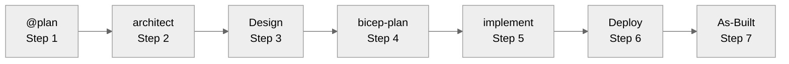

# Quick Start Guide

> **Version 3.6.0** | 10 minutes to your first AI-assisted infrastructure deployment
>
> ⚡ For a comprehensive learning journey with role-based paths, see [Learning Paths](learning-paths.md).

---

## Prerequisites

Before you begin, ensure you have:

| Requirement    | Version                    | Check Command            | Get It |
| -------------- | -------------------------- | ------------------------ | ------ |
| VS Code        | Latest                     | `code --version`         | [Download](https://code.visualstudio.com/) |
| GitHub Copilot | Active subscription        | Check VS Code extensions | [Get Copilot](https://github.com/features/copilot) |
| Docker Desktop | Latest (for Dev Container) | `docker --version`       | [Download](https://docker.com/products/docker-desktop/) |
| Git            | 2.30+                      | `git --version`          | [Download](https://git-scm.com/) |

**Optional** (for Azure deployments):

- Azure subscription with Contributor access
- Azure CLI (included in Dev Container)

### Quick Checklist

- [ ] GitHub account with Copilot license (Individual, Business, or Enterprise)
- [ ] VS Code with GitHub Copilot and Copilot Chat extensions installed
- [ ] Docker Desktop running
- [ ] Git installed

---

## Defaults for IT Pros

| Setting | Value | Reference |
| ------- | ----- | --------- |
| **Region** | `swedencentral` (fallback: `germanywestcentral`) | [ADR-004](../adr/ADR-004-region-defaults.md) |
| **Naming** | `uniqueString(resourceGroup().id)` suffix | [Defaults](../reference/defaults.md) |
| **Modules** | AVM-first approach | [ADR-003](../adr/ADR-003-avm-first-approach.md) |
| **Workflow** | 7-step agent flow | [Workflow Guide](../reference/workflow.md) |

---

## Step 1: Clone and Open (2 min)

```bash
# Clone the repository
git clone https://github.com/jonathan-vella/azure-agentic-infraops.git

# Open in VS Code
code azure-agentic-infraops
```

---

## Step 2: Open in Dev Container (3 min)

The Dev Container provides all required tools pre-configured.

1. Press `F1` to open the Command Palette
2. Type **"Dev Containers: Reopen in Container"**
3. Select it and wait 2-3 minutes for the container to build

**What's included:**

- ✅ Azure CLI with Bicep extension
- ✅ Terraform + tfsec + Checkov
- ✅ PowerShell 7+
- ✅ Python 3.10+ with diagrams library
- ✅ All required VS Code extensions
- ✅ Azure Pricing MCP server (auto-configured)

### Verify the Setup

```bash
# Check all tools are installed
az --version && bicep --version && pwsh --version && python --version
```

📖 For Docker alternatives (Podman, Colima, Rancher) and troubleshooting,
see [Dev Containers Setup](../guides/dev-containers-setup.md).

---

## Step 3: Open Copilot Chat (1 min)

Press `Ctrl+Alt+I` (Windows/Linux) or `Cmd+Alt+I` (Mac) to open the Copilot Chat panel.

Verify Copilot is active: Look for the Copilot icon in the VS Code status bar.

---

## Step 4: Run Your First Workflow (5 min)

### Recommended: S01 Bicep Baseline

Navigate to `scenarios/S01-bicep-baseline/` and follow the README.

Or copy this prompt into Copilot Chat:

```text
@plan Create a hub-spoke network in Azure with:
- Hub VNet (10.0.0.0/16) with Azure Firewall subnet
- Spoke VNet (10.1.0.0/16) with web and data subnets
- NSGs on all subnets
Region: swedencentral
Environment: dev
```

### Follow the Workflow

The 7-step workflow guides you through:



At each step, the agent will ask for approval. Reply with `yes` or `approve` to continue.

📖 Full workflow documentation: [Workflow Guide](../reference/workflow.md)

---

## Step 5: Deploy (Optional)

After `bicep-implement` generates templates:

```bash
# Navigate to generated templates
cd infra/bicep/{your-project}/

# Create resource group
az group create --name rg-{project}-dev-swc --location swedencentral

# Preview changes
az deployment group what-if \
  --resource-group rg-{project}-dev-swc \
  --template-file main.bicep

# Deploy
az deployment group create \
  --resource-group rg-{project}-dev-swc \
  --template-file main.bicep
```

---

## Troubleshooting

| Issue | Solution |
| ----- | -------- |
| Agent not responding | Reload VS Code (`F1` → "Developer: Reload Window") |
| Copilot icon missing | Check extension is installed and licensed |
| Dev Container won't start | Ensure Docker Desktop is running, check disk space |
| Azure deployment fails | Verify `az account show` shows correct subscription |

📖 Full troubleshooting guide: [Troubleshooting](../guides/troubleshooting.md)

---

## Next Steps

| Your Goal | Next Step |
| --------- | --------- |
| Detailed S01 walkthrough | [First Scenario](first-scenario.md) |
| Learn Copilot basics | [Copilot Getting Started](../guides/copilot-getting-started.md) |
| Explore more scenarios | [Scenarios Index](../../scenarios/) |
| Role-based learning paths | [Learning Paths](learning-paths.md) |
| Choose AI model | [Model Selection](../guides/copilot-model-selection.md) |

---

## Azure Subscription Requirements

If deploying to Azure (Step 5):

### Minimum Permissions

- **Contributor** role at subscription or resource group level
- Ability to create: VNets, Storage Accounts, Key Vaults, App Services, SQL Databases

### Recommended Regions

| Region | Use Case |
| ------ | -------- |
| `swedencentral` | Default - sustainable, good availability |
| `germanywestcentral` | Alternative if quota issues |
| `eastus` / `westus2` | Americas users for lower latency |

### Quota Considerations

| Resource | Typical Usage |
| -------- | ------------- |
| vCPUs | 4-8 cores |
| Public IPs | 2-3 |
| Storage Accounts | 1-2 |

Check quota: `az vm list-usage --location swedencentral`
