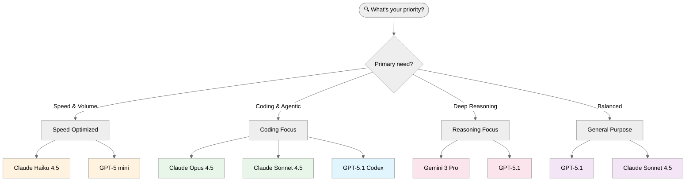
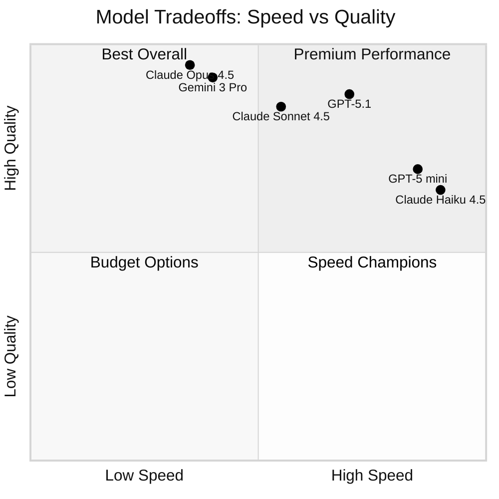

# Choosing the Right AI Model

**Your guide to selecting the best model for speed, quality, reasoning, and cost.**

> **TL;DR**: Use **Claude Sonnet 4.5** for most infrastructure work. Use **Claude Opus 4.5** for complex
> coding/agentic tasks. Switch to **GPT-5.1** for balanced work or **Gemini 3 Pro** for deep reasoning.
> The model matters less than your prompt quality.

---

## Quick Decision Guide



---

## Table of Contents

1. [Quick Recommendations](#quick-recommendations)
2. [2025 Model Benchmarks](#2025-model-benchmarks)
3. [Model Comparison Matrix](#model-comparison-matrix)
4. [Recommended Model by Scenario](#recommended-model-by-scenario)
5. [When to Use Each Model](#when-to-use-each-model)
6. [Context Windows & Throughput](#context-windows--throughput)
7. [Pricing Comparison](#pricing-comparison)
8. [How to Switch Models in VS Code](#how-to-switch-models-in-vs-code)
9. [Prompt & Cost Optimization](#prompt--cost-optimization)
10. [Troubleshooting Model Issues](#troubleshooting-model-issues)
11. [Live Leaderboards & Sources](#live-leaderboards--sources)

---

## Quick Recommendations

| Priority                             | Recommended Model | Fallback                    |
| ------------------------------------ | ----------------- | --------------------------- |
| ⚡ **Fastest + Cheapest**            | Claude Haiku 4.5  | GPT-5 mini                  |
| ⚖️ **Balanced (cost/quality/speed)** | GPT-5.1           | Claude Sonnet 4.5           |
| 🧠 **Best Reasoning & Math**         | Gemini 3 Pro      | GPT-5.1                     |
| 💻 **Best for Coding/Agentic**       | Claude Opus 4.5   | Claude Sonnet 4.5           |
| 📄 **Long Context (1M+ tokens)**     | Gemini 3 Pro      | Claude Sonnet 4.5 (1M beta) |
| 🎯 **Visual/Multimodal**             | Claude Opus 4.5   | GPT-5.1                     |

> **Note:** Pricing and throughput vary by region and provider. Always confirm current limits in your deployment.

---

## 2025 Model Benchmarks

Based on [LLM Stats](https://llm-stats.com),
[Artificial Analysis](https://artificialanalysis.ai/leaderboards/models), and
[Vellum LLM Leaderboard](https://www.vellum.ai/llm-leaderboard).
Benchmarks evolve rapidly—check these sources for latest data:

### Overall Intelligence & Reasoning

| Model                 | LMArena Elo | GPQA Diamond | ARC-AGI-2 | Humanity's Last Exam | Notes                   |
| --------------------- | ----------- | ------------ | --------- | -------------------- | ----------------------- |
| **Gemini 3 Pro**      | 1501 ⭐     | 93.8% ⭐     | 45.1% ⭐  | 41% ⭐               | First to break 1500 Elo |
| **Claude Opus 4.5**   | ~1480       | 74-80%       | 38%       | 32%                  | Best for coding/agentic |
| **GPT-5.1**           | ~1470       | ~70%         | 35%       | 28%                  | Best balanced model     |
| **Claude Sonnet 4.5** | ~1460       | 69-72%       | 32%       | 25%                  | High-volume throughput  |

### Coding Benchmarks (SWE-bench Verified)

| Model                 | SWE-bench Score | Agentic Endurance | Notes                      |
| --------------------- | --------------- | ----------------- | -------------------------- |
| **Claude Opus 4.5**   | 80.9% ⭐        | 30+ hours         | First to break 80%         |
| **Claude Sonnet 4.5** | 77.2%           | 24+ hours         | Best throughput for coding |
| **GPT-5.1**           | 76%             | 20+ hours         | Adaptive accuracy          |
| **Gemini 3 Pro**      | ~75%            | 15+ hours         | Deep Think mode available  |

---

## Model Comparison Matrix



### Detailed Comparison

| Model                 | Speed      | Quality    | Reasoning  | Coding     | Cost       | Best For                          |
| --------------------- | ---------- | ---------- | ---------- | ---------- | ---------- | --------------------------------- |
| **Gemini 3 Pro**      | ⭐⭐⭐     | ⭐⭐⭐⭐⭐ | ⭐⭐⭐⭐⭐ | ⭐⭐⭐⭐   | ⭐⭐⭐⭐   | Math, science, complex reasoning  |
| **Claude Opus 4.5**   | ⭐⭐⭐     | ⭐⭐⭐⭐⭐ | ⭐⭐⭐⭐   | ⭐⭐⭐⭐⭐ | ⭐⭐⭐     | Coding, agentic workflows, visual |
| **GPT-5.1**           | ⭐⭐⭐⭐   | ⭐⭐⭐⭐   | ⭐⭐⭐⭐   | ⭐⭐⭐⭐   | ⭐⭐⭐⭐   | Balanced general purpose          |
| **Claude Sonnet 4.5** | ⭐⭐⭐⭐   | ⭐⭐⭐⭐   | ⭐⭐⭐⭐   | ⭐⭐⭐⭐   | ⭐⭐⭐⭐   | High-volume IaC and coding        |
| **GPT-5 mini**        | ⭐⭐⭐⭐⭐ | ⭐⭐⭐     | ⭐⭐⭐     | ⭐⭐⭐     | ⭐⭐⭐⭐⭐ | Quick questions, simple tasks     |
| **Claude Haiku 4.5**  | ⭐⭐⭐⭐⭐ | ⭐⭐⭐     | ⭐⭐⭐     | ⭐⭐⭐     | ⭐⭐⭐⭐⭐ | High-volume, latency-sensitive    |

---

## Recommended Model by Scenario

| Scenario                    | Recommended Model           | Why                                       |
| --------------------------- | --------------------------- | ----------------------------------------- |
| **S01 Bicep Baseline**      | Claude Sonnet 4.5           | Best balance of speed and quality for IaC |
| **S02 Terraform Baseline**  | Claude Sonnet 4.5           | Same reasoning as Bicep                   |
| **S03 Five-Agent Workflow** | Claude Sonnet 4.5           | Optimized for agent handoffs and planning |
| **S04 Documentation**       | GPT-5.1 or Claude Haiku 4.5 | Fast generation for text-heavy tasks      |
| **S05 Service Validation**  | GPT-5.1 Codex               | PowerShell generation with large context  |
| **S06 Troubleshooting**     | GPT-5 mini                  | Quick answers, diagnostic speed matters   |
| **S07 SBOM Generator**      | GPT-5.1                     | Straightforward task, good context        |
| **S08 Diagrams as Code**    | GPT-5.1 Codex               | Python code generation                    |
| **S09 Coding Agent**        | Claude Opus 4.5             | Best for issue-to-PR automation           |

---

## When to Use Each Model

### Claude Sonnet 4.5 (Default for IaC)

**Use when:**

- Writing Bicep or Terraform templates
- Working with custom agents (bicep-plan, bicep-implement)
- Generating modular infrastructure code
- Architecture design and planning

**Example prompt:**

```text
Create a Bicep module for Azure Key Vault with:
- Private endpoint in snet-data subnet
- Soft delete enabled (90 days)
- RBAC authorization
- Diagnostic settings to Log Analytics
```

### Claude Opus 4.5 (Premium Coding)

**Use when:**

- Complex multi-step agentic workflows
- Advanced debugging and refactoring
- Visual/multimodal understanding
- High-stakes code generation

### Gemini 3 Pro (Reasoning Champion)

**Use when:**

- Complex reasoning and planning
- Math and scientific analysis
- Deep Think mode for difficult problems
- Large context (1M tokens)

### GPT-5.1 (Balanced General Purpose)

**Use when:**

- Working with very large codebases
- General questions and explanations
- Cross-referencing many files simultaneously
- Mixed code and documentation tasks

### Claude Haiku 4.5 / GPT-5 mini (Speed Champions)

**Use when:**

- Inline code completions
- High-volume simple tasks
- Quick syntax fixes
- Time-sensitive troubleshooting

---

## Context Windows & Throughput

| Model                 | Max Input Context | Max Output | Output Speed    | First Token Latency |
| --------------------- | ----------------- | ---------- | --------------- | ------------------- |
| **Gemini 3 Pro**      | 1M tokens ⭐      | 64K        | 130 tok/sec     | 15-32s (Deep Think) |
| **Claude Sonnet 4.5** | 1M tokens (beta)  | 64K        | ~70 tok/sec     | ~2.2s               |
| **Claude Opus 4.5**   | 200K tokens       | 64K        | 63-78 tok/sec   | 1.9-2.1s            |
| **GPT-5.1**           | 272K-400K tokens  | 128K ⭐    | 150+ tok/sec ⭐ | <2s ⭐              |
| **GPT-5 mini**        | 1M tokens         | 64K        | 200+ tok/sec    | <1s                 |
| **Claude Haiku 4.5**  | 200K tokens       | 64K        | 150+ tok/sec    | <1s                 |

### Context Window Guide

| Context Size  | Practical Meaning                    | Recommended Models                     |
| ------------- | ------------------------------------ | -------------------------------------- |
| **1M tokens** | ~750,000 words, entire codebases     | Gemini 3 Pro, Claude Sonnet 4.5 (beta) |
| **200K-400K** | ~150,000-300,000 words, 50-150 files | GPT-5.1, Claude Opus 4.5               |
| **128K**      | ~96,000 words, 30-50 files           | Most general-purpose tasks             |

---

## Pricing Comparison

> **⚠️ Prices change frequently.** Check [Artificial Analysis](https://artificialanalysis.ai/leaderboards/models)
> for current pricing. Values below are approximate and based on publicly available data.

| Model                 | Input (per 1M tokens) | Output (per 1M tokens) | Effective Cost      |
| --------------------- | --------------------- | ---------------------- | ------------------- |
| **GPT-5.1**           | ~$3.44                | ~$10                   | ⭐⭐⭐⭐ Best value |
| **Gemini 3 Pro**      | ~$4.50                | ~$13                   | ⭐⭐⭐⭐            |
| **Claude Sonnet 4.5** | ~$6                   | ~$15                   | ⭐⭐⭐              |
| **Claude Opus 4.5**   | ~$10                  | ~$30                   | ⭐⭐⭐ Premium      |
| **GPT-5 mini**        | ~$0.50                | ~$2                    | ⭐⭐⭐⭐⭐ Cheapest |
| **Claude Haiku 4.5**  | ~$0.80                | ~$4                    | ⭐⭐⭐⭐⭐          |

### Cost Optimization Tips

- **High-volume, simple tasks:** Use Haiku or GPT-5 mini (80-90% cost savings)
- **Complex reasoning:** Gemini 3 Pro offers best quality/cost ratio
- **Coding workflows:** Claude Sonnet 4.5 balances cost and capability

---

## How to Switch Models in VS Code

### Method 1: Model Picker (Recommended)

1. Open Copilot Chat (`Ctrl+Alt+I`)
2. Click the model name in the chat header
3. Select your preferred model

### Method 2: Inline Mention

Type the model name in your prompt:

```text
@claude-sonnet-4.5 Create a Bicep template for...
```

### Method 3: Settings

```json
// settings.json
{
  "github.copilot.chat.defaultModel": "claude-sonnet-4.5"
}
```

---

## Prompt & Cost Optimization

### Best Practices

- **Keep prompts compact:** Use system messages for policy/style; avoid repeating instructions
- **Chunk long inputs:** Retrieve only relevant context for grounding
- **Set reasonable max tokens:** Favor shorter outputs unless necessary
- **Cache frequent instructions:** Reuse references instead of re-sending long text
- **Use file context:** Keep relevant files open, use `#file:network.bicep` to reference specific files

### Example: Efficient Prompting

```text
❌ Inefficient:
"Please help me create a comprehensive Azure networking configuration
with all the security best practices and make sure to include VNets,
subnets, NSGs, route tables, and explain everything in detail..."

✅ Efficient:
"Create Bicep for hub-spoke VNet:
- Hub: 10.0.0.0/16 with GatewaySubnet, AzureFirewallSubnet
- Spoke: 10.1.0.0/16 with web, app, data subnets
- NSGs: deny-all default, allow 443/80 to web
Output: main.bicep only, minimal comments"
```

### Testing Workflow

1. **Collect 10-20 real prompts** representative of your use case
2. **Test cheapest viable model first** (Haiku or GPT-5 mini)
3. **Step up if quality insufficient** (GPT-5.1 → Claude Sonnet 4.5 → Claude Opus 4.5)
4. **Lock in your choice** and add monitoring

---

## Troubleshooting Model Issues

### "Model not available"

- Check your Copilot license tier (some models require Business/Enterprise)
- Try a different model temporarily
- Verify internet connection

### "Response cut off"

- Break your request into smaller parts
- Ask for specific sections ("First, show me the network module")
- Use `Continue` in the chat

### "Quality seems low"

- Add more context to your prompt
- Try a different model for comparison
- Check if you're using a "mini" variant (optimized for speed over depth)

### When to Reconsider Your Model

| Symptom               | Likely Cause     | Action                                               |
| --------------------- | ---------------- | ---------------------------------------------------- |
| Latency SLOs slipping | Model too heavy  | Try Haiku, GPT-5 mini, or Gemini 3 Pro               |
| Costs spiking         | Excessive tokens | Reduce max tokens, improve retrieval, downshift tier |
| Quality issues        | Model too light  | Refine prompts, add tests, or move up a tier         |
| New model release     | Market evolution | Re-run 10-20 prompt bake-off and compare             |

---

## Live Leaderboards & Sources

Stay current with the latest benchmarks and pricing:

| Resource                            | URL                                                                                        | What It Tracks                 |
| ----------------------------------- | ------------------------------------------------------------------------------------------ | ------------------------------ |
| **LLM Stats**                       | [llm-stats.com](https://llm-stats.com)                                                     | Comprehensive benchmarks       |
| **Artificial Analysis**             | [artificialanalysis.ai](https://artificialanalysis.ai/leaderboards/models)                 | Speed, price, quality rankings |
| **Vellum LLM Leaderboard**          | [vellum.ai/llm-leaderboard](https://www.vellum.ai/llm-leaderboard)                         | Enterprise-focused comparisons |
| **GitHub Copilot Model Comparison** | [docs.github.com](https://docs.github.com/en/copilot/reference/ai-models/model-comparison) | Copilot-specific guidance      |
| **LMArena**                         | [lmarena.ai](https://lmarena.ai)                                                           | Human preference rankings      |

### Key Benchmark Sources

- **SWE-bench Verified:** Real-world GitHub issue resolution ([swebench.com](https://www.swebench.com))
- **GPQA Diamond:** Graduate-level science/math reasoning
- **ARC-AGI-2:** Abstract reasoning and pattern recognition
- **Humanity's Last Exam:** Cutting-edge capability assessment

---

## Next Steps

- [Prerequisites](prerequisites.md) - Ensure your environment is ready
- [Quick Start](QUICKSTART.md) - Get started in 10 minutes
- [S01 Bicep Baseline](../../scenarios/S01-bicep-baseline/) - Start your first scenario

---

**Last Updated:** December 2025
**Feedback:** Open an issue with label `documentation`
