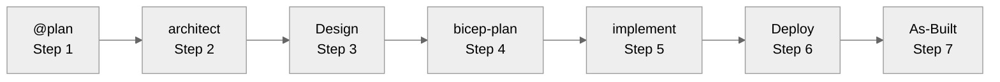

# Quick Start Guide

> **10 minutes to your first AI-assisted infrastructure deployment.**
>
> This guide gets you running fast. For a comprehensive learning journey with phases and learning paths,
> see [Getting Started Journey](getting-started-journey.md).

## Prerequisites

Before you begin, ensure you have:

| Requirement    | Version                    | Check Command            |
| -------------- | -------------------------- | ------------------------ |
| VS Code        | Latest                     | `code --version`         |
| GitHub Copilot | Active subscription        | Check VS Code extensions |
| Docker Desktop | Latest (for Dev Container) | `docker --version`       |
| Git            | 2.30+                      | `git --version`          |

**Optional** (for Azure deployments):

- Azure subscription with Contributor access
- Azure CLI (included in Dev Container)

---

## Defaults for IT Pros

> **Region**: `swedencentral` (fallback: `germanywestcentral` for quota issues). See
> [ADR-004](../adr/ADR-004-region-defaults.md) for latency/compliance guidance.
>
> **Naming**: Unique suffix via `uniqueString(resourceGroup().id)` — Key Vault ≤24 chars, Storage ≤24 chars (no
> hyphens).
>
> **Modules**: AVM-first ([ADR-003](../adr/ADR-003-avm-first-approach.md)) for policy-compliant, repeatable
> deployments.
>
> **Agent Workflow**: Seven-step flow (`@plan` → `azure-principal-architect` → Design Artifacts → `bicep-plan` →
> `bicep-implement` → Deploy → As-Built Artifacts). See [Workflow Guide](../workflow/WORKFLOW.md) for details.

---

## Step 1: Clone and Open

```bash
# Clone the repository
git clone https://github.com/jonathan-vella/azure-agentic-infraops.git

# Open in VS Code
code azure-agentic-infraops
```

---

## Step 2: Open in Dev Container

The Dev Container provides all required tools pre-configured.
For detailed Docker setup, alternatives (Podman, Colima, Rancher Desktop),
and troubleshooting, see the [Dev Containers Setup Guide](dev-containers-setup.md).

1. Press `F1` to open the Command Palette
2. Type **"Dev Containers: Reopen in Container"**
3. Select it and wait 2-3 minutes for the container to build

**What's included:**

- ✅ Azure CLI with Bicep extension
- ✅ PowerShell 7+
- ✅ Python 3.10+ with diagrams library
- ✅ All required VS Code extensions
- ✅ Azure Pricing MCP server (auto-configured)

### Verify the Setup

After the container is ready, run:

```bash
# Check tools
az --version
bicep --version
pwsh --version
python --version

# Should see version numbers for all
```

---

## Step 3: Open Copilot Chat

Press `Ctrl+Alt+I` (Windows/Linux) or `Cmd+Alt+I` (Mac) to open the Copilot Chat panel.

---

## Step 4: Choose a Demo Scenario

We have pre-built scenarios ready to run:

| Scenario               | Complexity   | Time   | Prompt File                                      |
| ---------------------- | ------------ | ------ | ------------------------------------------------ |
| **Static Website**     | Beginner     | 15 min | `scenarios/S11-quick-demos/static-site-demo.md`  |
| **E-Commerce**         | Intermediate | 30 min | `scenarios/S11-quick-demos/ecommerce-prompts.md` |
| **Healthcare Portal**  | Advanced     | 30 min | `scenarios/S11-quick-demos/healthcare-demo.md`   |
| **Analytics Platform** | Intermediate | 30 min | `scenarios/S11-quick-demos/analytics-demo.md`    |

**Recommended first scenario:** Static Website (simplest, fastest)

---

## Step 5: Run Your First Workflow

### Option A: Quick Start (Copy-Paste)

1. Open `scenarios/S11-quick-demos/static-site-demo.md`
2. Copy the Step 1 prompt
3. In Copilot Chat, type `@plan` then paste the prompt
4. Follow the workflow through all steps

### Option B: Custom Infrastructure

Type this in Copilot Chat:

```text
@plan Create a simple web application on Azure with:
- App Service for the backend API
- Azure SQL Database for data storage
- Key Vault for secrets
Region: swedencentral
Environment: dev
```

---

## Step 6: Follow the Workflow

The workflow has 7 steps, each requiring your approval:



> **Note**: Steps 3 (Design) and 7 (As-Built) are optional for generating diagrams and ADRs.

### At Each Step

| Agent Says...      | You Reply...                   |
| ------------------ | ------------------------------ |
| "Do you approve?"  | `yes` or `approve` to continue |
| Shows architecture | Review scores, then `approve`  |
| Shows diagram      | `continue` to proceed          |
| Shows plan         | `yes` to accept                |
| Shows code         | `approve` to finalize          |

### Switching Agents Manually

If you need to invoke an agent directly:

1. Press `Ctrl+Shift+A` (or click the Agent button)
2. Select the agent from the dropdown
3. Type your prompt

---

## Step 7: Deploy (Optional)

After `bicep-implement` generates the templates:

```bash
# Navigate to the generated templates
cd infra/bicep/{your-project}/

# Create resource group
az group create --name rg-{project}-dev-swc --location swedencentral

# Preview changes
az deployment group what-if \
  --resource-group rg-{project}-dev-swc \
  --template-file main.bicep

# Deploy
az deployment group create \
  --resource-group rg-{project}-dev-swc \
  --template-file main.bicep
```

---

## Troubleshooting

### Agent Not Responding

- Ensure you have an active GitHub Copilot subscription
- Try reloading VS Code (`F1` → "Developer: Reload Window")
- Check Copilot status in the bottom status bar

### Dev Container Won't Start

- Ensure Docker Desktop is running
- Try "Rebuild Container" from Command Palette
- Check Docker resources (4GB RAM minimum recommended)

### MCP Server Not Working

The Azure Pricing MCP server should auto-configure. To verify:

1. Open Command Palette (`F1`)
2. Run: **MCP: List Servers**
3. Verify `azure-pricing` appears with 6 tools

If not working:

```bash
cd mcp/azure-pricing-mcp
pip install -e .
```

### Bicep Build Errors

Common issues:

| Error             | Solution                                      |
| ----------------- | --------------------------------------------- |
| Module not found  | Run `bicep restore main.bicep`                |
| API version error | Update to latest API version                  |
| Name too long     | Shorten project name or use `take()` function |

---

## Next Steps

After completing the quick start:

1. 📖 Read the [Full Workflow Documentation](workflow/WORKFLOW.md)
2. 🏗️ Try more complex demos (`healthcare-demo.md`, `analytics-demo.md`)
3. 📐 Read the [Architecture Decision Records](adr/) for design context
4. 🔧 Customize agents in `.github/agents/` for your organization

---

## Key Commands Reference

| Action               | Command/Shortcut                     |
| -------------------- | ------------------------------------ |
| Open Copilot Chat    | `Ctrl+Alt+I`                         |
| Select Agent         | `Ctrl+Shift+A` or click Agent button |
| Open Command Palette | `F1` or `Ctrl+Shift+P`               |
| Validate Bicep       | `bicep build main.bicep`             |
| Format Bicep         | `bicep format main.bicep`            |
| Lint Bicep           | `bicep lint main.bicep`              |

---

## Getting Help

- **Workflow issues:** Check [Workflow Guide](../workflow/WORKFLOW.md)
- **Agent behavior:** Review agent files in `.github/agents/`
- **Scenario prompts:** See files in `scenarios/` folder
- **Bug reports:** Open a GitHub issue

---

## GitHub Copilot Fundamentals

New to GitHub Copilot? Here are the essentials for IaC workflows:

### What Copilot Does Best

| Strength           | Example Use Case                                |
| ------------------ | ----------------------------------------------- |
| ✅ Writing tests   | Generate unit tests for Bicep modules           |
| ✅ Repetitive code | Create similar resource blocks, parameter files |
| ✅ Debugging       | "Why does this Bicep template fail validation?" |
| ✅ Explaining code | "Explain what this Terraform module does"       |
| ✅ Boilerplate     | Scaffold new modules, scripts, README files     |

### Essential Keyboard Shortcuts

| Action             | Windows/Linux | Mac          |
| ------------------ | ------------- | ------------ |
| Accept suggestion  | `Tab`         | `Tab`        |
| Dismiss suggestion | `Esc`         | `Esc`        |
| See alternatives   | `Ctrl+Enter`  | `Ctrl+Enter` |
| Open Copilot Chat  | `Ctrl+Alt+I`  | `Cmd+Alt+I`  |
| Inline chat        | `Ctrl+I`      | `Cmd+I`      |

> 📖 **Deep Dive**: For complete Copilot setup, plans comparison, and detailed tutorials,
> see [Getting Started with GitHub Copilot](copilot-getting-started.md).
