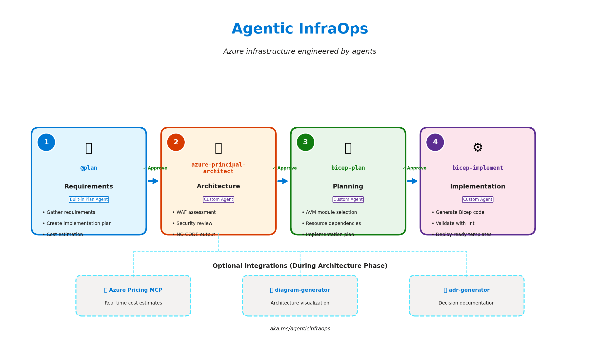
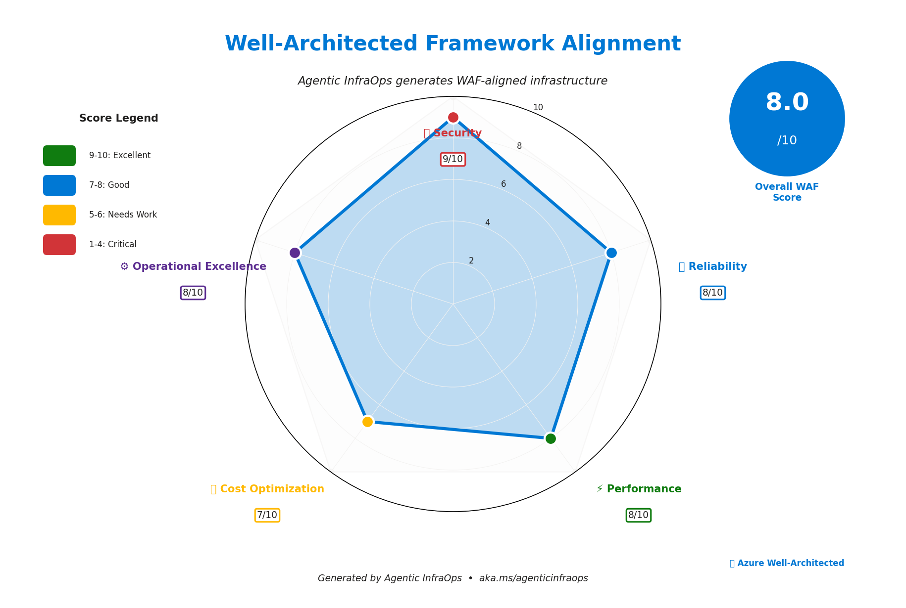
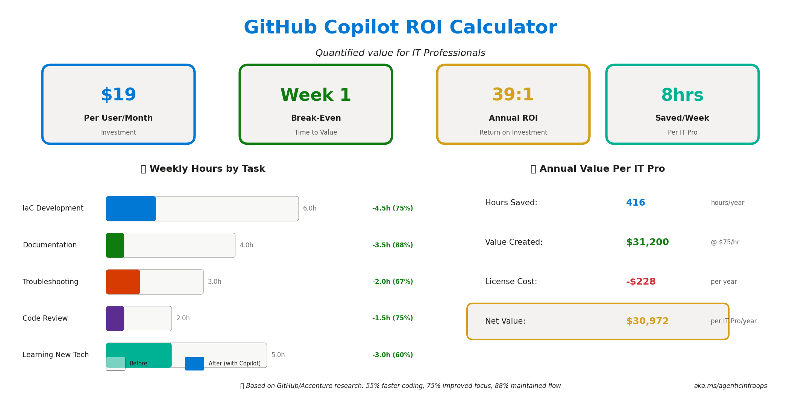

<!-- _class: lead -->
<!-- _backgroundColor: #0078D4 -->
<!-- _color: white -->

# Agentic InfraOps

## Azure infrastructure engineered by agents

**Verified. Well-Architected. Deployable.**

---



# What is Agentic InfraOps?

**AI-powered infrastructure development** using coordinated GitHub Copilot agents

- Transform requirements → deploy-ready templates
- Aligned with Azure Well-Architected Framework
- Uses Azure Verified Modules (AVM)
- Real-time pricing via MCP integration

🔗 **aka.ms/agenticinfraops**

---

# The Evolution of Infrastructure Development

| Era | Approach | Time to Deploy |
|-----|----------|----------------|
| Manual | Click-ops in portal | Days |
| Scripted | ARM/Bicep templates | Hours |
| **Agentic** | AI-coordinated agents | **Minutes** |

> "From clicking buttons to describing intent"

---

# The 4-Step Agent Workflow


---

# Step 1: @plan (Requirements)

**Built-in Plan Agent** gathers requirements

```
@plan Create a HIPAA-compliant patient portal with 
      Azure App Service and SQL Database
```

✅ Captures business requirements
✅ Identifies compliance needs  
✅ Creates implementation plan
✅ Estimates costs

---

# Step 2: azure-principal-architect

**Custom Agent** provides WAF assessment

- Security evaluation (9/10)
- Reliability review (8/10)  
- Performance analysis (8/10)
- Cost optimization (7/10)
- Operational excellence (8/10)

⚠️ **NO CODE OUTPUT** - Architecture guidance only

---



# Well-Architected Alignment

Every design is scored against Azure WAF pillars

**Overall Score: 8.0/10**

Agents ensure compliance with:
- Azure Security Benchmark
- Reliability best practices
- Performance targets
- Cost constraints

---

# Step 3: bicep-plan

**Custom Agent** creates implementation plan

- Selects Azure Verified Modules (AVM)
- Maps resource dependencies
- Generates machine-readable plan
- Stored in `.bicep-planning-files/`

```
📁 .bicep-planning-files/
   └── INFRA.patient-portal.md
```

---

# Step 4: bicep-implement

**Custom Agent** generates deploy-ready code

- Creates Bicep templates from plan
- Uses Azure Verified Modules
- Validates with `bicep build` and `lint`
- Ready for `az deployment` 

```bash
# One-command deployment
az deployment group create \
  --resource-group rg-patient-portal \
  --template-file main.bicep
```

---

# 💰 Azure Pricing MCP Integration

**Real-time pricing data** during architecture phase

| Tool | Purpose |
|------|---------|
| `azure_price_search` | Query retail prices |
| `azure_region_recommend` | Find cheapest regions |
| `azure_cost_estimate` | Calculate monthly costs |
| `azure_sku_discovery` | List available SKUs |

> No more guessing costs!

---



# ROI: The Business Case

**$19/user/month** investment

- **Week 1**: Break-even
- **39:1**: Annual ROI
- **8 hours/week**: Time saved

> 416 hours saved per IT Pro annually

---

# Time Savings by Task

| Task | Before | After | Savings |
|------|--------|-------|---------|
| IaC Development | 6.0h | 1.5h | **-75%** |
| Documentation | 4.0h | 0.5h | **-88%** |
| Troubleshooting | 3.0h | 1.0h | **-67%** |
| Code Review | 2.0h | 0.5h | **-75%** |
| Learning New Tech | 5.0h | 2.0h | **-60%** |

*Per week per IT Pro*

---

# E-Commerce Platform Demo

**Scenario**: Multi-tier e-commerce with PCI-DSS alignment

**Components** (61 resources):
- Azure Front Door Premium + WAF
- App Service (zone-redundant P1v4)
- Azure SQL Database
- Azure Cognitive Search
- Service Bus Premium
- Private endpoints throughout

**Monthly Cost**: ~$1,595

---

# Demo: Architecture Diagram


Generated with `diagram-generator` agent

---

# Objection: "Will AI Replace Me?"

## ❌ Myth: Copilot replaces IT Pros

## ✅ Reality: Copilot **amplifies** IT Pros

| Role | Before | After |
|------|--------|-------|
| Expert | Write code | Review + guide AI |
| Mid-level | Copy/paste patterns | Design + customize |
| Newcomer | Learn basics | Learn best practices |

> "The best IT Pros will be those who master AI collaboration"

---

# Objection: "Is It Secure?"

**Enterprise-Grade Security:**

- ✅ No code retained after response
- ✅ No training on your code
- ✅ SOC 2 Type II compliant
- ✅ Enterprise proxy support
- ✅ IP indemnity included

*GitHub Copilot Business/Enterprise only*

---

# Objection: "Code Quality?"

**Built-in Guardrails:**

1. **WAF Assessment** before code
2. **AVM Modules** (tested, maintained)
3. **Bicep lint** validation
4. **Human approval** at each step
5. **Enterprise policies** enforced

> "Trust but verify" - every step requires approval

---

# Getting Started

## 1. Clone the Repository
```bash
git clone https://github.com/jonathan-vella/azure-agentic-infraops
code azure-agentic-infraops
```

## 2. Open in Dev Container
- F1 → "Dev Containers: Reopen in Container"

## 3. Start the Workflow
- Open Copilot Chat → Select `@plan`

---

# Quick Start Prompts

**E-Commerce Platform:**
```
@plan Create a PCI-DSS compliant e-commerce platform 
with Azure Front Door, App Service, and SQL Database
```

**Patient Portal:**
```
@plan Create a HIPAA-compliant patient portal with 
secure access to medical records
```

**Data Analytics:**
```
@plan Create a data analytics platform with 
Azure Synapse and Power BI integration
```

---

# Scenarios Available

| # | Scenario | Duration | Difficulty |
|---|----------|----------|------------|
| S01 | Bicep Baseline | 30 min | Beginner |
| S02 | Terraform Baseline | 30 min | Beginner |
| S03 | Five-Agent Workflow | 45 min | Advanced |
| S04 | Documentation Generation | 20 min | Beginner |
| S05 | Service Validation | 30 min | Intermediate |

*10 total scenarios from beginner to advanced*

---

# Resources

📖 **Documentation**: [docs/README.md](../README.md)
📋 **Workflow Guide**: [docs/workflow/WORKFLOW.md](../workflow/WORKFLOW.md)
💰 **Pricing MCP**: [mcp/azure-pricing-mcp/](../../mcp/azure-pricing-mcp/)
🎯 **Scenarios**: [scenarios/](../../scenarios/)

**GitHub**: github.com/jonathan-vella/azure-agentic-infraops
**Shortlink**: **aka.ms/agenticinfraops**

---

# Q&A

## Common Questions

- **"What models are supported?"** - Claude, GPT-4o, o1
- **"Can I use my own agents?"** - Yes, `.agent.md` files
- **"Terraform support?"** - Yes, S02 scenario
- **"Multi-cloud?"** - Azure-focused, extensible

---

<!-- _class: lead -->
<!-- _backgroundColor: #0078D4 -->
<!-- _color: white -->

# Thank You!

## Start your Agentic InfraOps journey today

🔗 **aka.ms/agenticinfraops**

**Questions?** Open a GitHub Discussion

---

# Appendix: Agent Files

Located in `.github/agents/`:

| Agent | Purpose |
|-------|---------|
| `azure-principal-architect` | WAF assessment |
| `bicep-plan` | Implementation planning |
| `bicep-implement` | Code generation |
| `diagram-generator` | Architecture diagrams |
| `adr-generator` | Decision records |

---

# Appendix: Color Palette

| Color | Hex | Usage |
|-------|-----|-------|
| Azure Blue | `#0078D4` | Primary, headers |
| Green | `#107C10` | Success, planning |
| Purple | `#5C2D91` | Implementation |
| Orange | `#D83B01` | Architecture |
| Yellow | `#FFB900` | Warnings |
| Gray | `#201F1E` | Body text |
