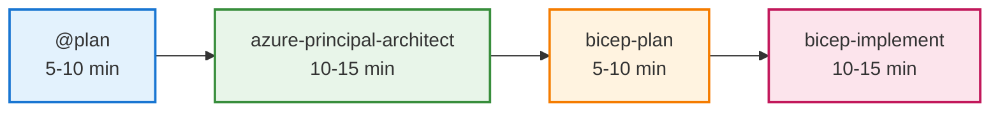

# Visual Elements Placement Guide

## Overview

This guide specifies exactly where to insert images, screenshots, and diagrams in the PowerPoint presentation.

---

## Required Visual Assets

### Images to Prepare

| Asset                         | Source                                 | Slides Used |
| ----------------------------- | -------------------------------------- | ----------- |
| `copilot-logo.png`            | GitHub assets                          | 1, 25       |
| `copilot-chat-screenshot.png` | VS Code screenshot                     | 3           |
| `ecommerce_architecture.png`  | `scenarios/scenario-output/ecommerce/` | 11, 12      |
| `agent-workflow-diagram.png`  | Create from Mermaid                    | 9           |
| `vscode-plan-agent.png`       | VS Code screenshot                     | 9, 23       |
| `waf-scores.png`              | Demo output screenshot                 | 10          |
| `cost-breakdown-chart.png`    | Create pie chart                       | 13          |
| `portfolio-collage.png`       | Project screenshots                    | 15          |

---

## Slide-by-Slide Visual Placement

### Slide 1: Title Slide

**Background:** Gradient blue (#0078D4 to #106EBE)
**Right side (40%):** GitHub Copilot logo/icon
**Alternative:** Azure + Copilot combined visual

---

### Slide 3: Key Capabilities

**Right side (35%):** Screenshot of Copilot Chat in VS Code

- Show a conversation asking about Bicep
- Capture: Open VS Code → Copilot Chat → Type "Write a Bicep template for a storage account"

---

### Slide 9: Four-Step Agent Workflow

**Center/Full width:** Workflow diagram

**Create this Mermaid diagram and export as PNG:**



---

### Slide 10: E-Commerce Platform Overview

**Right side (40%):** `ecommerce_architecture.png`

- File location: `scenarios/scenario-output/ecommerce/ecommerce_architecture.png`
- This is the Python-generated architecture diagram

---

### Slide 12: Architecture Output

**Right side (55%):** `ecommerce_architecture.png` (larger version)

- Same file, but displayed larger
- Left side has bullet points

---

### Slide 13: Cost Breakdown

**Consider adding:** Pie chart visualization

**Data for chart:**

| Category      | Percentage | Color            |
| ------------- | ---------- | ---------------- |
| Compute       | 34%        | #0078D4 (Blue)   |
| Data Services | 29%        | #107C10 (Green)  |
| Networking    | 24%        | #5C2D91 (Purple) |
| Messaging     | 13%        | #D83B01 (Orange) |
| Security      | 1%         | #FFB900 (Yellow) |

---

### Slide 15: Portfolio - What I've Built

**Option A:** Grid of project screenshots (2×3)
**Option B:** Timeline visual with project milestones
**Option C:** Simple icons representing each technology

---

### Slide 25: Thank You

**Right side (40%):** GitHub Copilot logo
**Background:** Gradient matching Slide 1

---

## Screenshots to Capture

### From VS Code (Recommended Captures)

1. **Copilot Chat View**

   - Open VS Code
   - Open Copilot Chat panel
   - Ask: "Create a Bicep template for a storage account with private endpoint"
   - Screenshot the response

2. **Agent Selection**

   - Open Chat
   - Click agent dropdown
   - Show available agents (Plan, azure-principal-architect, etc.)
   - Screenshot with dropdown visible

3. **Plan Agent Output**

   - Use @plan with e-commerce scenario
   - Screenshot the plan output with checkboxes

4. **Inline Suggestions**

   - Open a .bicep file
   - Type partial resource block
   - Show ghost text suggestion
   - Screenshot

5. **bicep build/lint Output**
   - Run validation in terminal
   - Screenshot success output

---

## Color Palette (Microsoft/Azure Style)

| Color      | Hex     | Usage                  |
| ---------- | ------- | ---------------------- |
| Azure Blue | #0078D4 | Primary headers, links |
| Dark Blue  | #106EBE | Secondary headers      |
| Green      | #107C10 | Success, positive      |
| Purple     | #5C2D91 | Accent, creativity     |
| Orange     | #D83B01 | Warnings, attention    |
| Yellow     | #FFB900 | Highlights             |
| Light Gray | #F3F2F1 | Backgrounds            |
| Dark Gray  | #323130 | Body text              |

---

## Exporting from Marp

### To PowerPoint (PPTX)

Run these commands from the **repository root directory**:

```bash
# Install Marp CLI
npm install -g @marp-team/marp-cli

# Export to PPTX (run from repository root)
marp docs/presenter-toolkit/github-copilot-for-itpros.md --pptx -o github-copilot-for-itpros.pptx

# Export to PDF (for backup)
marp docs/presenter-toolkit/github-copilot-for-itpros.md --pdf -o github-copilot-for-itpros.pdf
```

### Using VS Code Extension

1. Install "Marp for VS Code" extension
2. Open `github-copilot-for-itpros.md`
3. Click the Marp icon in the editor toolbar
4. Select "Export slide deck..."
5. Choose PPTX format

---

## Post-Export Customization

After exporting to PPTX, you may want to:

1. **Add transitions** - Marp doesn't support transitions
2. **Adjust image sizes** - Fine-tune positioning
3. **Add animations** - Build effects for bullet points
4. **Insert videos** - Demo recordings if desired
5. **Customize fonts** - Match your organization's brand
6. **Add presenter notes** - Speaker notes are exported but may need formatting

---

## Demo Recording Tips

If you want to include a live demo video:

1. **Resolution:** 1920×1080 (16:9)
2. **Length:** 3-5 minutes max per clip
3. **Zoom:** 150% in VS Code for visibility
4. **Font size:** Increase editor font to 16-18pt
5. **Clean workspace:** Hide unnecessary panels
6. **Narration:** Optional, can present live

**Recommended clips:**

- @plan agent creating implementation plan (2 min)
- Bicep generation from prompt (1 min)
- bicep build/lint validation (30 sec)
- Deployment what-if output (1 min)

---

## File Locations Summary

```
docs/presenter-toolkit/
├── github-copilot-for-itpros.md          # Marp source
├── visual-elements-guide.md               # This file
├── assets/                                # Create this folder
│   ├── copilot-logo.png
│   ├── copilot-chat-screenshot.png
│   ├── vscode-agents-dropdown.png
│   ├── plan-agent-output.png
│   └── workflow-diagram.png
└── exports/                               # Output folder
    ├── github-copilot-for-itpros.pptx
    └── github-copilot-for-itpros.pdf

scenarios/scenario-output/ecommerce/
└── ecommerce_architecture.png             # Already exists
```
