# Agents Overview

> **Version 3.6.0** | Complete reference for all 7 custom agents

This document provides a single-page overview of all agents in Agentic InfraOps, their purposes, when to use them,
and example prompts.

---

## Agent Comparison Table

| Agent                              | Step | Purpose                       | Creates Code? | Output Files                          |
| ---------------------------------- | ---- | ----------------------------- | ------------- | ------------------------------------- |
| `@plan` (built-in)                 | 1    | Requirements gathering        | ❌ No         | `01-requirements.md`                  |
| `azure-principal-architect`        | 2    | WAF assessment & guidance     | ❌ No         | `02-architecture-assessment.md`       |
| `diagram-generator`                | 3, 7 | Python architecture diagrams  | ✅ Yes        | `03-des-diagram.*`, `07-ab-diagram.*` |
| `adr-generator`                    | 3, 7 | Architecture Decision Records | ❌ No         | `03-des-adr-*`, `07-ab-adr-*`         |
| `bicep-plan`                       | 4    | Implementation planning       | ❌ No         | `04-implementation-plan.md`           |
| `bicep-implement`                  | 5    | Bicep code generation         | ✅ Yes        | `infra/bicep/{project}/`              |
| `workload-documentation-generator` | 7    | Customer-deliverable docs     | ❌ No         | `07-*.md`                             |

---

## How to Use Agents

1. Press `Ctrl+Shift+A` or click the **Agent** button in Copilot Chat
2. Select agent from dropdown
3. Type your prompt and submit
4. **Wait for approval prompt** before proceeding to next step

---

## Agent Details

### @plan (Built-in)

> **Step 1** | VS Code built-in planning agent

**Purpose**: Gather comprehensive requirements including business context, NFRs (SLA/RTO/RPO), compliance needs,
and cost constraints.

**📋 Template**: Use [`.github/prompts/plan-requirements.prompt.md`](../../.github/prompts/plan-requirements.prompt.md)

**Example Prompt**:

```text
@plan Create deployment plan for HIPAA-compliant patient portal.
Business context: Healthcare startup serving 10,000 patients.
NFRs: 99.95% SLA, RTO=4hrs, RPO=1hr, <2s page load.
Compliance: HIPAA, SOC 2, data residency in EU.
Budget: $3,000/month maximum.
```

**Output**: `agent-output/{project}/01-requirements.md`

---

### azure-principal-architect

> **Step 2** | Azure Well-Architected Framework assessment

**Purpose**: Provide architectural guidance based on Azure WAF pillars. Does NOT create any code—only assessment
and recommendations.

**Key Behaviors**:

- Validates that Step 1 captured NFRs before proceeding
- Scores each WAF pillar (Reliability, Security, Cost, Operations, Performance)
- Recommends Azure services and patterns
- Integrates with Azure Pricing MCP for cost estimates

**Example Prompt**:

```text
@azure-principal-architect Assess architecture for patient portal from Step 1.
Focus on HIPAA compliance and high availability requirements.
```

**Output**: `agent-output/{project}/02-architecture-assessment.md`

**📖 Definition**: [`.github/agents/azure-principal-architect.agent.md`](../../.github/agents/azure-principal-architect.agent.md)

---

### diagram-generator

> **Steps 3 & 7** | Python architecture diagrams

**Purpose**: Generate architecture diagrams using the `diagrams` Python library. Creates both `.py` source files
and rendered `.png` images.

**When to Use**:

- Step 3: Design-phase diagrams (`-des` suffix)
- Step 7: As-built diagrams (`-ab` suffix)

**Example Prompts**:

```text
@diagram-generator Create architecture diagram for the patient portal design.

@diagram-generator Generate as-built diagram showing deployed infrastructure.
```

**Output**:

- `agent-output/{project}/03-des-diagram.py` + `.png`
- `agent-output/{project}/07-ab-diagram.py` + `.png`

**📖 Definition**: [`.github/agents/diagram-generator.agent.md`](../../.github/agents/diagram-generator.agent.md)

---

### adr-generator

> **Steps 3 & 7** | Architecture Decision Records

**Purpose**: Create ADRs documenting significant architectural decisions with context, options considered,
and rationale.

**When to Use**:

- Step 3: Design-phase decisions (`-des` suffix)
- Step 7: Implementation decisions (`-ab` suffix)

**Example Prompts**:

```text
@adr-generator Create ADR for database selection decision (SQL vs Cosmos DB).

@adr-generator Document the decision to use App Service instead of AKS.
```

**Output**:

- `agent-output/{project}/03-des-adr-NNN-{title}.md`
- `agent-output/{project}/07-ab-adr-NNN-{title}.md`

**📖 Definition**: [`.github/agents/adr-generator.agent.md`](../../.github/agents/adr-generator.agent.md)

---

### bicep-plan

> **Step 4** | Implementation planning with governance discovery

**Purpose**: Create detailed implementation plan including module structure, resource dependencies, and
governance constraints from Azure Policy.

**Key Behaviors**:

- Queries Azure Resource Graph for policy assignments
- Generates governance constraints file
- Plans module structure and dependencies
- Integrates with Azure Pricing MCP for cost validation

**Example Prompt**:

```text
@bicep-plan Create implementation plan for patient portal architecture.
Include module structure and deployment order.
```

**Output**:

- `agent-output/{project}/04-implementation-plan.md`
- `agent-output/{project}/04-governance-constraints.md`

**📖 Definition**: [`.github/agents/bicep-plan.agent.md`](../../.github/agents/bicep-plan.agent.md)

---

### bicep-implement

> **Step 5** | Bicep code generation

**Purpose**: Generate production-ready Bicep templates based on the implementation plan. Creates modular,
validated code following AVM-first approach.

**Key Behaviors**:

- Generates `main.bicep` + module files
- Creates deployment script (`deploy.ps1`)
- Validates with `bicep build` and `bicep lint`
- Follows unique suffix pattern for resource names
- Uses Azure Verified Modules where available

**Example Prompt**:

```text
@bicep-implement Generate Bicep templates for patient portal.
Follow the implementation plan from Step 4.
```

**Output**:

- `infra/bicep/{project}/main.bicep`
- `infra/bicep/{project}/modules/*.bicep`
- `infra/bicep/{project}/deploy.ps1`
- `agent-output/{project}/05-implementation-reference.md`

**📖 Definition**: [`.github/agents/bicep-implement.agent.md`](../../.github/agents/bicep-implement.agent.md)

---

### workload-documentation-generator

> **Step 7** | Customer-deliverable documentation

**Purpose**: Generate comprehensive workload documentation package for customer handoff, including design docs,
runbooks, and compliance matrices.

**Creates**:

- `07-documentation-index.md` — Master index
- `07-design-document.md` — Architecture design document
- `07-operations-runbook.md` — Day-2 operational procedures
- `07-resource-inventory.md` — Complete resource listing
- `07-compliance-matrix.md` — Security control mapping
- `07-backup-dr-plan.md` — DR procedures

**Example Prompt**:

```text
@workload-documentation-generator Generate complete workload documentation package
for the deployed patient portal infrastructure.
```

**Output**: `agent-output/{project}/07-*.md` (6 files)

**📖 Definition**: [`.github/agents/workload-documentation-generator.agent.md`](../../.github/agents/workload-documentation-generator.agent.md)

---

## Workflow Summary

```mermaid
%%{init: {'theme':'neutral'}}%%
graph LR
    P["@plan<br/>Step 1"] --> A[azure-principal-architect<br/>Step 2]
    A --> D["Design Artifacts<br/>Step 3"]
    D --> B[bicep-plan<br/>Step 4]
    B --> I[bicep-implement<br/>Step 5]
    I --> DEP["Deploy<br/>Step 6"]
    DEP --> F["As-Built Artifacts<br/>Step 7"]
    MCP["💰 Azure Pricing MCP"] -.->|real-time costs| A
    MCP -.->|cost validation| B
```



---

## Quick Reference

| I want to...                | Use Agent                          | Step   |
| --------------------------- | ---------------------------------- | ------ |
| Gather requirements         | `@plan`                            | 1      |
| Get architecture guidance   | `azure-principal-architect`        | 2      |
| Create architecture diagram | `diagram-generator`                | 3 or 7 |
| Document a decision         | `adr-generator`                    | 3 or 7 |
| Plan implementation         | `bicep-plan`                       | 4      |
| Generate Bicep code         | `bicep-implement`                  | 5      |
| Create customer docs        | `workload-documentation-generator` | 7      |

---

## Related Documentation

- [Workflow Guide](workflow.md) — Complete 7-step workflow
- [Defaults Reference](defaults.md) — Regions, naming, tags
- [Bicep Patterns](bicep-patterns.md) — Code patterns
