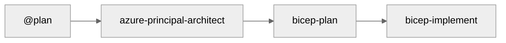

# Workflow Documentation

This folder contains the complete guide to the Agentic InfraOps four-step agent workflow.

## Quick Reference

| Step | Agent                     | Purpose                                    |
| ---- | ------------------------- | ------------------------------------------ |
| 1    | `@plan`                   | Generate implementation plan               |
| 2    | `azure-principal-architect` | WAF assessment, architecture guidance    |
| 3    | `bicep-plan`              | AVM module selection, implementation plan  |
| 4    | `bicep-implement`         | Generate validated Bicep templates         |

**Optional agents**: `diagram-generator` (architecture visuals), `adr-generator` (decision records)

## Main Documentation

➡️ **[WORKFLOW.md](WORKFLOW.md)** — Complete guide with detailed instructions for each step

This comprehensive guide covers:

- How to invoke and use each agent
- Approval gates and when to proceed
- Best practices for effective prompting
- Common patterns and anti-patterns
- Troubleshooting workflow issues

## Related Documentation

- [Quick Start](../guides/quickstart.md) — 10-minute setup + first workflow run
- [Getting Started Journey](../guides/getting-started-journey.md) — Comprehensive onboarding with learning paths
- [Troubleshooting](../guides/troubleshooting.md) — Common issues and solutions
- [Agent Definitions](../../.github/agents/) — Customize agent behavior
