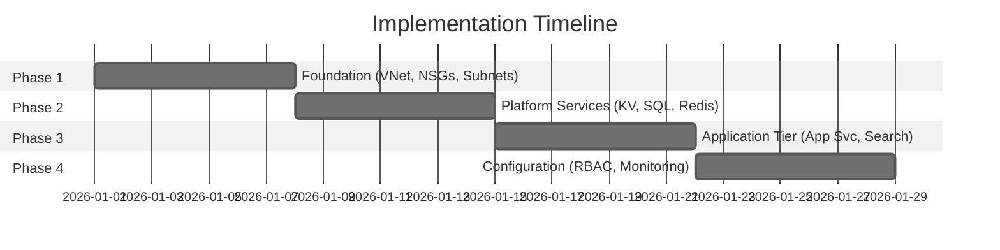

# Step 1: Plan Agent (@plan)

> **Agent Used:** `@plan` (built-in VS Code Copilot agent)  
> **Purpose:** Create initial deployment plan with requirements and cost estimates

---

## 💬 Prompt

```text
Create a deployment plan for a multi-tier e-commerce platform on Azure with the following requirements:

Business Requirements:
- High availability (99.9% SLA) for a retail website serving European customers
- Handle peak traffic of 10,000 concurrent users during sales events
- PCI-DSS compliance for payment data handling
- Sub-100ms response time for product catalog queries

Technical Requirements:
- Web frontend (React SPA)
- REST API backend (.NET 8)
- Product catalog database with full-text search
- User session caching
- Order processing with async capabilities
- Secure secrets management
- CDN for static assets

Constraints:
- Region: swedencentral (primary)
- Budget: Mid-tier (not the cheapest, but cost-conscious)
- Team has Azure PaaS experience but limited Kubernetes knowledge

Please provide a detailed implementation plan including:
1. Recommended Azure services for each component
2. Network architecture
3. Security considerations
4. Estimated monthly costs
5. Implementation phases
```

---

## ✅ Output

# Multi-Tier E-Commerce Platform on Azure

Deploy a PCI-DSS compliant, high-availability e-commerce platform using Azure PaaS services in `swedencentral`. The architecture uses App Service for the .NET 8 API, Azure Static Web Apps for the React SPA, Azure SQL with Cognitive Search for sub-100ms catalog queries, Redis for session caching, and Service Bus with Functions for async order processing—all secured via private endpoints, Key Vault, and Azure Front Door with WAF.

---

## Business Requirements

| Requirement   | Target                  |
| ------------- | ----------------------- |
| Availability  | 99.9% SLA               |
| Peak Traffic  | 10,000 concurrent users |
| Compliance    | PCI-DSS                 |
| Query Latency | Sub-100ms               |

---

## Recommended Azure Services

| Component              | Service                              | SKU           | Rationale                                       |
| ---------------------- | ------------------------------------ | ------------- | ----------------------------------------------- |
| React SPA Frontend     | Azure Static Web Apps                | Standard      | Built-in CDN, global edge, no server management |
| .NET 8 REST API        | Azure App Service                    | P1v4          | Zone redundancy for 99.9% SLA, PaaS familiarity |
| Product Catalog DB     | Azure SQL Database                   | S3 (100 DTU)  | Relational data, Azure AD-only auth             |
| Full-Text Search       | Azure Cognitive Search               | Standard S1   | Sub-100ms queries, faceted navigation           |
| Session Caching        | Azure Cache for Redis                | Standard C2   | 10K concurrent sessions, low latency            |
| Async Order Processing | Service Bus + Azure Functions        | Premium / EP1 | Reliable queuing, event-driven scaling          |
| Secrets Management     | Azure Key Vault                      | Standard      | PCI-DSS, managed identity access                |
| CDN + WAF              | Azure Front Door                     | Standard      | Global CDN, integrated WAF for PCI-DSS          |
| Monitoring             | Application Insights + Log Analytics | Pay-as-you-go | End-to-end tracing, compliance logging          |

---

## Network Architecture

| Tier        | Subnet                                | Resources                                   | NSG Rules                      |
| ----------- | ------------------------------------- | ------------------------------------------- | ------------------------------ |
| Edge        | —                                     | Front Door (global)                         | WAF policies, geo-filtering    |
| Web         | `snet-web-prod` (10.0.1.0/24)         | App Service (VNet integrated)               | Allow 443 from Front Door only |
| Data        | `snet-data-prod` (10.0.2.0/24)        | SQL, Redis, Search (private endpoints)      | Allow from web subnet only     |
| Integration | `snet-integration-prod` (10.0.3.0/24) | Functions (VNet integrated), Service Bus PE | Allow from web/data subnets    |

---

## Security Considerations (PCI-DSS)

1. **Network segmentation** — 3-tier subnet isolation with NSGs (deny-by-default at priority 4096)
2. **No public endpoints** — Private endpoints for SQL, Redis, Search, Service Bus, Key Vault
3. **Encryption** — TLS 1.2+ in transit, transparent data encryption at rest
4. **Authentication** — Azure AD-only for SQL, managed identities for all service-to-service
5. **Secrets** — All connection strings/keys in Key Vault, no secrets in code/config
6. **WAF** — Azure Front Door WAF with OWASP ruleset enabled
7. **Audit logging** — Diagnostic settings → Log Analytics (90-day retention)

---

## Estimated Monthly Costs

| Service                                     | Estimated Cost (USD) |
| ------------------------------------------- | -------------------- |
| App Service Plan (P1v4 x2 instances)        | ~$412                |
| Azure SQL (S3, 100 DTU)                     | ~$150                |
| Azure Cognitive Search (S1)                 | ~$250                |
| Azure Cache for Redis (C2)                  | ~$170                |
| Azure Functions (EP1) + Service Bus Premium | ~$200                |
| Azure Front Door (Standard)                 | ~$100                |
| Key Vault, Storage, Log Analytics           | ~$80                 |
| **Total Estimate**                          | **~$1,250/month**    |

> 💡 **Tip:** Reserved instances (1-3 year) can reduce costs by 30-50%

---

## Implementation Phases



### Phase 1 — Foundation (Week 1)

- VNet `vnet-prod-main-swc` with address space 10.0.0.0/16
- 3 subnets: web, data, integration
- NSGs with segmentation rules
- Resource group `rg-ecommerce-prod`

### Phase 2 — Platform Services (Week 2)

- Key Vault with soft-delete enabled
- App Service Plan (P1v4, zone redundant)
- Azure SQL (Azure AD-only auth)
- Azure Cache for Redis with private endpoint
- Azure Cognitive Search with private endpoint

### Phase 3 — Application Tier (Week 3)

- App Service (API) with VNet integration
- Static Web App (SPA)
- Azure Functions with VNet integration
- Service Bus namespace with private endpoint
- Front Door with WAF policies

### Phase 4 — Configuration (Week 4)

- Managed identity RBAC assignments
- Key Vault secrets population
- Application Insights instrumentation
- Alert rules for SLA monitoring
- Deployment slots for zero-downtime deployments

---

## Open Questions for Next Step

1. **Disaster Recovery** — Add geo-replication to `germanywestcentral`? (+40% cost)
2. **Payment Processing** — External gateway (Stripe/Adyen) or on-platform HSM?
3. **Search Sync** — Scheduled batch or real-time change feed?

---

## ➡️ Next Step

Proceed to **`azure-principal-architect`** agent for Well-Architected Framework assessment.
