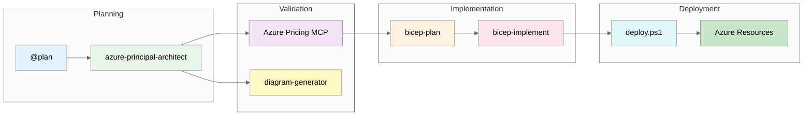

# Demo 04: E-Commerce Platform - Full Agent Workflow

## Meet Carlos Mendez

> _"Black Friday isn't a drill. When 50,000 users hit checkout simultaneously,
> there are no second chances."_

**Carlos Mendez** is an E-Commerce Architect at TechRetail Inc. With 90 days until Black Friday,
he needs to build infrastructure that handles 50,000 concurrent users while maintaining PCI-DSS
compliance for payment processing. The full 7-step workflow—including real-time cost validation
with the Azure Pricing MCP server—is exactly what he needs to deliver on time and on budget.

---

## 🎯 Overview

This demo showcases GitHub Copilot's **complete agent workflow** for designing and implementing a
**PCI-DSS compliant e-commerce platform** on Azure.
It demonstrates all 7 steps:
`@plan → azure-principal-architect → pricing/diagram → bicep-plan → bicep-implement → deploy`,
with real-time cost validation using the Azure Pricing MCP server.

> **Working Implementation**: Complete Bicep templates available in
> [`../../infra/bicep/ecommerce/`](../../infra/bicep/ecommerce/) (18 modules, 61 Azure resources).
>
> **Workflow Output**: Step-by-step captured outputs in
> [`../scenario-output/ecommerce/`](../scenario-output/ecommerce/).

**Target Audience**: Solution Architects, Cloud Architects, Infrastructure Engineers, IT Professionals

**Scenario**: Design and implement a PCI-DSS compliant multi-tier e-commerce platform

**Time**: 60-90 minutes (full workflow with deployment) or 30-45 minutes (abbreviated demo)

## 🌟 Why This Matters

This demo extends the 7-step workflow by adding:

- 💰 **Real-time pricing**: Azure Pricing MCP server for accurate cost estimates
- 📊 **Architecture diagrams**: Python-based diagrams using `diagrams` library
- 🔧 **Issue resolution**: Common Bicep errors and solutions documented
- 🚀 **Deployment script**: Enhanced `deploy.ps1` with professional output

**With Full Workflow**:

- ⚡ **90 minutes**: From requirements to deployed infrastructure (vs. 3-5 days manual)
- 💵 **Cost-validated**: Real-time Azure pricing before deployment
- 🔒 **PCI-DSS aligned**: Security controls for payment processing
- 📈 **Scalable**: Zone-redundant, 10K concurrent users

## Related Assets

| Resource                                                              | Description                         |
| --------------------------------------------------------------------- | ----------------------------------- |
| [E-Commerce Bicep](../../infra/bicep/ecommerce/)                      | Working implementation (18 modules) |
| [Cost Estimate](../../docs/cost-estimates/ecommerce-cost-estimate.md) | Monthly cost breakdown              |
| [Workflow Outputs](../scenario-output/ecommerce/)                     | Step-by-step captured outputs       |
| [ADR-003: AVM-First](../../docs/adr/ADR-003-avm-first-approach.md)    | Module selection rationale          |
| [Presenter Toolkit](../../docs/presenter-toolkit/)                    | Demo delivery guides                |

## 🤖 The Seven Steps



| Step | Agent/Tool                  | Duration  | Key Output                            |
| ---- | --------------------------- | --------- | ------------------------------------- |
| 1    | `@plan` (built-in)          | 5-10 min  | Implementation plan + requirements    |
| 2    | `azure-principal-architect` | 10-15 min | WAF assessment (8.0/10) + compliance  |
| 3a   | Azure Pricing MCP           | 5 min     | Real-time cost estimate (~$1,595/mo)  |
| 3b   | `diagram-generator`         | 5 min     | Python architecture diagram           |
| 4    | `bicep-plan`                | 10 min    | Phased implementation plan (4 phases) |
| 5    | `bicep-implement`           | 15-20 min | 18 Bicep modules + deploy script      |
| 6    | Deployment                  | 10-15 min | 61 Azure resources deployed           |

## 📋 Scenario: Multi-Tier E-Commerce Platform

**Business Context**:

- **Organization**: Retail company serving European customers
- **Need**: High-availability e-commerce platform for online sales
- **Traffic**: 10,000 concurrent users during peak sales events
- **Compliance**: PCI-DSS for payment card processing
- **Performance**: Sub-100ms response for product catalog

**Technical Requirements**:

| Component        | Technology          | Purpose                     |
| ---------------- | ------------------- | --------------------------- |
| Web Frontend     | React SPA           | Customer-facing UI          |
| Backend API      | .NET 8 REST API     | Business logic              |
| Product Database | Azure SQL + Search  | Catalog with full-text      |
| Session Caching  | Redis C2            | 10K concurrent sessions     |
| Order Processing | Service Bus Premium | Async, reliable queue       |
| CDN + Security   | Front Door Premium  | Global edge + WAF (PCI-DSS) |

**Budget**: ~$1,595/month (production environment)

## 🚀 Quick Start

### Prerequisites

- Visual Studio Code with GitHub Copilot
- Azure subscription with Contributor access
- Custom agents configured (see [Workflow Guide](../../docs/workflow/WORKFLOW.md))
- Azure Pricing MCP server running (see [MCP README](../../mcp/azure-pricing-mcp/README.md))

### Run the Demo

1. **Open the prompts file**:

   ```powershell
   code scenarios/S04-ecommerce-platform/prompts/workflow-prompts.md
   ```

2. **Follow each step** using the prompts provided

3. **Review captured outputs** in [`../scenario-output/ecommerce/`](../scenario-output/ecommerce/)

4. **Deploy the infrastructure**:

   ```powershell
   cd infra/bicep/ecommerce
   .\deploy.ps1 -WhatIf  # Preview changes
   .\deploy.ps1          # Deploy
   ```

## 📁 Demo Structure

```text
S04-ecommerce-platform/
├── README.md                    # This file
├── DEMO-SCRIPT.md               # Step-by-step presentation guide
├── scenario/
│   └── business-requirements.md # Detailed scenario
├── prompts/
│   └── workflow-prompts.md      # Copy-paste prompts for each step
└── [Outputs in ../scenario-output/ecommerce/]
    ├── 00-plan.md               # @plan output
    ├── 01-azure-architect.md    # WAF assessment
    ├── 02-bicep-plan.md         # Implementation plan
    ├── 03-bicep-code-gen.md     # Bicep strategy
    ├── 04-pricing-estimate.md   # MCP pricing output
    ├── 05-bicep-issues-solutions.md # Issues & fixes
    ├── 06-deployment-script.md  # Enhanced deploy.ps1
    ├── ecommerce-cost-estimate.md # Detailed cost breakdown
    └── architecture.py          # Python diagram code
```

## 📊 Key Metrics

| Metric           | Value           |
| ---------------- | --------------- |
| Azure Resources  | 61 resources    |
| Bicep Modules    | 18 modules      |
| Monthly Cost     | ~$1,595 USD     |
| Region           | Sweden Central  |
| Compliance       | PCI-DSS aligned |
| WAF Score        | 8.0/10          |
| Concurrent Users | 10,000          |
| SLA Target       | 99.9%           |

## 💰 Cost Breakdown

Using Azure Pricing MCP (real-time API):

| Category            | Monthly Cost | % of Total |
| ------------------- | ------------ | ---------- |
| Compute             | $535         | 34%        |
| Data Services       | $466         | 29%        |
| Networking          | $376         | 24%        |
| Messaging           | $200         | 13%        |
| Security/Management | $18          | 1%         |
| **Total**           | **~$1,595**  | 100%       |

> 💡 **Savings Opportunity**: 3-year reserved instances can save ~$2,030/year (32% on compute)

## 🔒 Security Architecture

### PCI-DSS Controls Implemented

| Control Area         | Implementation                             |
| -------------------- | ------------------------------------------ |
| Network Segmentation | 3-tier subnets with NSG deny-by-default    |
| Encryption (Transit) | TLS 1.2+ enforced, Front Door WAF          |
| Encryption (Rest)    | Azure-managed keys, transparent encryption |
| Access Control       | Azure AD-only auth, managed identities     |
| Secrets Management   | Key Vault with private endpoint            |
| Audit Logging        | Log Analytics 90-day retention             |
| WAF                  | Front Door Premium with OWASP rules        |

### Network Topology

```text
┌─────────────────────────────────────────────────────────────────┐
│ Azure Front Door Premium (Global Edge + WAF)                    │
└─────────────────────┬───────────────────────────────────────────┘
                      │ HTTPS Only
┌─────────────────────▼───────────────────────────────────────────┐
│ snet-web-prod (10.0.1.0/24)                                     │
│ ┌─────────────────┐  ┌─────────────────┐                        │
│ │ App Service API │  │ Static Web App  │                        │
│ │ (P1v4 Linux)    │  │ (React SPA)     │                        │
│ └─────────────────┘  └─────────────────┘                        │
└─────────────────────┬───────────────────────────────────────────┘
                      │ Private Endpoints
┌─────────────────────▼───────────────────────────────────────────┐
│ snet-data-prod (10.0.2.0/24)                                    │
│ ┌──────────┐ ┌──────────┐ ┌──────────┐ ┌──────────┐             │
│ │ SQL (S3) │ │ Redis C2 │ │ Search S1│ │ Key Vault│             │
│ └──────────┘ └──────────┘ └──────────┘ └──────────┘             │
└─────────────────────────────────────────────────────────────────┘
                      │ Private Endpoints
┌─────────────────────▼───────────────────────────────────────────┐
│ snet-integration-prod (10.0.3.0/24)                             │
│ ┌─────────────────────┐  ┌─────────────────────┐                │
│ │ Azure Functions EP1 │  │ Service Bus Premium │                │
│ └─────────────────────┘  └─────────────────────┘                │
└─────────────────────────────────────────────────────────────────┘
```

## 🔧 Issues & Solutions

Common issues encountered during implementation:

| Issue              | Solution                                       |
| ------------------ | ---------------------------------------------- |
| BCP036 scope error | Use `existing` keyword for diagnostic settings |
| WAF matchVariable  | Use `RequestHeader` (singular)                 |
| SQL admin identity | Auto-detect current Azure user                 |
| Resource group     | Create before what-if analysis                 |
| Storage shared key | Use identity-based connections                 |

See [`05-bicep-issues-solutions.md`](../scenario-output/ecommerce/05-bicep-issues-solutions.md) for details.

## 📈 Value Metrics

| Metric                  | Traditional  | With Agent Workflow | Improvement |
| ----------------------- | ------------ | ------------------- | ----------- |
| Architecture Assessment | 4 hours      | 30 min              | 87%         |
| Bicep Modules (18)      | 16 hours     | 2 hours             | 88%         |
| Cost Estimation         | 1 hour       | 10 min              | 83%         |
| Deploy Script           | 2 hours      | 30 min              | 75%         |
| **Total**               | **23 hours** | **3 hours**         | **87%**     |

## 🎯 Learning Objectives

By the end of this demo, participants will:

1. ✅ Use **all 6 workflow steps** including pricing and diagrams
2. ✅ Query **real-time Azure pricing** via MCP server
3. ✅ Generate **Python architecture diagrams** with `diagram-generator`
4. ✅ Handle **common Bicep errors** (BCP036, WAF, SQL auth)
5. ✅ Create **production-grade deploy scripts** with professional output
6. ✅ Understand **PCI-DSS aligned** architecture patterns
7. ✅ Articulate **ROI** (87% time savings, 20 hours saved)

## 🎤 Presentation Tips

### Opening (2 minutes)

- **Hook**: "What if you could design, validate, and deploy a PCI-DSS compliant e-commerce platform in under 3 hours?"
- Present traditional timeline (3-5 days)
- Introduce the 7-step workflow with MCP pricing

### During Demo (60 minutes)

- **Pause at cost validation** - Show MCP pricing vs. estimates
- **Show the architecture diagram** - Visual impact for stakeholders
- **Demonstrate error resolution** - Real-world issues solved
- **Run deployment** - Live Azure resources created

### Closing (3 minutes)

- **Summarize metrics** - 87% time reduction, 20 hours saved
- **Emphasize cost accuracy** - Real-time pricing before deployment
- **Call to action** - "Start with @plan for your next project"

## 📚 Resources

- [Workflow Output Files](../scenario-output/ecommerce/)
- [Bicep Templates](../../infra/bicep/ecommerce/)
- [Azure Pricing MCP](../../mcp/azure-pricing-mcp/README.md)
- [Workflow Guide](../../docs/workflow/WORKFLOW.md)
- [Cost Estimate Details](../scenario-output/ecommerce/ecommerce-cost-estimate.md)

## ✅ Success Criteria

Demo is successful when audience:

- [ ] Understands the **7-step workflow** with pricing and diagrams
- [ ] Sees value in **real-time cost validation** before deployment
- [ ] Recognizes **PCI-DSS security patterns** implemented
- [ ] Appreciates **issue resolution documentation**
- [ ] Understands **87% time savings** (23 hours → 3 hours)
- [ ] Wants to try Azure Pricing MCP on their own projects

---

**Demo Version**: 1.0.0
**Last Updated**: December 4, 2025
**Tested With**: GitHub Copilot (Claude Sonnet 4.5), Azure CLI 2.50.0+, Bicep 0.20.0+
