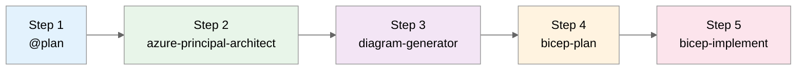

# E-Commerce Platform Scenario Prompts

> **Scenario:** Build a PCI-DSS compliant, multi-tier e-commerce platform on Azure  
> **Duration:** ~30 minutes  
> **Output:** See `scenario-output/` folder for complete agent responses

---

## Workflow Overview



| Step | Agent                       | Purpose                      | Output File             |
| ---- | --------------------------- | ---------------------------- | ----------------------- |
| 1    | `@plan`                     | Requirements & cost estimate | `00-plan.md`            |
| 2    | `azure-principal-architect` | WAF assessment               | `01-azure-architect.md` |
| 3    | `diagram-generator`         | Architecture visualization   | `architecture.py`       |
| 4    | `bicep-plan`                | Implementation planning      | `02-bicep-plan.md`      |
| 5    | `bicep-implement`           | Code generation strategy     | `03-bicep-code-gen.md`  |

---

## Step 1: Plan Agent (@plan)

> **How to invoke:** Type `@plan` in Copilot Chat

```text
Create a deployment plan for a multi-tier e-commerce platform on Azure with the following requirements:

Business Requirements:
- High availability (99.9% SLA) for a retail website serving European customers
- Handle peak traffic of 10,000 concurrent users during sales events
- PCI-DSS compliance for payment data handling
- Sub-100ms response time for product catalog queries

Technical Requirements:
- Web frontend (React SPA)
- REST API backend (.NET 8)
- Product catalog database with full-text search
- User session caching
- Order processing with async capabilities
- Secure secrets management
- CDN for static assets

Constraints:
- Region: swedencentral (primary)
- Budget: Mid-tier (not the cheapest, but cost-conscious)
- Team has Azure PaaS experience but limited Kubernetes knowledge

Please provide a detailed implementation plan including:
1. Recommended Azure services for each component
2. Network architecture
3. Security considerations
4. Estimated monthly costs
5. Implementation phases
```

**Expected Output:** Service recommendations, network architecture, ~$1,250/month estimate, 4-week timeline

---

## Step 2: Azure Principal Architect Agent

> **How to invoke:** Press `Ctrl+Shift+A` → Select `azure-principal-architect`

```text
Assess the e-commerce platform architecture from the plan against the Azure Well-Architected Framework.
Provide scores for each pillar and specific recommendations.
```

**Expected Output:** WAF pillar scores (Security 9/10, Reliability 8/10, etc.), recommendations, risk assessment

---

## Step 3: Diagram Generator Agent

> **How to invoke:** Press `Ctrl+Shift+A` → Select `diagram-generator`

```text
Generate a Python architecture diagram for the e-commerce platform using the diagrams library.
Include all Azure services from the WAF assessment.
```

**Expected Output:** `docs/diagrams/ecommerce/architecture.py` and PNG file

---

## Step 4: Bicep Plan Agent

> **How to invoke:** Press `Ctrl+Shift+A` → Select `bicep-plan`

### Initial Prompt (May Hit Token Limit)

```text
Now create a Bicep implementation plan for the visualized architecture.
Use the diagram as reference for resource dependencies and relationships.
```

### Workaround: Split into Phases

If you encounter "response hit the length limit", use phased prompts:

#### Phase 1 — Foundation

```text
Create Bicep implementation plan for Phase 1 only:
- VNet with 3 subnets (web, data, integration)
- NSGs with segmentation rules
- Resource group structure

Region: swedencentral
```

#### Phase 2 — Platform Services

```text
Create Bicep implementation plan for Phase 2:
- Key Vault with private endpoint
- App Service Plan P1v3 (zone redundant)
- Azure SQL with Azure AD-only auth
- Azure Cache for Redis with private endpoint
- Private DNS zones

Reference Phase 1 network outputs.
```

#### Phase 3 — Application Tier

```text
Create Bicep implementation plan for Phase 3:
- App Service with VNet integration
- Cognitive Search with private endpoint
- Service Bus Premium with private endpoint
- Azure Functions EP1

Reference Phase 1-2 outputs.
```

#### Phase 4 — Edge & Monitoring

```text
Create Bicep implementation plan for Phase 4:
- Azure Front Door with WAF
- Application Insights
- Log Analytics
- Static Web App
- Diagnostic settings for all resources
```

**Expected Output:** 4 planning files in `.bicep-planning-files/` with AVM module specs

---

## Step 5: Bicep Implement Agent

> **How to invoke:** Press `Ctrl+Shift+A` → Select `bicep-implement`

### Strategy Discussion

```text
Before you proceed with Bicep code generation, how can we make sure that we do not
run into the same issue as before (response hit the length limit)?
```

### Phase-by-Phase Implementation Prompts

#### Implement Phase 1

```text
Implement Phase 1 Bicep code:
- Create main.bicep scaffold with uniqueSuffix and parameters
- Create modules/network.bicep using avm/res/network/virtual-network
- Create modules/nsg.bicep using avm/res/network/network-security-group

Use the implementation plan from INFRA.ecommerce-phase1-foundation.md
Region: swedencentral
```

#### Implement Phase 2

```text
Implement Phase 2 Bicep code:
- modules/key-vault.bicep using avm/res/key-vault/vault
- modules/sql.bicep using avm/res/sql/server
- modules/redis.bicep using avm/res/cache/redis
- modules/app-service-plan.bicep using avm/res/web/serverfarm
- modules/private-dns.bicep

Reference Phase 1 outputs for VNet and subnet IDs.
```

#### Implement Phase 3

```text
Implement Phase 3 Bicep code:
- modules/app-service.bicep using avm/res/web/site
- modules/cognitive-search.bicep using avm/res/search/search-service
- modules/service-bus.bicep using avm/res/service-bus/namespace
- modules/functions.bicep
- modules/rbac.bicep for managed identity role assignments

Reference Phase 1-2 outputs.
```

#### Implement Phase 4

```text
Implement Phase 4 Bicep code:
- modules/log-analytics.bicep using avm/res/operational-insights/workspace
- modules/app-insights.bicep using avm/res/insights/component
- modules/front-door.bicep using avm/res/cdn/profile
- modules/waf-policy.bicep
- modules/static-web-app.bicep using avm/res/web/static-site
- modules/diagnostics.bicep
```

#### Finalize

```text
Complete the Bicep implementation:
- Update main.bicep with all module references
- Create main.bicepparam with environment-specific values
- Create deploy.ps1 PowerShell deployment script
- Create README.md with deployment instructions
```

**Expected Output:** Complete Bicep modules in `infra/bicep/ecommerce/`

---

## Quick Reference

### Token Limit Workaround

When you see "Sorry, the response hit the length limit":

1. **Split by phase** — Ask for one deployment phase at a time
2. **Reduce scope** — Request outlines instead of full implementations
3. **Use follow-up prompts** — "Continue from where you left off"

### Validation Commands

```bash
# Validate Bicep
bicep build infra/bicep/ecommerce/main.bicep
bicep lint infra/bicep/ecommerce/main.bicep

# Preview deployment
az deployment group what-if \
  --resource-group rg-ecommerce-prod-swc \
  --template-file infra/bicep/ecommerce/main.bicep
```

---

## Demo Outputs

After running this demo, you should have:

| Artifact                | Location                                     |
| ----------------------- | -------------------------------------------- |
| Plan output             | `scenario-output/00-plan.md`                     |
| WAF assessment          | `scenario-output/01-azure-architect.md`          |
| Planning strategy       | `scenario-output/02-bicep-plan.md`               |
| Implementation strategy | `scenario-output/03-bicep-code-gen.md`           |
| Architecture diagram    | `docs/diagrams/ecommerce/`                   |
| Bicep planning files    | `.bicep-planning-files/INFRA.ecommerce-*.md` |
| Bicep templates         | `infra/bicep/ecommerce/`                     |
