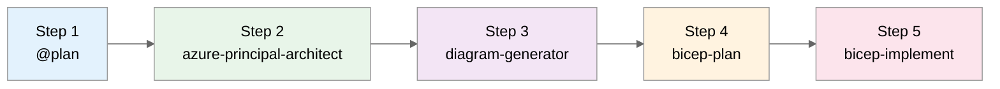

# Healthcare Patient Portal Scenario Prompts

> **Scenario:** Build a HIPAA-compliant patient portal on Azure  
> **Duration:** ~30 minutes  
> **Complexity:** Advanced (healthcare regulations, data sovereignty)

---

## Workflow Overview



| Step | Agent                       | Purpose                      | Output Folder               |
| ---- | --------------------------- | ---------------------------- | --------------------------- |
| 1    | `@plan`                     | Requirements & cost estimate | `scenario-output/healthcare/`   |
| 2    | `azure-principal-architect` | WAF + HIPAA assessment       | `scenario-output/healthcare/`   |
| 3    | `diagram-generator`         | Architecture visualization   | `docs/diagrams/healthcare/` |
| 4    | `bicep-plan`                | Implementation planning      | `.bicep-planning-files/`    |
| 5    | `bicep-implement`           | Code generation              | `infra/bicep/healthcare/`   |

---

## Step 1: Plan Agent (@plan)

> **How to invoke:** Type `@plan` in Copilot Chat

```text
Create a deployment plan for a HIPAA-compliant patient portal on Azure with the following requirements:

Business Requirements:
- Secure patient access to medical records and test results
- Appointment scheduling and reminders
- Secure messaging between patients and healthcare providers
- Document upload for insurance and consent forms
- HIPAA compliance with audit logging
- Support for 50,000 registered patients, 5,000 daily active users

Technical Requirements:
- Web frontend (Angular 17)
- REST API backend (.NET 8 with HealthChecks)
- Patient records database with encryption at rest
- Document storage with retention policies
- Real-time notifications (SignalR)
- Identity with MFA enforcement
- Audit logging for all PHI access

Compliance Requirements:
- HIPAA BAA required
- All PHI encrypted at rest and in transit
- 7-year audit log retention
- Access controls with least privilege
- Data residency in EU (healthcare regulations)

Constraints:
- Region: swedencentral (EU data sovereignty)
- Budget: Healthcare-grade (prioritize compliance over cost)
- Team familiar with Azure PaaS, limited infra experience

Please provide:
1. Recommended Azure services for each component
2. Security architecture with defense-in-depth
3. Compliance controls mapping
4. Estimated monthly costs
5. Implementation phases
```

**Expected Output:** HIPAA-compliant architecture, ~$2,500/month estimate, compliance mapping

---

## Step 2: Azure Principal Architect Agent

> **How to invoke:** Press `Ctrl+Shift+A` → Select `azure-principal-architect`

```text
Assess the healthcare patient portal architecture against the Azure Well-Architected Framework.

Pay special attention to:
1. Security pillar - HIPAA compliance, encryption, access controls
2. Reliability pillar - PHI data protection, backup/recovery
3. Operational Excellence - Audit logging, compliance monitoring

Provide WAF scores and specific HIPAA compliance recommendations.
```

**Expected Output:** WAF pillar scores with HIPAA focus, compliance gap analysis

---

## Step 3: Diagram Generator Agent

> **How to invoke:** Press `Ctrl+Shift+A` → Select `diagram-generator`

```text
Generate a Python architecture diagram for the healthcare patient portal.
Include security boundaries and data flow for PHI.
Show encryption points and audit logging paths.
```

**Expected Output:** `docs/diagrams/healthcare/architecture.py` with security annotations

---

## Step 4: Bicep Plan Agent

> **How to invoke:** Press `Ctrl+Shift+A` → Select `bicep-plan`

### Phase 1 — Security Foundation

```text
Create Bicep implementation plan for Phase 1:
- VNet with isolated subnets (web, api, data, integration)
- NSGs with healthcare-grade rules (deny all, allow specific)
- Azure Firewall for egress control
- Private DNS zones
- Key Vault with HSM backing

Region: swedencentral
Environment: prod
```

### Phase 2 — Identity & Compliance

```text
Create Bicep implementation plan for Phase 2:
- Azure AD B2C for patient identity with MFA
- Log Analytics with 7-year retention (HIPAA)
- Microsoft Defender for Cloud
- Azure Policy for compliance (HIPAA HITRUST)
- Storage account for audit logs (immutable)

Reference Phase 1 security foundation.
```

### Phase 3 — Data Platform

```text
Create Bicep implementation plan for Phase 3:
- Azure SQL with TDE and Always Encrypted
- Cosmos DB for patient preferences (encrypted)
- Azure Blob Storage with lifecycle policies
- Azure Search for patient records (encrypted index)
- Private endpoints for all data services

Reference Phase 1-2 outputs.
```

### Phase 4 — Application Tier

```text
Create Bicep implementation plan for Phase 4:
- App Service Premium for API (zone redundant)
- Azure Functions for background processing
- SignalR Service for real-time updates
- Azure Communication Services for notifications
- App Insights with PHI-safe telemetry

Reference Phase 1-3 outputs.
```

**Expected Output:** 4 planning files in `.bicep-planning-files/INFRA.healthcare-*.md`

---

## Step 5: Bicep Implement Agent

> **How to invoke:** Press `Ctrl+Shift+A` → Select `bicep-implement`

### Implement Phase 1 (Security Foundation)

```text
Implement Phase 1 Bicep code for healthcare portal:
- main.bicep with uniqueSuffix and HIPAA tags
- modules/network.bicep with isolated subnets
- modules/nsg.bicep with healthcare segmentation
- modules/firewall.bicep for egress control
- modules/key-vault.bicep with HSM SKU

Use AVM modules where available.
Region: swedencentral
```

### Implement Phase 2 (Identity & Compliance)

```text
Implement Phase 2 Bicep code:
- modules/log-analytics.bicep with 7-year retention
- modules/defender.bicep for Microsoft Defender
- modules/policy.bicep for HIPAA assignments
- modules/audit-storage.bicep with immutable policies

Reference Phase 1 outputs.
```

### Implement Phase 3 (Data Platform)

```text
Implement Phase 3 Bicep code:
- modules/sql.bicep with TDE and Always Encrypted columns
- modules/cosmos.bicep with customer-managed keys
- modules/storage.bicep with lifecycle and immutability
- modules/search.bicep with private endpoint
- modules/private-endpoints.bicep for all data services

Reference Phase 1-2 outputs.
```

### Implement Phase 4 (Application Tier)

```text
Implement Phase 4 Bicep code:
- modules/app-service.bicep with VNet integration
- modules/functions.bicep for background jobs
- modules/signalr.bicep for real-time
- modules/communication-services.bicep
- modules/app-insights.bicep with PHI-safe config

Reference Phase 1-3 outputs.
```

### Finalize

```text
Complete the healthcare Bicep implementation:
- Update main.bicep with all module references
- Create main.bicepparam with production values
- Create deploy.ps1 with compliance pre-checks
- Create README.md with HIPAA deployment notes
```

**Expected Output:** Complete Bicep modules in `infra/bicep/healthcare/`

---

## Validation Commands

```bash
# Validate Bicep
bicep build infra/bicep/healthcare/main.bicep
bicep lint infra/bicep/healthcare/main.bicep

# Preview deployment
az deployment group what-if \
  --resource-group rg-healthcare-prod-swc \
  --template-file infra/bicep/healthcare/main.bicep

# Validate HIPAA policy compliance
az policy state list \
  --resource-group rg-healthcare-prod-swc \
  --filter "complianceState eq 'NonCompliant'"
```

---

## Key Compliance Considerations

| Requirement         | Azure Service                      | Configuration                    |
| ------------------- | ---------------------------------- | -------------------------------- |
| PHI Encryption      | Azure SQL TDE, Always Encrypted    | Customer-managed keys in HSM KV  |
| Audit Logging       | Log Analytics, Diagnostic Settings | 7-year retention, immutable blob |
| Access Control      | Azure AD, RBAC, PIM                | JIT access, least privilege      |
| Network Security    | NSG, Azure Firewall, Private Link  | Zero trust, no public endpoints  |
| Backup/Recovery     | Azure Backup, Geo-replication      | 30-day retention, PITR           |
| Compliance Policies | Azure Policy, Defender for Cloud   | HIPAA HITRUST initiative         |

---

## Demo Artifacts

After running this demo, you should have:

| Artifact             | Location                                       |
| -------------------- | ---------------------------------------------- |
| Plan output          | `scenario-output/healthcare/00-plan.md`            |
| WAF assessment       | `scenario-output/healthcare/01-azure-architect.md` |
| Architecture diagram | `docs/diagrams/healthcare/`                    |
| Bicep planning files | `.bicep-planning-files/INFRA.healthcare-*.md`  |
| Bicep templates      | `infra/bicep/healthcare/`                      |
