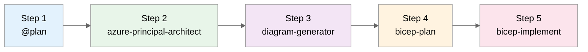

# Data Analytics Platform Scenario Prompts

> **Scenario:** Build a real-time analytics platform with data lakehouse architecture on Azure  
> **Duration:** ~30 minutes  
> **Complexity:** Intermediate (data engineering, streaming)

---

## Workflow Overview



| Step | Agent                       | Purpose                      | Output Folder              |
| ---- | --------------------------- | ---------------------------- | -------------------------- |
| 1    | `@plan`                     | Requirements & cost estimate | `scenario-output/analytics/`   |
| 2    | `azure-principal-architect` | WAF assessment               | `scenario-output/analytics/`   |
| 3    | `diagram-generator`         | Architecture visualization   | `docs/diagrams/analytics/` |
| 4    | `bicep-plan`                | Implementation planning      | `.bicep-planning-files/`   |
| 5    | `bicep-implement`           | Code generation              | `infra/bicep/analytics/`   |

---

## Step 1: Plan Agent (@plan)

> **How to invoke:** Type `@plan` in Copilot Chat

```text
Create a deployment plan for a real-time data analytics platform on Azure with the following requirements:

Business Requirements:
- Ingest 1 million events per minute from IoT devices and web applications
- Real-time dashboards with <5 second latency
- Historical analysis on 2 years of data (50TB+)
- Self-service BI for business analysts
- Data science workloads with ML model training
- Multi-tenant data isolation for 3 business units

Technical Requirements:
- Event ingestion (Kafka-compatible)
- Stream processing with exactly-once semantics
- Data lakehouse architecture (Bronze/Silver/Gold)
- Delta Lake format for ACID transactions
- Interactive query engine for analysts
- ML workspace for data scientists
- BI dashboards and reporting

Data Governance:
- Data catalog with lineage tracking
- Column-level security
- Data quality monitoring
- Cost allocation per business unit

Constraints:
- Region: swedencentral (primary), germanywestcentral (DR)
- Budget: Data-intensive (optimize for storage and compute efficiency)
- Team has SQL and Python experience, learning Spark

Please provide:
1. Recommended Azure services for each layer
2. Data flow architecture
3. Security and governance controls
4. Estimated monthly costs (by workload)
5. Implementation phases
```

**Expected Output:** Lakehouse architecture, ~$8,000/month estimate, medallion pattern

---

## Step 2: Azure Principal Architect Agent

> **How to invoke:** Press `Ctrl+Shift+A` → Select `azure-principal-architect`

```text
Assess the data analytics platform architecture against the Azure Well-Architected Framework.

Focus on:
1. Cost Optimization - Storage tiers, compute auto-scaling, data lifecycle
2. Performance Efficiency - Query optimization, caching, partitioning
3. Reliability - Data durability, disaster recovery, SLAs
4. Security - Data classification, encryption, access controls

Provide WAF scores and data platform-specific recommendations.
```

**Expected Output:** WAF pillar scores with data platform focus, cost optimization strategies

---

## Step 3: Diagram Generator Agent

> **How to invoke:** Press `Ctrl+Shift+A` → Select `diagram-generator`

```text
Generate a Python architecture diagram for the data analytics platform.
Show the medallion architecture (Bronze/Silver/Gold) layers.
Include data flow from ingestion to BI dashboards.
```

**Expected Output:** `docs/diagrams/analytics/architecture.py` with data flow annotations

---

## Step 4: Bicep Plan Agent

> **How to invoke:** Press `Ctrl+Shift+A` → Select `bicep-plan`

### Phase 1 — Foundation & Networking

```text
Create Bicep implementation plan for Phase 1:
- VNet with data platform subnets (ingestion, processing, serving)
- NSGs for data segmentation
- Private DNS zones for all data services
- Key Vault for secrets and encryption keys
- Log Analytics for platform monitoring

Region: swedencentral
Environment: prod
```

### Phase 2 — Data Ingestion Layer

```text
Create Bicep implementation plan for Phase 2:
- Event Hubs namespace with 20 throughput units
- Event Hubs for each data source (IoT, web, apps)
- Capture to ADLS Gen2 (Bronze layer)
- Stream Analytics for real-time alerts
- Azure Data Factory for batch ingestion

Reference Phase 1 network outputs.
```

### Phase 3 — Data Lakehouse (Storage & Processing)

```text
Create Bicep implementation plan for Phase 3:
- ADLS Gen2 with hierarchical namespace
- Container structure: bronze/, silver/, gold/
- Databricks workspace (Premium) with Unity Catalog
- Databricks clusters configuration
- Synapse Analytics for SQL analytics

Reference Phase 1-2 outputs.
```

### Phase 4 — Serving & BI Layer

```text
Create Bicep implementation plan for Phase 4:
- Synapse Serverless SQL for Gold layer queries
- Power BI Embedded capacity
- Azure Machine Learning workspace
- Purview for data governance
- Cost Management budgets and alerts

Reference Phase 1-3 outputs.
```

**Expected Output:** 4 planning files in `.bicep-planning-files/INFRA.analytics-*.md`

---

## Step 5: Bicep Implement Agent

> **How to invoke:** Press `Ctrl+Shift+A` → Select `bicep-implement`

### Implement Phase 1 (Foundation)

```text
Implement Phase 1 Bicep code for analytics platform:
- main.bicep with uniqueSuffix and analytics tags
- modules/network.bicep with data platform subnets
- modules/nsg.bicep with data segmentation rules
- modules/key-vault.bicep for encryption keys
- modules/log-analytics.bicep for monitoring

Use AVM modules where available.
Region: swedencentral
```

### Implement Phase 2 (Ingestion)

```text
Implement Phase 2 Bicep code:
- modules/event-hubs.bicep with multiple hubs
- modules/stream-analytics.bicep for real-time
- modules/data-factory.bicep for batch ETL
- modules/storage-bronze.bicep for landing zone

Reference Phase 1 outputs.
```

### Implement Phase 3 (Lakehouse)

```text
Implement Phase 3 Bicep code:
- modules/storage-lakehouse.bicep with bronze/silver/gold containers
- modules/databricks.bicep with Unity Catalog
- modules/synapse.bicep for analytics workspace
- modules/private-endpoints.bicep for data services

Reference Phase 1-2 outputs.
```

### Implement Phase 4 (Serving)

```text
Implement Phase 4 Bicep code:
- modules/ml-workspace.bicep for ML workloads
- modules/purview.bicep for data governance
- modules/powerbi.bicep for BI capacity
- modules/budgets.bicep for cost management

Reference Phase 1-3 outputs.
```

### Finalize

```text
Complete the analytics Bicep implementation:
- Update main.bicep with all module references
- Create main.bicepparam with production values
- Create deploy.ps1 with phased deployment
- Create README.md with data platform setup notes
```

**Expected Output:** Complete Bicep modules in `infra/bicep/analytics/`

---

## Validation Commands

```bash
# Validate Bicep
bicep build infra/bicep/analytics/main.bicep
bicep lint infra/bicep/analytics/main.bicep

# Preview deployment
az deployment group what-if \
  --resource-group rg-analytics-prod-swc \
  --template-file infra/bicep/analytics/main.bicep

# Verify Databricks workspace
az databricks workspace show \
  --resource-group rg-analytics-prod-swc \
  --name dbw-analytics-prod
```

---

## Data Platform Architecture

```text
┌─────────────────────────────────────────────────────────────────────────┐
│                           DATA SOURCES                                   │
│   IoT Devices    │    Web Apps    │    Batch Files    │    APIs         │
└────────┬─────────┴────────┬───────┴─────────┬─────────┴────────┬────────┘
         │                  │                 │                  │
         ▼                  ▼                 ▼                  ▼
┌─────────────────────────────────────────────────────────────────────────┐
│                        INGESTION LAYER                                   │
│         Event Hubs (Streaming)    │    Data Factory (Batch)             │
└────────────────────────┬────────────────────────────────────────────────┘
                         │
                         ▼
┌─────────────────────────────────────────────────────────────────────────┐
│                       BRONZE LAYER (Raw)                                 │
│   ADLS Gen2 - Delta format - Append-only - Full fidelity                │
└────────────────────────┬────────────────────────────────────────────────┘
                         │ Databricks ETL
                         ▼
┌─────────────────────────────────────────────────────────────────────────┐
│                       SILVER LAYER (Cleansed)                            │
│   ADLS Gen2 - Delta format - Deduped - Validated - Enriched            │
└────────────────────────┬────────────────────────────────────────────────┘
                         │ Databricks Aggregation
                         ▼
┌─────────────────────────────────────────────────────────────────────────┐
│                       GOLD LAYER (Curated)                               │
│   ADLS Gen2 - Delta format - Business aggregates - Star schemas        │
└────────────────────────┬────────────────────────────────────────────────┘
                         │
         ┌───────────────┼───────────────┐
         ▼               ▼               ▼
┌───────────────┐ ┌───────────────┐ ┌───────────────┐
│   Synapse     │ │   Power BI    │ │   ML Studio   │
│   Serverless  │ │   Dashboards  │ │   Training    │
└───────────────┘ └───────────────┘ └───────────────┘
```

---

## Cost Optimization Tips

| Component   | Optimization Strategy                            |
| ----------- | ------------------------------------------------ |
| Event Hubs  | Auto-inflate, use Standard tier initially        |
| ADLS Gen2   | Lifecycle policies: Hot→Cool→Archive             |
| Databricks  | Spot instances for dev, auto-terminate clusters  |
| Synapse     | Serverless for ad-hoc, dedicated for predictable |
| Stream Jobs | Scale up during peaks, pause during off-hours    |

---

## Demo Artifacts

After running this demo, you should have:

| Artifact             | Location                                      |
| -------------------- | --------------------------------------------- |
| Plan output          | `scenario-output/analytics/00-plan.md`            |
| WAF assessment       | `scenario-output/analytics/01-azure-architect.md` |
| Architecture diagram | `docs/diagrams/analytics/`                    |
| Bicep planning files | `.bicep-planning-files/INFRA.analytics-*.md`  |
| Bicep templates      | `infra/bicep/analytics/`                      |
