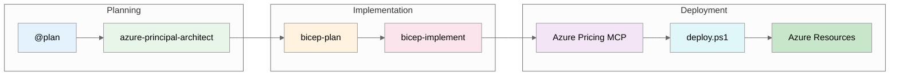

# E-Commerce Platform Scenario Workflow

> **Version 1.0.0** | Last Updated: December 3, 2025
>
> **Complete demonstration of GitHub Copilot agents for Azure infrastructure**

---

## 📁 Demo Files Index

| Step | File                                                             | Agent/Tool                  | Purpose                          |
| ---- | ---------------------------------------------------------------- | --------------------------- | -------------------------------- |
| 1    | [`00-plan.md`](./00-plan.md)                                     | `@plan` (built-in)          | Initial deployment planning      |
| 2    | [`01-azure-architect.md`](./01-azure-architect.md)               | `azure-principal-architect` | WAF assessment & architecture    |
| 3    | [`02-bicep-plan.md`](./02-bicep-plan.md)                         | `bicep-plan`                | Infrastructure planning with AVM |
| 4    | [`03-bicep-code-gen.md`](./03-bicep-code-gen.md)                 | `bicep-implement`           | Phased code generation strategy  |
| 5    | [`04-pricing-estimate.md`](./04-pricing-estimate.md)             | Azure Pricing MCP           | Real-time cost estimation        |
| 6    | [`05-bicep-issues-solutions.md`](./05-bicep-issues-solutions.md) | `bicep-implement`           | Issues encountered & fixes       |
| 7    | [`06-deployment-script.md`](./06-deployment-script.md)           | `bicep-implement`           | Enhanced deploy.ps1              |

---

## 📊 Supporting Files

| File                                                         | Description                          |
| ------------------------------------------------------------ | ------------------------------------ |
| [`ecommerce-cost-estimate.md`](./ecommerce-cost-estimate.md) | Detailed cost breakdown (~$2,212/mo) |
| [`architecture.py`](./architecture.py)                       | Python diagrams code                 |
| [`ecommerce_architecture.png`](./ecommerce_architecture.png) | Generated architecture diagram       |

---

## 🚀 Workflow Summary

---

## 📈 Key Metrics

| Metric          | Value              |
| --------------- | ------------------ |
| Total Resources | 61 Azure resources |
| Bicep Modules   | 18 modules         |
| Monthly Cost    | ~$2,212 USD        |
| Region          | Sweden Central     |
| Compliance      | PCI-DSS aligned    |
| WAF Score       | 8.0/10             |

---

## 🔧 Issues Resolved

1. **BCP036 Scope Error** - Use `existing` keyword for diagnostic settings
2. **WAF matchVariable** - Use `RequestHeader` (singular) not `RequestHeaders`
3. **SQL Admin Identity** - Auto-detect current Azure user
4. **Resource Group** - Create before what-if analysis

---

## 📚 Documentation Updates

Instructions files updated with lessons learned:

- `.github/copilot-instructions.md`
- `.github/agents/bicep-implement.agent.md`
- `.github/instructions/bicep-code-best-practices.instructions.md`

---

## ⏱️ Time Investment

| Phase         | Traditional  | With Copilot | Savings |
| ------------- | ------------ | ------------ | ------- |
| Architecture  | 4 hours      | 30 min       | 87%     |
| Bicep Modules | 8 hours      | 2 hours      | 75%     |
| Cost Estimate | 1 hour       | 10 min       | 83%     |
| Deploy Script | 2 hours      | 30 min       | 75%     |
| **Total**     | **15 hours** | **3 hours**  | **80%** |

---

## 🎯 Next Steps

1. Type `yes` in terminal to complete deployment
2. Configure Azure AD authentication for SQL
3. Deploy application code to App Service
4. Deploy React SPA to Static Web App
5. Configure custom domain for Front Door
