# Azure Cost Estimate: Contoso Patient Portal

**Generated**: 2025-12-04
**Region**: swedencentral (Sweden Central)
**Environment**: Production
**Compliance**: HIPAA
**Architecture Reference**: [WAF Assessment](./01-azure-architect.md)

---

## 💰 Cost At-a-Glance

> **Monthly Total: ~$207** | Annual: ~$2,484
>
> ```
> Budget: ███░░░░░░░ 26% utilized ($207 of $800) ✅
> ```
>
> | Status            | Indicator                             |
> | ----------------- | ------------------------------------- |
> | Budget Status     | ✅ Under Budget by $593/month         |
> | Cost Trend        | ➡️ Stable                             |
> | Savings Available | 💰 $458/year with 1-year reservations |
> | Compliance        | ✅ HIPAA aligned                      |

---

## 📊 Top 5 Cost Drivers

| Rank | Resource                | Monthly Cost | % of Total | Trend |
| ---- | ----------------------- | ------------ | ---------- | ----- |
| 1️⃣   | App Service Plan (P1v3) | $146         | 70%        | ➡️    |
| 2️⃣   | SQL Database (S1)       | $30          | 14%        | ➡️    |
| 3️⃣   | Private Endpoints (×2)  | $15          | 7%         | ➡️    |
| 4️⃣   | Log Analytics           | $12          | 6%         | ➡️    |
| 5️⃣   | Key Vault               | $3           | 1%         | ➡️    |

> 💡 **Budget Headroom**: $593/month remaining for staging environment, Azure AD B2C, or geo-replication

---

## Summary

| Metric                | Value             |
| --------------------- | ----------------- |
| 💵 Monthly Estimate   | $200 - $250       |
| 📅 Annual Estimate    | $2,400 - $3,000   |
| 🌍 Primary Region     | swedencentral     |
| 💳 Pricing Type       | List Price (PAYG) |
| ⭐ WAF Score          | 8.2/10            |
| 💰 Budget             | $800/month        |
| 📊 Budget Utilization | 26% ✅            |

### Business Context

This patient portal serves 10,000 patients and 50 staff with HIPAA-compliant access to
medical records, appointment scheduling, and secure messaging. The architecture prioritizes
security and compliance while staying well under the $800/month budget constraint, leaving
room for future enhancements.

---

## Architecture Overview

### Cost Distribution

```mermaid
%%{init: {'theme':'base', 'themeVariables': {'pie1': '#0078D4', 'pie2': '#107C10', 'pie3': '#5C2D91', 'pie4': '#008272', 'pie5': '#FFB900'}}}%%
pie showData
    title Monthly Cost Distribution ($)
    "💻 Compute" : 146
    "💾 Database" : 30
    "🌐 Networking" : 15
    "📊 Monitoring" : 13
    "🔐 Security" : 3
```

<!-- markdownlint-disable MD013 -->

<!-- markdownlint-enable MD013 -->

### Key Design Decisions Affecting Cost

| Decision           | Cost Impact   | Business Rationale                     | Status           |
| ------------------ | ------------- | -------------------------------------- | ---------------- |
| P1v3 (not P1v4)    | -$60/month 📉 | Zone redundancy not required initially | Cost optimized   |
| SQL S1 (not S2)    | -$31/month 📉 | 20 DTU adequate for 10K patients       | Right-sized      |
| Private endpoints  | +$15/month    | HIPAA network isolation requirement    | Required         |
| Single region      | $0            | DR not in initial scope                | Budget conscious |
| No geo-replication | $0            | RTO/RPO requirements not specified     | Future option    |

---

## ⚠️ Cost Risk Indicators

| Resource      | Risk Level | Issue                      | Mitigation              |
| ------------- | ---------- | -------------------------- | ----------------------- |
| SQL DTU Usage | 🟢 Low     | 20 DTU should be adequate  | Monitor DTU %           |
| Log Analytics | 🟢 Low     | 5 GB estimate conservative | Set daily cap if needed |
| Data Transfer | 🟢 Low     | Minimal egress expected    | Monitor monthly         |

> **✅ Low Risk Profile**: This architecture is conservatively sized with clear upgrade paths
> if performance requirements increase.

---

## 🎯 Quick Decision Matrix

_"If you need X, expect to pay Y more"_

| Requirement            | Additional Cost | Current Status | Notes                    |
| ---------------------- | --------------- | -------------- | ------------------------ |
| Zone Redundancy        | +$60/month      | Not included   | Requires P1v4 upgrade    |
| SQL S2 (50 DTU)        | +$31/month      | S1 (20 DTU)    | If DTU consistently >80% |
| SQL Geo-Replication    | +$85/month      | Not included   | For DR requirements      |
| Azure AD B2C (10K MAU) | +$33/month      | Not included   | Patient authentication   |
| Azure Front Door       | +$40/month      | Not included   | Global load balancing    |
| Defender for Cloud     | +$15/month      | Not included   | Enhanced security        |

> 💡 All additions above still fit within the $800/month budget

---

## 💰 Savings Opportunities

> ### Total Potential Savings: $458/year (26% on reservable resources)
>
> | Commitment                | Monthly Savings | Annual Savings |
> | ------------------------- | --------------- | -------------- |
> | 1-Year Reserved Instances | $38             | **$458**       |
> | 3-Year Reserved Instances | $55             | $660           |
>
> **Recommendation**: Given the stable, predictable workload, 1-year reservations are recommended.

### Detailed Savings by Resource

| Resource         | PAYG/Month | 1-Year     | 3-Year     | Max Annual Savings |
| ---------------- | ---------- | ---------- | ---------- | ------------------ |
| App Service P1v3 | $146       | $117 (20%) | $102 (30%) | 💰 $350            |
| SQL Database S1  | $30        | $21 (30%)  | $16 (47%)  | 💰 $108            |
| **Total**        | **$176**   | **$138**   | **$118**   | **$458-$660**      |

---

## Detailed Cost Breakdown

### 💻 Compute Services

| Resource         | SKU        | Qty | $/Hour | $/Month | Notes                   |
| ---------------- | ---------- | --- | ------ | ------- | ----------------------- |
| App Service Plan | P1v3 Linux | 1   | $0.20  | $146.00 | .NET 8, VNet integrated |

**💻 Compute Subtotal**: ~$146/month

### 💾 Data Services

| Resource           | SKU         | Config   | $/Day  | $/Month | Notes              |
| ------------------ | ----------- | -------- | ------ | ------- | ------------------ |
| Azure SQL Database | S1 Standard | 20 DTU   | $0.998 | $29.93  | Patient data       |
| Key Vault          | Standard    | ~500 ops | -      | $3.00   | Secrets management |

**💾 Data Subtotal**: ~$33/month

### 🌐 Networking

| Resource         | SKU | Config      | $/Hour | $/Month | Notes              |
| ---------------- | --- | ----------- | ------ | ------- | ------------------ |
| Private Endpoint | -   | SQL Server  | $0.01  | $7.30   | Database isolation |
| Private Endpoint | -   | Key Vault   | $0.01  | $7.30   | Secrets isolation  |
| Virtual Network  | -   | 10.0.0.0/16 | Free   | $0.00   | Network foundation |
| NSGs (×3)        | -   | 3 subnets   | Free   | $0.00   | Security rules     |

**🌐 Networking Subtotal**: ~$15/month

### 📊 Monitoring & Management

| Resource             | SKU           | Config      | $/Month  | Notes              |
| -------------------- | ------------- | ----------- | -------- | ------------------ |
| Log Analytics        | Pay-as-you-go | ~5 GB/month | $12.42   | 90-day retention   |
| Application Insights | Pay-as-you-go | ~5 GB/month | Included | With Log Analytics |
| Storage (logs)       | LRS           | ~10 GB      | $0.50    | Diagnostic data    |

**📊 Monitoring Subtotal**: ~$13/month

---

## 📋 Monthly Cost Summary

| Category      | Monthly Cost | % of Total | Trend |
| ------------- | ------------ | ---------- | ----- |
| 💻 Compute    | $146         | 70%        | ➡️    |
| 💾 Data       | $33          | 16%        | ➡️    |
| 🌐 Networking | $15          | 7%         | ➡️    |
| 📊 Monitoring | $13          | 6%         | ➡️    |
| **Total**     | **~$207**    | 100%       |       |

```
Cost Distribution:
💻 Compute      ██████████████████████████████ 70%
💾 Data         ███████░░░░░░░░░░░░░░░░░░░░░░░ 16%
🌐 Networking   ███░░░░░░░░░░░░░░░░░░░░░░░░░░░  7%
📊 Monitoring   ██░░░░░░░░░░░░░░░░░░░░░░░░░░░░  6%
```

---

## 💵 Budget Analysis

| Metric            | Value      |
| ----------------- | ---------- |
| 💰 Budget         | $800/month |
| 📊 Estimated Cost | $207/month |
| ✅ Remaining      | $593/month |
| 📈 Utilization    | 26%        |

### Possible Additions Within Budget

| Addition                    | Monthly Cost | Running Total | Still Under Budget?   |
| --------------------------- | ------------ | ------------- | --------------------- |
| Current architecture        | $207         | $207          | ✅ $593 remaining     |
| + Staging environment       | +$150        | $357          | ✅ $443 remaining     |
| + Azure AD B2C (10K MAU)    | +$33         | $390          | ✅ $410 remaining     |
| + SQL Geo-replication       | +$85         | $475          | ✅ $325 remaining     |
| + Azure Front Door Standard | +$40         | $515          | ✅ $285 remaining     |
| + Defender for Cloud        | +$15         | $530          | ✅ $270 remaining     |
| **All additions**           |              | **$530**      | ✅ **$270 remaining** |

> ✅ Even with ALL suggested additions, the solution remains $270 under the $800 budget

---

## 🌍 Regional Comparison

| Region             | Monthly Cost | vs. Primary | Data Residency   | Recommendation |
| ------------------ | ------------ | ----------- | ---------------- | -------------- |
| swedencentral      | $207         | Baseline    | EU (Sweden) ✅   | **Selected**   |
| germanywestcentral | $210         | +1%         | EU (Germany)     | DE sovereignty |
| westeurope         | $185         | -11%        | EU (Netherlands) | Alternative    |
| northeurope        | $180         | -13%        | EU (Ireland)     | Lower cost EU  |
| eastus             | $165         | -20%        | US East          | Lowest (no EU) |

> 💡 **Decision**: swedencentral selected for GDPR/EU data residency and sustainable operations.

---

## 🔄 Environment Cost Comparison

| Environment | Monthly Cost | vs. Production | Notes                                  |
| ----------- | ------------ | -------------- | -------------------------------------- |
| Production  | $207         | Baseline       | P1v3 + S1 + private endpoints          |
| Staging     | $150         | -28%           | Same SKUs, shared monitoring           |
| Development | $35          | -83%           | B1 + Basic 5 DTU, no private endpoints |

**Total for all environments**: ~$392/month (still under $800 budget ✅)

> 💡 **Tip**: Use Azure Dev/Test pricing for non-production subscriptions for additional savings

---

## 📝 Assumptions

- **Usage**: 730 hours/month (24×7 operation)
- **Data transfer**: Minimal egress (<10 GB/month)
- **Pricing**: Azure retail list prices (pay-as-you-go)
- **Region**: swedencentral (EU GDPR compliant)
- **Prices queried**: 2025-12-04 via Azure Pricing MCP
- **SQL operations**: Read-heavy workload, 20 DTU sufficient
- **Patient base**: 10,000 patients, 50 staff
- **Storage**: ~10 GB for logs and diagnostics

---

## 📊 Pricing Data Accuracy

> **📊 Data Source**: All prices queried in real-time from the
> [Azure Retail Prices
> API](https://learn.microsoft.com/en-us/rest/api/cost-management/retail-prices/azure-retail-prices).
>
> ✅ **Included**: Retail list prices (PAYG), Savings Plan pricing, Spot pricing
>
> ❌ **Not Included**: EA discounts, CSP pricing, negotiated rates, Azure Hybrid Benefit
>
> 💡 For official quotes, verify with [Azure Pricing Calculator](https://azure.microsoft.com/pricing/calculator/)

---

## 🔗 References

- [Azure Pricing Calculator](https://azure.microsoft.com/pricing/calculator/)
- [WAF Assessment](./01-azure-architect.md)
- [Implementation Plan](./02-bicep-plan.md)
- [Architecture Diagram](./contoso_architecture.png)
- [Bicep Templates](../../infra/bicep/contoso-patient-portal/)
- [Azure HIPAA BAA](https://learn.microsoft.com/azure/compliance/offerings/offering-hipaa-us)
