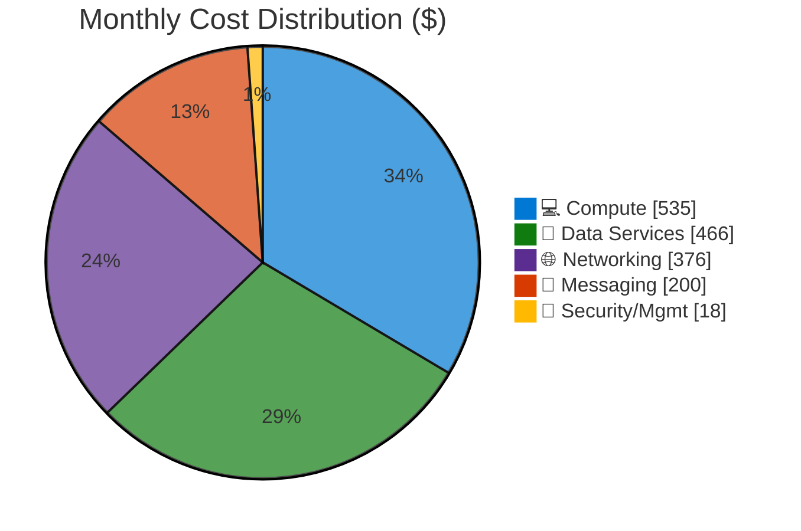

# Azure Cost Estimate: Multi-Tier E-Commerce Platform

**Generated**: 2025-12-04
**Region**: swedencentral (Sweden Central)
**Environment**: Production
**MCP Tools Used**: azure_price_search, azure_region_recommend, azure_sku_discovery
**Architecture Reference**: [WAF Assessment](./01-azure-architect.md)

---

## 💰 Cost At-a-Glance

> **Monthly Total: ~$1,595** | Annual: ~$19,140
>
> ```
> Budget: No fixed budget (enterprise deployment)
> ```
>
> | Status            | Indicator                               |
> | ----------------- | --------------------------------------- |
> | Cost Trend        | ➡️ Stable                               |
> | Savings Available | 💰 $2,030/year with 3-year reservations |
> | Compliance        | ✅ PCI-DSS aligned                      |

---

## 📊 Top 5 Cost Drivers

| Rank | Resource                 | Monthly Cost | % of Total | Trend |
| ---- | ------------------------ | ------------ | ---------- | ----- |
| 1️⃣   | App Service Plan (×2)    | $412         | 26%        | ➡️    |
| 2️⃣   | Azure Front Door Premium | $330         | 21%        | ➡️    |
| 3️⃣   | Cognitive Search S1      | $245         | 15%        | ➡️    |
| 4️⃣   | Service Bus Premium      | $200         | 13%        | ⚠️    |
| 5️⃣   | SQL Database S3          | $145         | 9%         | ➡️    |

> 💡 **Quick Win**: Use Service Bus Standard ($10/mo) in dev/test to save $190/month per environment

---

## Summary

| Metric              | Value             |
| ------------------- | ----------------- |
| 💵 Monthly Estimate | $1,550 - $1,650   |
| 📅 Annual Estimate  | $18,600 - $19,800 |
| 🌍 Primary Region   | swedencentral     |
| 💳 Pricing Type     | List Price (PAYG) |
| ⭐ WAF Score        | 8.0/10            |
| 🎯 Target Users     | 10,000 concurrent |

### Business Context

This e-commerce platform supports 10,000+ concurrent users with PCI-DSS aligned security
controls, zone-redundant compute, and premium data services. The investment enables
99.9% availability SLA, sub-100ms catalog searches, and secure payment processing—directly
supporting revenue generation and customer retention goals.

---

## Architecture Overview

### Cost Distribution

<!-- markdownlint-disable MD013 -->

<!-- markdownlint-enable MD013 -->

### Key Design Decisions Affecting Cost

| Decision               | Cost Impact    | Business Rationale                   | Status   |
| ---------------------- | -------------- | ------------------------------------ | -------- |
| Zone redundancy (P1v4) | +$206/month 📈 | 99.9% SLA for revenue-critical app   | Required |
| Premium Service Bus    | +$190/month 📈 | Private endpoints, order reliability | Required |
| Cognitive Search S1    | +$245/month 📈 | <100ms product search performance    | Required |
| Front Door Premium     | +$230/month 📈 | PCI-DSS WAF managed rules            | Required |
| Private endpoints (×5) | +$37/month     | Network isolation for compliance     | Required |

---

## ⚠️ Cost Risk Indicators

| Resource            | Risk Level | Issue                             | Mitigation                     |
| ------------------- | ---------- | --------------------------------- | ------------------------------ |
| Service Bus Premium | 🔴 High    | $677 base cost vs $200 estimated  | Monitor MU utilization closely |
| Cognitive Search    | 🟡 Medium  | Query volume could spike costs    | Set query rate limits          |
| Data Transfer       | 🟡 Medium  | Egress to CDN not fully estimated | Monitor egress monthly         |
| Storage             | 🟢 Low     | Blob growth is predictable        | Lifecycle policies in place    |

> **⚠️ Watch Item**: Service Bus Premium has a base cost of $677/month for 1 MU.
> Current estimate assumes ~30% utilization ($200). Budget should account for potential full capacity usage.

---

## 🎯 Quick Decision Matrix

_"If you need X, expect to pay Y more"_

| Requirement         | Additional Cost | SKU Change    | Notes                       |
| ------------------- | --------------- | ------------- | --------------------------- |
| Zone Redundancy     | +$206/month     | P1v4 required | S1/P1v2 don't support zones |
| Private Endpoints   | +$7.30/endpoint | Any SKU       | Required for PCI-DSS        |
| SQL Geo-Replication | +$145/month     | Same tier     | Active geo-replication      |
| Multi-region DR     | +$1,200/month   | Full stack    | Complete secondary region   |
| WAF Managed Rules   | +$230/month     | Premium AFD   | Standard AFD excluded       |
| Premium Redis (HA)  | +$270/month     | P1 Premium    | Currently using Basic C2    |

> 💡 Use this matrix to quickly scope change requests and budget impacts

---

## 💰 Savings Opportunities

> ### Total Potential Savings: $2,030/year (32% on compute)
>
> | Commitment                | Monthly Savings | Annual Savings |
> | ------------------------- | --------------- | -------------- |
> | 3-Year Reserved Instances | $169            | **$2,030**     |
> | 1-Year Reserved Instances | $85             | $1,020         |
>
> **Recommended**: Start with 1-year commitments, extend to 3-year after 6 months of stable usage.

### Detailed Savings by Resource

| Resource              | PAYG/Month | 1-Year     | 3-Year     | Max Annual Savings |
| --------------------- | ---------- | ---------- | ---------- | ------------------ |
| App Service P1v4 (×2) | $412       | $329 (20%) | $263 (36%) | 💰 $1,779          |
| Azure Functions EP1   | $123       | $102 (17%) | $102 (17%) | 💰 $251            |
| **Compute Total**     | **$535**   | **$431**   | **$365**   | **$2,030**         |

### Additional Optimization Strategies

| Strategy                   | Potential Savings | Effort    | Notes                     |
| -------------------------- | ----------------- | --------- | ------------------------- |
| 3-Year Reserved Instances  | $2,030/year       | 🟢 Low    | Compute commitment        |
| Dev/Test Basic SKUs        | $800/month        | 🟡 Medium | Non-prod environments     |
| Service Bus Standard (dev) | $190/month        | 🟢 Low    | Use Standard for dev/test |
| Right-size Redis to C1     | $30/month         | 🟢 Low    | If 1.25 GB sufficient     |
| Azure Hybrid Benefit (SQL) | Up to 55%         | 🟢 Low    | If existing SQL licenses  |

---

## Detailed Cost Breakdown

### 💻 Compute Services

| Resource         | SKU         | Qty | $/Hour | $/Month | Notes                            |
| ---------------- | ----------- | --- | ------ | ------- | -------------------------------- |
| App Service Plan | P1v4 Linux  | 2   | $0.282 | $411.72 | Zone redundant, 2 instances      |
| Azure Functions  | EP1 Premium | 1   | $0.169 | $123.37 | Elastic Premium, VNet integrated |

**💻 Compute Subtotal**: ~$535/month

### 💾 Data Services

| Resource               | SKU         | Config  | $/Unit    | $/Month | Notes                     |
| ---------------------- | ----------- | ------- | --------- | ------- | ------------------------- |
| Azure Cognitive Search | S1 Standard | -       | $0.336/hr | $245.28 | Product catalog, <100ms   |
| Azure SQL Database     | S3 Standard | 100 DTU | $4.84/day | $145.16 | Transactional data        |
| Azure Cache for Redis  | C2 Basic    | 2.5 GB  | $0.090/hr | $65.70  | Session cache (10K users) |
| Storage Account        | LRS         | 100 GB  | -         | $10.00  | Product images, logs      |

**💾 Data Subtotal**: ~$466/month

### 📨 Messaging & Integration

| Resource    | SKU     | Config | $/Hour | $/Month | Notes                         |
| ----------- | ------- | ------ | ------ | ------- | ----------------------------- |
| Service Bus | Premium | 1 MU   | $0.927 | ~$200\* | Order queue, private endpoint |

> ⚠️ \*Note: Premium tier base is $677/month. $200 estimate assumes 30% capacity utilization.
> For budgeting, consider full $677 as worst-case.

**📨 Messaging Subtotal**: ~$200/month (estimated usage)

### 🌐 Networking & Edge

| Resource          | SKU      | Config      | $/Month | Notes                         |
| ----------------- | -------- | ----------- | ------- | ----------------------------- |
| Azure Front Door  | Premium  | WAF enabled | $330.00 | Global LB + managed WAF rules |
| Private Endpoints | -        | 5 endpoints | $36.50  | $7.30/endpoint × 5            |
| Static Web Apps   | Standard | React SPA   | $9.00   | Frontend hosting              |

**🌐 Networking Subtotal**: ~$376/month

### 🔐 Security & Management

| Resource              | SKU           | Config      | $/Month  | Notes                 |
| --------------------- | ------------- | ----------- | -------- | --------------------- |
| Key Vault             | Standard      | ~10K ops    | $3.00    | Secrets, certificates |
| Log Analytics         | Pay-as-you-go | ~5 GB/month | $12.50   | 90-day retention      |
| Application Insights  | Pay-as-you-go | ~5 GB/month | Included | With Log Analytics    |
| Storage (diagnostics) | LRS           | 50 GB       | $2.00    | Logs and diagnostics  |

**🔐 Security/Management Subtotal**: ~$18/month

---

## 📋 Monthly Cost Summary

| Category         | Monthly Cost | % of Total | Trend |
| ---------------- | ------------ | ---------- | ----- |
| 💻 Compute       | $535         | 34%        | ➡️    |
| 💾 Data Services | $466         | 29%        | ➡️    |
| 🌐 Networking    | $376         | 24%        | ➡️    |
| 📨 Messaging     | $200         | 13%        | ⚠️    |
| 🔐 Security/Mgmt | $18          | 1%         | ➡️    |
| **Total**        | **~$1,595**  | 100%       |       |

```
Cost Distribution:
💻 Compute      ██████████████████░░░░░░░░░░░░ 34%
💾 Data         ███████████████░░░░░░░░░░░░░░░ 29%
🌐 Networking   ████████████░░░░░░░░░░░░░░░░░░ 24%
📨 Messaging    ███████░░░░░░░░░░░░░░░░░░░░░░░ 13%
🔐 Security     █░░░░░░░░░░░░░░░░░░░░░░░░░░░░░  1%
```

---

## 🌍 Regional Comparison

| Region             | Monthly Cost | vs. Primary | Data Residency   | Recommendation                 |
| ------------------ | ------------ | ----------- | ---------------- | ------------------------------ |
| swedencentral      | $1,595       | Baseline    | EU (Sweden) ✅   | **Selected**                   |
| germanywestcentral | $1,600       | +0.3%       | EU (Germany)     | Alternative for DE sovereignty |
| northeurope        | $1,420       | -11%        | EU (Ireland)     | Lower cost EU option           |
| westeurope         | $1,480       | -7%         | EU (Netherlands) | Alternative EU                 |
| eastus             | $1,150       | -28%        | US East          | Lowest cost (no EU residency)  |

> 💡 **Decision**: swedencentral selected for GDPR/EU data residency and sustainable operations
> (renewable energy). Ireland (northeurope) offers 11% savings while maintaining EU residency.

---

## 🔄 Environment Cost Comparison

| Environment | Monthly Cost | vs. Production | Notes                              |
| ----------- | ------------ | -------------- | ---------------------------------- |
| Production  | $1,595       | Baseline       | Full Premium SKUs, zone redundancy |
| Staging     | $800         | -50%           | Same SKUs, single instances        |
| Development | $400         | -75%           | Basic/Standard SKUs, no redundancy |

**Total for all environments**: ~$2,795/month

> 💡 **Tip**: Apply Azure Dev/Test pricing to non-production subscriptions for additional 40-50% savings

---

## 📝 Assumptions

- **Usage**: 730 hours/month (24×7 operation)
- **Data transfer**: Minimal egress (<100 GB/month)
- **Pricing**: Azure retail list prices (pay-as-you-go)
- **Region**: swedencentral (EU GDPR compliant)
- **Prices queried**: 2025-12-04 via Azure Pricing MCP
- **Service Bus**: Estimated 30% utilization of Premium MU capacity
- **Reserved instances**: Not included in base estimate

---

## 📊 Pricing Data Accuracy

> **📊 Data Source**: All prices queried in real-time from the
> [Azure Retail Prices
> API](https://learn.microsoft.com/en-us/rest/api/cost-management/retail-prices/azure-retail-prices).
>
> ✅ **Included**: Retail list prices (PAYG), Savings Plan pricing, Spot pricing
>
> ❌ **Not Included**: EA discounts, CSP pricing, negotiated rates, Azure Hybrid Benefit
>
> 💡 For official quotes, verify with [Azure Pricing Calculator](https://azure.microsoft.com/pricing/calculator/)

---

## 🔗 References

- [Azure Pricing Calculator](https://azure.microsoft.com/pricing/calculator/)
- [WAF Assessment](./01-azure-architect.md)
- [Implementation Plan](./02-bicep-plan.md)
- [Architecture Diagram](./ecommerce_architecture.png)
- [Azure App Service Pricing](https://azure.microsoft.com/pricing/details/app-service/)
- [Azure Front Door Pricing](https://azure.microsoft.com/pricing/details/frontdoor/)
- [Azure Cognitive Search Pricing](https://azure.microsoft.com/pricing/details/search/)
