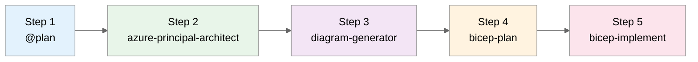

# Static Website Scenario Prompts

> **Scenario:** Deploy a static marketing website with global CDN and contact form  
> **Duration:** ~15 minutes  
> **Complexity:** Beginner (great first demo)

---

## Workflow Overview



| Step | Agent                       | Purpose                      | Output Folder               |
| ---- | --------------------------- | ---------------------------- | --------------------------- |
| 1    | `@plan`                     | Requirements & cost estimate | `scenario-output/staticsite/`   |
| 2    | `azure-principal-architect` | WAF assessment               | `scenario-output/staticsite/`   |
| 3    | `diagram-generator`         | Architecture visualization   | `docs/diagrams/staticsite/` |
| 4    | `bicep-plan`                | Implementation planning      | `.bicep-planning-files/`    |
| 5    | `bicep-implement`           | Code generation              | `infra/bicep/staticsite/`   |

---

## Why This Demo?

This is the **recommended first demo** because:

- ✅ Simple architecture (3-4 resources)
- ✅ Fast deployment (~5 minutes)
- ✅ Low cost (~$20/month)
- ✅ Demonstrates full agent workflow
- ✅ No complex dependencies

---

## Step 1: Plan Agent (@plan)

> **How to invoke:** Type `@plan` in Copilot Chat

```text
Create a deployment plan for a static marketing website on Azure with the following requirements:

Business Requirements:
- Company marketing website with product pages and blog
- Global audience with fast load times (<2 seconds)
- Contact form that sends emails to sales team
- Custom domain with SSL certificate
- 99.9% availability

Technical Requirements:
- Static site generator (Hugo or Next.js export)
- Global CDN for static assets
- Serverless function for contact form
- Form submissions stored in database
- Email notifications via SendGrid or similar

Constraints:
- Region: swedencentral
- Budget: Minimal (< $50/month)
- Single developer maintaining the site

Please provide:
1. Recommended Azure services
2. Simple architecture diagram
3. Security considerations
4. Estimated monthly costs
5. Deployment steps
```

**Expected Output:** SWA + Functions architecture, ~$20/month estimate

---

## Step 2: Azure Principal Architect Agent

> **How to invoke:** Press `Ctrl+Shift+A` → Select `azure-principal-architect`

```text
Assess the static website architecture against the Azure Well-Architected Framework.
Keep recommendations simple and beginner-friendly.
Focus on security and cost optimization.
```

**Expected Output:** WAF scores, focus on Security (HTTPS, WAF) and Cost (free tier usage)

---

## Step 3: Diagram Generator Agent

> **How to invoke:** Press `Ctrl+Shift+A` → Select `diagram-generator`

```text
Generate a simple Python architecture diagram for the static marketing website.
Show user flow from browser through CDN to static content and API.
Keep it clean and minimal.
```

**Expected Output:** `docs/diagrams/staticsite/architecture.py` - clean, simple diagram

---

## Step 4: Bicep Plan Agent

> **How to invoke:** Press `Ctrl+Shift+A` → Select `bicep-plan`

### Single Phase Plan

```text
Create Bicep implementation plan for the static website:
- Azure Static Web App (Standard tier for custom domain)
- Cosmos DB Serverless for form submissions
- Application Insights for monitoring
- Custom domain and managed certificate

This is a simple deployment - keep it in a single phase.
Region: swedencentral
Environment: prod
```

**Expected Output:** Single planning file in `.bicep-planning-files/INFRA.staticsite.md`

---

## Step 5: Bicep Implement Agent

> **How to invoke:** Press `Ctrl+Shift+A` → Select `bicep-implement`

### Complete Implementation

```text
Implement Bicep code for the static website:
- main.bicep with all resources (simple flat structure, no modules needed)
- Static Web App with managed Functions
- Cosmos DB Serverless account with database and container
- Application Insights for monitoring
- Outputs for deployment URLs

Keep it simple - this should be a single main.bicep file.
Use AVM modules only if they simplify the code.
Region: swedencentral
```

### Add Deployment Artifacts

```text
Complete the static site deployment:
- Create main.bicepparam with production values
- Create deploy.ps1 with simple deployment script
- Create README.md with deployment instructions
- Include sample staticwebapp.config.json for routing
```

**Expected Output:** Simple Bicep in `infra/bicep/staticsite/`

---

## Validation Commands

```bash
# Validate Bicep
bicep build infra/bicep/staticsite/main.bicep
bicep lint infra/bicep/staticsite/main.bicep

# Deploy (after creating resource group)
az group create --name rg-staticsite-prod-swc --location swedencentral

az deployment group create \
  --resource-group rg-staticsite-prod-swc \
  --template-file infra/bicep/staticsite/main.bicep \
  --parameters main.bicepparam

# Get deployment URL
az staticwebapp show \
  --name swa-marketing-prod \
  --resource-group rg-staticsite-prod-swc \
  --query defaultHostname -o tsv
```

---

## Architecture Overview

```text
┌─────────────────────────────────────────────────────────────────┐
│                          USERS                                   │
│              (Global - Americas, Europe, APAC)                  │
└────────────────────────────┬────────────────────────────────────┘
                             │ HTTPS
                             ▼
┌─────────────────────────────────────────────────────────────────┐
│                    AZURE STATIC WEB APPS                         │
│  ┌─────────────────────────────────────────────────────────┐    │
│  │  Global CDN Edge (100+ PoPs)                             │    │
│  │  • Automatic HTTPS                                       │    │
│  │  • Custom domain support                                 │    │
│  │  • Built-in WAF rules                                    │    │
│  └─────────────────────────────────────────────────────────┘    │
│                                                                  │
│  ┌─────────────────────┐    ┌─────────────────────────────┐     │
│  │   Static Content    │    │   Managed Functions         │     │
│  │   • HTML/CSS/JS     │    │   • /api/contact            │     │
│  │   • Images          │    │   • /api/newsletter         │     │
│  │   • Blog posts      │    │                             │     │
│  └─────────────────────┘    └──────────────┬──────────────┘     │
└─────────────────────────────────────────────┼───────────────────┘
                                              │
                                              ▼
                              ┌─────────────────────────────┐
                              │     COSMOS DB SERVERLESS    │
                              │     • Form submissions      │
                              │     • Newsletter signups    │
                              └─────────────────────────────┘
```

---

## Cost Breakdown

| Service              | Tier/Config           | Est. Monthly Cost |
| -------------------- | --------------------- | ----------------- |
| Static Web Apps      | Standard              | $9.00             |
| Cosmos DB            | Serverless (1M RU/mo) | ~$5.00            |
| Application Insights | 5GB ingestion         | Free tier         |
| Custom Domain        | Managed certificate   | Free              |
| **Total**            |                       | **~$15-20/month** |

---

## Next Steps After Demo

1. **Connect GitHub repo** for automatic deployments
2. **Add staging environment** with preview URLs
3. **Configure custom domain** with DNS provider
4. **Set up alerts** for form submission failures
5. **Add authentication** for admin pages (optional)

---

## Sample Project Structure

```text
marketing-website/
├── src/
│   ├── index.html
│   ├── about.html
│   ├── contact.html
│   └── assets/
│       ├── css/
│       ├── js/
│       └── images/
├── api/
│   └── contact/
│       ├── function.json
│       └── index.js
├── staticwebapp.config.json
└── infra/
    └── bicep/
        └── staticsite/
            ├── main.bicep
            ├── main.bicepparam
            └── deploy.ps1
```

---

## Demo Artifacts

After running this demo, you should have:

| Artifact             | Location                                       |
| -------------------- | ---------------------------------------------- |
| Plan output          | `scenario-output/staticsite/00-plan.md`            |
| WAF assessment       | `scenario-output/staticsite/01-azure-architect.md` |
| Architecture diagram | `docs/diagrams/staticsite/`                    |
| Bicep planning file  | `.bicep-planning-files/INFRA.staticsite.md`    |
| Bicep templates      | `infra/bicep/staticsite/`                      |

---

## Common Issues & Fixes

| Issue                        | Solution                                         |
| ---------------------------- | ------------------------------------------------ |
| Custom domain not working    | Verify DNS CNAME record points to SWA hostname   |
| API routes returning 404     | Check staticwebapp.config.json route definitions |
| Cosmos DB connection errors  | Ensure connection string is in SWA app settings  |
| Build fails in GitHub Action | Check Node.js version in workflow file           |
